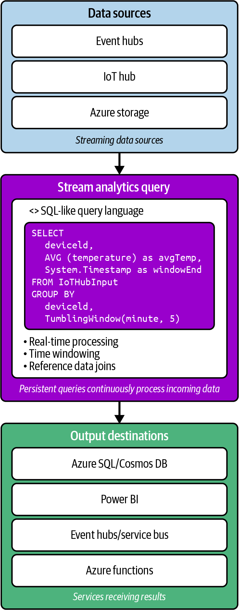
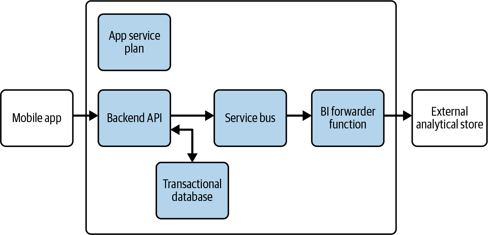

# Chapter 10 Real-time Analytics

The world today is hyperconnected, and analyzing data as it's created represents a tranformative capability for organizations across industries.
Whether monitoring financial transactions for fraus, optimizing traffic flow in smart cities, or personalizing cusomter experiences on ecommerce platforms, real-time analytics enables immediate insight and action that were impossible with traditional approaches.
This shift from retrospective analysis to instantaneous undertanding fundamentally changes how organizations operate and compete.

Think of real-time analytics as the difference between watching historical footage versus observing events as they unfold.
Traditional batch analyics resembles reviewing security camara footage the next day--valuable for understanding what happened but too late for immediate intervention.
Real-time analytics is like having security personnel monitor live camara feeds, enabling them to respond immediately to emerging situations.
This fundamental shift from reactive to proactive analytics transforms both technological approaches and business capabilities.

Figure below illustrates how data flows from diverse sources through ingestion and processing to deliver immediate insights.
The diagram shows streaming data entering the system on the top, passing through ingestion services and processing engines, and finally serving immediate insights through dashboards, alerts, and operational systems on the bottom.

For the DP-900 exam and anyone working with Azure, understanding real-time analytics is essential.
Azure provides a comprehensive ecosystem of services designed specifically for ingesting, processing, analyzing, and acting on data in real time.
These capabilities enable organizations to create systems that continuously monitor data streams and respond intelligently to changing conditions without human intervention.

**Coverage of Curriculum Objectives**

This chapter addresses the following DP-900 exam objectives:

- Describe considerations for real-time data analytics.
- Decribe the difference between batch and streaming data.
- Identify Microsoft cloud services for real-time analytics.

## Understanding Real-Time Analytics

Real-time analytics fundamentally changes the relationship between data and decision making.
Traditional analytics often involves collecting data over time, storing it in databases or data warehouses. and then periodically analyzing it to identify patterns and insights.
This approach, while valuable for histroical analysis and long-term planning, introduces significant delays betweeen when events occur and when organizations can react to them.
Real-time analytics eliminates this delay, enabling immediate awareness and response to events as they happen.

**Exam Tip**

The DP-900 exam frequently tests you ability to differentiate sceanrios where real-time analytics provides significant advantages over traditional batch processing.
Look for clues in questions about time sensitivity, immediate response requirements, or continuous monitoring needs that indicate real-time approaches would be appropriate.

**EOET**

### The Time-Value Relationship of Data

The value of data often correlates directly with its freshness.
Like many perishable goods, data can loose significant value as time passes from its creation to its analysis and application.
This time-value relationship varies dramatically across different scenarios, creating a spectrum of analytical needs from truly real-time to near-real time to periodic batch analysis.

Consider fraud detection in credit card transactions.
When a fraudulant purchase occurs, the value of detecting it diminishes rapidy with time.
Identifying fraud within milliseconds can block the transaction before it completes.
Detection within seconds might prevent subsequent fradulent purchases.
Discovery within minutes could still limit financial damage.
But finding the fraud during overnight batch processing likely means substantial losses have already occured.
In this scenario, the time-value curve drops precipitously, making real-time analysis essential.

Contrast this with inventory planning for a retail store.
While recent sales data provides valuable input, the difference between analyzing sales patterns within seconds versus hours generally doesn't dramatically impact restocking decisions.
The time-vlaue curve declines much more gradually, making near real-time or even batch processing potentially sufficient.

Understanding this time value relationship helps organizations determine where real-time analytics delivers substantial business value versus where traditional approaches remain adequate.
The most sophisiticated organizations develop a nuanced view that applies different analytical approaches based on the specific time sensitivity of each use case.

When the time-value curve drops sharply--when immediate awareness and response significantly outperform delayed analysis--real-time analytics becomes essential.
Following are some common scenarios where this occurs:

- Operational monitoring systems that detect equipment failures, network intrusions, or service disruptions require immediate awareness to minimize damage.
Every second of delay in identifying issues can translate to significant financial or reputational costs.
- Customer experience optimization relies increasingly on real-time personalization based on current behaviors.
Showing relevant recommendations while a customer browses an ecommerce site provides dramatically better results than sending suggestions the next day based on yesterday's behavior.
- Safety and security applications, from traffic management systems to industrial safety monitoring, depend on instantaneous detection of dangerous conditions.
These scenarios have near-vertical time-value curves, where even seconds of delay can have severe consequences.
- Dynamic pricing systems in industries like transportation, hospitality, and energy adjust rates based on current supply and demand conditions.
These mechanisms deliver optimal results when they incorporate the very latest market information in their calculations.

**Exam Tip**

The DP-900 exam emphasizes understanding when real-time analytics delivers substantial business value.
Focus on recognizing sceanarios where immediate insight and action provide significant advantages over delayed analysis

### The Evolution from Batch to Real-Time Analytics

To appreciate the transformative nature of real-time analytics, you need to understand how analytical approaches have evolved over time.
This journey from periodic batch processing to continuous real-time analysis reflects botch technological advances and changing business requirements.

Traditional batch analytics emerged in a era of more limited computational resources and simplier data environments.
Organizations would collect data throughout the day, then process it during overnight windows when systems had spare capacity.
This approach worked well when business processes operated on daily cycles and when competitive advantage didn't depend on immediate responsiveness.
Reports generated each morning would inform the day's activities, creating a predictable rhythm of data collection, processing, and application.

As competitive pressures increased and digital transformation accelerated, organizations began to seek faster analytical cycles.
This led to the development of microbatch processing, which reduced analytical windows from days to hours or even minutes.
Instead of running major analysis jobs once daily, systems would process smaller batches of data more frequently.
This approach maintained the fundamental batch paradigm but shortened the delay between data creation and analysis.

The true revolution came with stream processing, which fundamentally changed the analytical paradigm.
Rather than collecting data and periodically processing it, steam analyics continuously processes each piece of information as it arrives.
This eliminates the artifical boundaries between data collection and analysis, creating a continuous flow from event occurence to insight generation and action.
The result is analytical systems that can detect patterns, identify anomalies, and trigger responses within milliseconds of event occuring.

**Exam Tip**

While the DP-900 exam cocers fundamental real-time analytics concepts, advanced patterns llike Lambda and Kappa architectures that combine batch and streaming approaches are beyond the exam scope but worth noting for real-world implementations.

**EOET**

This evolution continues today with the development of complex event processing systems that can correlate multiple events across different streams to identify sophisticated patterns in real time.
These advanced capabilities enable organizations to detect nuanced situations that would be invisible when looking at individual events or single dataa streams in isolation.

The technological progression from batch to stream processing parallels a business evolution from reactive to proactive to predictive operations.
Real-time analytics enables organizations not just to respond quickly to events that have already occured but increasingly to anticipate and prevent issues before they fully develop.
This predictive capability represents the frontier of real-time analytics, where immediate analysis of current conditions informs predictions about future states, enabling truly proactive management.

### The Architecture of Real-Time Analytics

Real-time analytics requires a fundamentally different architectural apporach than tranditional batch processing.
While batch systems typically follow an ETL paradigm with clear separation between stages, real-time systems must continuously ingest, process, and deliver insights without these distinct boundaries.
This architectural shift affects every component of the analytics pipeline.

A well-designed real-time analytics architecture generally includes several key components working together to convert continuous data streams into actionable insights.

The data source layer encompasses the diverse origins of streaming data--IoT devices sending telemetry, mobile applications reporting user activities, financial systems recording transactions, websites tracking visitor behaviors, and industrial equipment reporting operational metrics.
Unlike batch systems that might connect to sources periodically, real-time architectures maintain conitinous connection to these sources, often through publish-subscribe messaging patterns.

The ingestion layer recieves and buffers incoming data streams, handling the potentially massive volume and velocity of real-time information.
This critical component must scale dynamically to accomodate variable input rates while preventing data loss during volume spikes.
Modern ingestion systems provide durability guarantees even under extreme load conditions, ensuring complete data capture regardless of downstream processing capacity.

The processing layer represents the analytical heart of the system, continuously analyzing incoming data to detect patterns, calculate metrics, identify anomalies, or recognize complex events.
This component employs techniques like windowing (analyzing data within time-based or count-based boundaries), stateful processing (maintaining context across events), and pattern detection.
The processing occurs continuously as data arrives, rather than waiting for batch boundaries.

The storage layer captures both raw streaming data and processed results, but with significant differences from batch storage.
While batch systems might optimize primarily for analytical query performance, real-time storage must balance multiple requirements: low-latency access for immediate analysis, high-throughput ingestion for continuous data capture, and efficent long-term retention for histroical analysis and compliance.
This often leads to multitiered storage approaches where recent data resides in high-performance stores while older information moves to more cost-effective solutions.

The serving layer delivers insights to consumers through dashboards, alerts, APIs, or direct integration with operational systems.
Unlike batch systems that might update reports daily, this layer continuously refreshes visualizations, triggers notifications, or invokes automated responses as new insights emerge.
The focus shifts from comprehensive reports to targeted, actionable information delivered at the momemnt of maximum relevance.

Throughout these components, a monitoring and management layer provides observability into the health and performance of real-time pipeline.
This cross-cutting concern becomes especially critical in streaming systems, where issues can affect the accuracy and timeliness of ongoing analysis rather than simply delaying periodic batch jobs.

This architectural approach enables organizations to process data constantly rather than periodically, eliminating the inherent delays associated with batch processing.
However, it also introduces new challenges around handling out-of-order data, managing system state, ensuring exactly-once processing semantics, and maintaining system performance under variable loads.
Addressing these challenges requires specialized technologies and design patterns that differ significantly from traditional batch analytics.

## Batch Versus Streaming Data

While we've touched on some differences between batch and streaming apporaches, let's examine this distinction more throughly.
Understanding the characteristics, advantages, and appropriate use cases for each paradigm helps organizations select the right apporach for different analytical needs.

The figure highlights the fundamental difference between batch and stream processing approaches.
The batch model (top) shows data accumulating before periodic processing, while the streaming model (bottom) demonstrates continuous processing as each data point arrives.
The diagram emphasives how batch processing introduces inherent delays between data creation and insight generation, while streaming enables immediate analysis.

### Characteristics of Batch Processing

Batch processing represents the traditional approach to data analytics, with a history stretching back to the earliest days of computing.
Despite technological advances and the rise of streaming alternatives, batch processing remains appropriate and efficent for many scenarios.
To understand when to use this approach, we need to recognize its fundamental characteristics.

At its core, batch processing operates on bounded datasets--collections of data that have definite beginning and endind points.
These might be daily transaction records, monthly customer activity logs, or quarterly financial results.
The bounded nature of these datasets enables several key characteristics of batch procesing.

First, batch processes typically have complete visibility into the entire dataset before producing results.
This completeness enables sophisticated analytical techniques that require multiple passes through the data or that analyze relationships across the entire dataset.
Complex aggregations, joins betwen different data sources, and global optimizations become possible when the full dataset is availbe for processing.

Second, batch processes generally prioritize throughput over latency.
Since they operate on data that's already been collected rather than requiring immediate processing of new events, they can optimize for efficent resource utilization and maximum data processing rates.
This often leads to higher overall throughput at the cost of increased end-to-end processing time.

Third, batch proccesses tend to follow predictable, scheduled execution patterns.
Organizations typically run batch jobs at regular intervals--nightly, weekly, or monthly--creating a rhythmic cycle of data collection, processing, and analysis.
This predictability simplifies resource planning, as systems can allocate computing capacity according to known processing windows.

Finally, batch processing typically employs sophisticated fault tolerance mechanisms that prioritize data completeness and accuracy over processing speed.
If errors occurs during processing, batch systems can retry operations, restore from checkpoints, or even restart entire jobs to ensure accurate results.
This approach acknowledges that getting the right anser eventually is more important than getting an approximate answer immediately.

These characteristics make batch processing well suited for several scenarios.

For example, historical analysis and reporting thrive under batch processing, where completeness and accuracy outweigh immediacy.
Financial reporting, compliance documentation, and business intelligence dashboards comparing performance across extended periods benefit from the thoroughness of batch approaches.

Complex analytical workloads that require multiple processing stages or that integrate diverse datasets often work best as batch processes.
Data science workflows, machine learning model training, and complex pattern detection acros historical data leverage the computational efficency of batch processing.

Resource-intensive processing that would strain systems if attempted in real time can operate efficency through scheduled batch windows.
Tasks like rebuilding recommendation models, recalculating complex network relationships, or processing high-resolution images benefit from the controlled resource allocation of batch approaches.

**Real-World Scenario**

A financial institution processes loan applications through a nightly batch system that incorporates credit history, income verification, property apprasials, and risk assessments.
This approach allows comprehensive analysis of all factors before making lending decisions, prioritizing accuracy and completemess over immediate approvals.
While not providing instant decisions, this overnight batch process still meets customer expectations for mortgage applications while ensuring thorough risk evaluation.

**EORWS**

### Characteristics of Streaming Data

In constrast to the bounded, periodic nature of batch processing, streaming data represents a continuous, never-ending flow of information.
This fundamental difference in data characteristics necessitates entirely different processing approaches.
Understanding these characteristics helps clarify when streaming analytics delivers substantial advantages.

Streaming data is inherently unbounded--it has no defined beginning or end but continues flowing indefinitely.
The continuous nature reflects many real-world processes: customer interactions with websites, sensor readings from IoT devices, financial market transactions, and social media activity.
These information sources don't produce cleanly packaged datasets with clear boundaries but generate endless sequences of events.

The unbounded nature of streaming data leads to several important characteristics.
First, streaming data typically arrives with time sensitivity, where the value of each data point diminishes rapidly after creation.
While batch data might retain consistent value whether processsed immediately or hours later, streaming data often contains signals requiring prompt detection and response.
This time sensitivity drives the need for immediate processing rather than periodic analysis.

Second, streaming data generally arrives at variable rates rather than in predictable volumes.
A social media monitoring system might see dramatic spikes during major events, while an IoT platform might experience daily patterns reflecting human activity cycles.
This variability challenges processing systems to scale dynamically rather than allocating fixed resources as many batch systems do.

Third, streaming data often requires stateful processing that maintains context across events.
While batch processes can analyze complete datasets to identify patterns, streaming systems must detect meaningful signals incrementally as data arrives.
This requires maintaining state information--tracking cumulative metrics, remembering recent events, or building evolving profiles--to provide the context needed for analysis.

Finally, streaming data frequently contains time-based relationships that affect its processing.
Event might arrive out of chronological order due to network delays or device characteristics.
Analytical windows might need to span time periods to identify patterns.
Common windowing approaches include tumbling windows (fixed, nonoverlapping time periods), sliding windows (overlapping time periods), and session windows (variable periods based on activity).
These temporal aspects introduce complexities that don't exist in batch processing, where the entire dataset is available for analysis regardless of creation time.

These charactersistics make streaming analytics essential for several key scenarios.

Monitoring and alerting applications depend on continuous data analysis to detect anomalies, threshold violations, or emerging patterns that require attention.
Whether monitoring network security, industrial equipment performance, or patient vital signs, these applications need immediate awareness of changing conditions.

Real-time decision systems leverage streaming analytics to make automated choices based on current conditions.
Dynamic pricing engines, fraud detection systems, and automated trading platforms all require instantaneous analysis to function effectively.

Customer experience optimization increasingly depends on understanding and responding to user behavior as it happens.
Personalization engines, recommendation systems, and contextual assistance features deliver maximum value when they incorporate the most recent user actions.

Operational intelligence across transportation networks, utility grids, telecommunications systems, and supply chains relies on continuous awareness of current conditions.
These complex systems benefit from real-time dashboards and control systems that reflect actual conditions rather than historical states.

**Exam Tip**

The DP-900 exam tests your understanding of when streaming analytics provides essential capabilities versus where batch procesing remains appropriate.
Focus on recognizing time sensitivity, continuous data characteristics, and immediate response requirements that indicate streaming approaches are needed.

**EOET**

### When to Use Each Approach

Given their fundamental differences, how should organizations determine which processing approach best fits their analytical needs?
Several key considerations influene this decision, helping to match technical approaches with business requirements.

Time sensitivity represents perhaps the most crucial factor. When the value of insights diminishes rapidly after events occur--when minutes or seconds matter--streaming analytics becomes essential.
Applications requiring immediate anomaly detection, real-time decision making, or instantanous personalization benefit from the minimal latency of streaming approaches.
Conversely, when analytical value remains relatively constant whether delivered immediately or hours later, batch processing may provide sufficient timelines while offering advantages in effciency and completeness.

Analytical complexity influences approach selection significantly.
Batch processing excels at complex, multistage analytical workflows that require multiple passes through data or sophisticated joins across diverse datasets.
The ability to see the entire dataset enables global optimizations and complex algorithms that may be difficult or impossible in streaming contexts.
Streaming analytics, while increasingly sophisticated, still faces greater challenges with complex analytical requirements due to its incremental processing nature.

Data completeness requirements affect requirements affect paradigm choice substantially.
Some analytical scenarios demand exhaustive processing of every relevant data point to deliver valid results.
Financial reconciliation, compliance reporting and certain scientific analyses fall into this category, generally favoring batch approaches that can ensure comprehensive data inclusion.
Other scenarios can deliver valuable insights from partial or sampled data, making them suitable for streaming approaches even with their inherent possibility of missing information during processing transitions or failures.

Technical infrastructure considerations often influence processing decisions.
Organizations with substantial investments in batch processing systems may extend these platforms rather than adopting entirely new streaming architectures.
Conversely, cloud native organizations building new analytical capabilities may embrace streaming-first approaches that leverage modern cloud services designed for real-time analytics.

The most sophisticated organizations recognize that batch and streaming aren't competing alternatives but complementry approaches addressing different analytical needs.
These organizations develop nuanced strategies that apply each paradigm where it delivers maximum value, often implementing lambda architectures that combine both apporaches within unified analytical frameworks.
This pragmatic perspective focuses on matching processing characteristic to business requirements rather than advocating universally for either batch or streaming.

**Exam Warning**

The DP-900 exam often presents scenarios asking you to select the most appropriate processing approach.
Be careful not to automatically choose streaming for every scenario.
Instead, recognize when batch processing provides adequate timeliness while offering advantages in completeness, efficency, or analytical complexity.

## Microsoft Cloud Services for Real-Time Analytics

Having explored the concepts and characteristics of real-time analytics, let's examine how Microsoft implements these capabilities in Azure.
The cloud has revolutionized real-time analytics by providing fully managed services that eliminate much of the infrastructure complexity traditionally associated with stream processing.
Azure offers a comprehensive ecosystem of services designed specifically for ingesting, processing, analyzing, and visualizing streaming data.

### Azure Event Hubs

At the foundation of many real-time analytics architectures lies Azure Event Hubs, a cloud native event ingestion service designed to capture and buffer massive volumes of streaming data.
Think of Event Hubs as a specialized digital funnel--capable of recieving millions of events per second from distributed sources, preserving their order within partitions, and making them available for down-stream processing.

Event Hubs serve as the entry point for streaming data from diverse sources: IoT devices sending telemetry, web applications tracking use activities, logging systems recording service operations, or custom applications producing event streams.
Its primary responsibility involvves efficently capturing this continuous flow of information, providing temporary buffering, and enabling multiple down-stream systems to process the same events independently.

Several key capabities make Event Hubs paricularly valuable for real-time analyics scenarios.

Massive scalability enables ingestion of millions of events per second with sub-millisecond latency.
This performance capacity handles both consistent high-volume streams and unexpected traffic spikes that might overwhelm less robust ingestion systems.
Organizations can start with minimal capacity and scale dynamically as streaming volumes grow.

Partitioning provides the fundamental organizing priciple of streaming data within Event Hubs.
The service distributes incoming events across partitions based on partition keys, maintaining strict ordering of events within each partition.
This structure enables parallel processing while preserving sequence relationships for event sharing the same key--a critical capability for analyzing related events in the correct order.

The publisher-subscriber model allows multiple independent consumers to process the same event streams without interfering with each other.
Each consumer tracks its own position within the stream, enabling diverse applications to analyze the same events at different rates or using different processing approaches.
This capability supports sophisticated architectures where multiple analytical system operate concurrently on the same data streams.

Time retention features maintain events for configurable periods, typically between one and seven days.
This temporary persistance enables replay of recent events for analytical purposes or recovery after downstream processsing failures.
The retention provides a buffer that decouples event producers from consumers, allowing each component to operate at its own pace within reasonable time frames.

Event Hubs particularly excels in high-volume ingestion scenarios that benefit from its partitioning approach and temporary retention capabilities.

IoT telemetry collections represent a perfect fit for Event Hubs, with its ability to handle millions of device messages while preserving their sequence within device-specific partitions.
The service's support for AMQP (Advanced Message Quening Protocol, an enterprise messaging standard) and MQTT (Message Quening Telemetry Transpor, a lightweight protocol designed for IoT devices) enables direct integration with many IoT devices and gateways.

Application monitoring systems increasingly adopt event-driven architectures (systems that respond to events as they occur rather than operating on fixed scheduules) that feed operational metrics, logs, and trace information into analytics pipelines.
Event Hubs serves as an ideal ingestion point for these monitoring events, enabling real-time operational awareness across distributed applications.

Activity tracking for websites, mobile applications, and digital services generates valuable behavioral data for analysis.
Event Hubs efficently captures these user interaction events, making them available for immediate processing at power personalization, anomaly detection, or experience optimization.

**Exam Tip**

For the DP-900, understand that Azure Event Hubs specializes in high-volume event ingestion and temporary buffering for streaming data.
Its particular strengths include massive scalabity, partitioned event organization, and support for multiple concurrent consumers of the same event streams.

**EOET**

### Azure Stream Analytics

While Event Hubs excels at capturing streaming data, Azure Stream Analyics procides the analytical engine needed to derive meaning from these continuous information flows.
Stream Analytics enables real-time querying of data streams using a SQL-like language, making sophisticated streaming analysis accessible to the many data professionals already familar with SQL.

Stream Analytics processes continuous streams of data through persistent queries that analyze events as they arrive rather than waiting for batch boundaries.
These queries apply filtering, aggregation, pattern detection, and joining operations to incoming events, producting analytical results with minimal latency.
The service handles the complexity of distributed processing, state managemnt, and fault tolerance, allowing developers to focus on analyical logic rather than infrastructure concerns.

Several distinctive capabilities make Stream Analytics particularly valuable for real-time analytical scenarios.

Temporal processing represents a core strength, with built-in support for time-based operations like windowing, filtering by time properties, or handling late-arriving data.
The service intelligently manages event timestamps, enabling analysis based on when events occured rather than when they arrived for processing.
This temporal awareness is crucial for analyzing real-world event sequences where network delays or device limitations might affect transmission timing.

Its SQL-based query language dramatically simplifies streaming analytics devlopment.
Rather than requiring specialized programming skills, Stream Analytics enables analysts with SQL experience to create powerful streaming queries using familar syntax. The language extends standard SQL with streaming-specific features like windowing functions, geospatial operations, and pattern matching, creating an accessible yet powerful analytical environment.

Reference data joins combine streaming events with static datasets to provide essential context.
For example, a stream of IoT sensor reading might join with a device metadata table to incorporate location, type, and configuaration information.
This capability connects real-time events with the organizational context needed for meaningful analysis, bridging between streaming and batch data worlds.

Integration with the broader Azure ecosystem enables end-to-end streaming pipelines.
Stream Analytics connects natively with Event Hubs and IoT Hub for input, while supporting diverse output desinations including databases, storage services, analytical systems, and visualization tools.
This connectivity simplifies the construction of complete streaming solutions that transform raw events into actionable insights.

The figure illustrates how Azure Stream Analytics process data streams through persistent queries.
Input adapters connect to event sources like Event Hubs or IoT Hub; event data flows through SQL-like analytical queries that filter, aggregate, and transform the information; and output adapters deliver results to destinations ranging from databases to visualization tools.
The architecture emphasizes how Stream Analytics maintains continuous processing of incoming events, delivering analytical results with minimal latency.

Stream Analytics particularly excels in analytical scenarios requiring continuous query processing with SQL-like semantics.

IoT analytics leverages Stream Analytics to monitor and analyze telemetry from connected devices.
The service can detect threshold violations, calculate moving
averages across measurement windows, identify anomalous patterns, or trigger alerts based on complex event combinations.
These capabilities enable scenarios from industrial monitoring to smart building management.

Note that Stream Analytics has limitations with complex multiway joins and built-in machine learning support.
For these advanced scenarios, consider Azure Databricks with Spark Structured Streaming.

Business activity monitoring applies Stream Analytics to operational event streams, providing real-time visibility into organizational processes.
The service can track key performance indicatos, detect process bottlenecks, or identify exceptional conditions requiring intervention.
This continuous monitoring transforms traditional business processes into adaptively managed operations responding to actual conditions.

Media stream analysis employs Stream Analytics for processing metadata from media streams, social platforms, or content delivery networks.
While not processing the media content itself, the service analyzes viewer behaviors, quality metrics, or consumption patterns, enabling adaptive content delivery and personalized experiences.

**Real-World Scenario**

A utility company uses Stream Analytics to process millions of smart meter readings hourly, detecting anomalous consumption patterns that might indicate meter tampering, infrastructure leaks, or billing issues.
The streaming queries compare current usage against historical patterns, time-of-day expectations, and neighborhood averages to identify outliers requiring investigation.
This real-time awareness enables proactive service management that would be impossible with traditional batch processing of meter data.

**EORWS**

### Azure Synapse Analytics

While we explored Azure Synapse Analytics in detail in the previous chapter focusing on large-scale analytics, it deserves mention here for its significant real-time analytics capabilities.
Synapse Analytics provides integrated streaming support within its comprehensive analytics platform, enabling organizations to incorporate real-time data processing alongside batch analytics, data warehousing, and machine learning.

Synapse Analytics integrates streaming analytics through several key capabilities.

*Synapse Link* creates change data capture connections to operational databases like Cosmos DB, automatically streaming changes into analytical storage for immediate analysis.
This capability eliminates traditional ETL delays between operational systems and analytical environments, enabling near-real-time analytics on operational data without impacting transaction processing.

Synapse Pipelines support streaming data ingestion through integration with Event Hubs, IoT Hub, and other real-time sources.
These pipelines can continuously move streaming data into Synapse analytical environments, making it available for immediate processing without manual intervention.

Spark Structured Streaming leverages Apache Spark within Synapse to provide code-based stream processing using Python, Scala, or .NET.
This capability enables sophisticated streaming analytics that might require complex algorithms, machine learning models, or custom processing logic beyond what's possible with SQL-based approaches.

Integration with Stream Analytics allows organizations to incorporate Stream Analytics queries within Synapse analytical workflows.
This integration enables scenarios that combine the SQL-based simplicity of Stream Analytics with the comprehensive analytical capvilities of the broader Synapse platform.

Synapse Analytics particularly excels at scenarios requiring integration betwen streaming and batch analytics.

Operational analytics benefits from Synapse's ability to combine real-time operational data with historical context.
Organizations can monitor current business metrics while simultaneously analyzing longer-term trends and patterns, providing both immediate awareness and deepre understanding of performance drivers.

Combined streaming and batch pipelines enable sophisticated lambda architectures where systems process data through both real-time and batch paths.
Synapse supports these hybrid approaches within a unified platform, simplifying the implementation of architectures that deliever both immediate insights and comprehensive analytical results.

Near-real-time data warehousing leverages Synapse's streaming capabilities to continuously update decidated SQL pools with fresh information.
This approach reduces the latency between operaational events and their availability for analytical querying, supporting business intelligence scenarios that benefit from current rather than day-old information.

### Azure Data Explorer

For organizations dealing with particularly high-volume telemtry data or requiring specialized time-series analysis, Azure Data Explorer (ADX) provides unique capabilities optimized for these scenarios.
ADX offers a fully managed analytics service designed specifically for high-volume log and telemetry data analysis, with exceptional performance for interactive querying of massive datasets.

While not exclusively focused on real-time processing, ADX includes significant streaming capabilties that make it valuable for near-real-time analytics on continous data streams.
The service can ingest millions of events per second directly from event Hubs or IoT Hub, making them available for querting within seconds of creation.
This combination of massive ingestion capacity and immediate query availability supports scenarios requiring interactive analysis of high-volume telemtery.

Several distinctive capabilities make ADX particularly valuable for certain streaming analytics scenarios:

    Kusto Query Language (KQL)
        This expressive language provides a powerful-built language for analyzing log and telemetry data.
        It combines element of SQL with unique operators designed specifically for time-series data, pattern matching, and telemetry data.
        These optimizations enable fast performance even when querying billions of events across extended time periods.
    
    Time-series optimizations
        Having these throughout the system delivers exceptional performance for time-based queries.
        The service employs specialized indexing, storage formats, and query processing techniques designed specifically for patterns common in log and telemetry data.
        These optimizations enable fast performance even when querying billions of events across extended time periods.
    
    Multitier storage architecture
        This automatically manages data across performance tiers based on age.
        Recent data remains in memory and SSD storage for fast interactive querying, while older infomration transitions to cooler storage tiers for cost-effective retention.
        This automated tiering ensures optimal performance for recent data while maintaining access to historical information for long-term analysis.

    Interactive querying at scale
        This sets ADX apart from many streaming technologies.
        Rather than focusing exclusively on continuous processing of new events, ADX enables analysts to interactively explore massive telemetry datasets, iteratively refining queries to investigate patterns of anomalies.
        This interactive capability bridges between streaming and explorartory analytics paradigms.

These capabilities combine to create a uniquely powerful platform for organizations dealing with massive volumes of time-series data.
The seamless integration of streaming and historical analysis enables use cases that would otherwise require multiple specialized systems.

Azure Data Explorer particularly excels in scenarios involving high-volume telemetry and log analyics:

    Application performance monitoring
        This leverages ADX to collect and analyze telemetry from thousands of application instances, enabling detection of performance issues, usage patterns, or error conditions.
        The service's ability to handle billions of daily events while providing interactive query performance enables effective monitoring of large-scale application deployments.
    
    IoT platform analytics systems
        These systems employ ADX to analyze telemetry from massive device fleets, idenifying patterns, anomalies, or maintenance requirements.
        The service's time-series optimizations and scalable architecture make it ideal for scenarios involving millions of connected device generating continuous data streams.
    
    Security monitoring systems
        These increasingly use ADX to analyze authentication events, network traffic logs, and security signals at scale.
        The service's pattern matching capabilities and performance with high-cardinality datasets enable sophisticated threat hunting and anomaly detection across enterprise security telemetry.

For organizations with demanding telemetry analysis requirements, Azure Data Exploreer offers a compelling combination of scalability performance and specialized capabilities.
As data volumes continue to grow exponentially, particularly in IoT and application monitoring domains, ADX provides a future-proof foundation for extracting actionable insights from massive telemetry streams.

### Azure Event Grid

While not a processing engine itself, Azure Event Grid deserves mention for its central role in reactive real-time architectures.
Event Grid provides a fully managed event routing service that enables event-driven architectures and real-time integration between systems.
This service handles the complexity of event distribution, connecting event producers with interested consumers without requiring direct integration between components.

Event Grid serves as the nervous system of many real-time applications, propagating events through the architecture to trigger analyical and operational responses.
It follows a publish-subscribe model whre sources publish events to topics, and subscribers recieve those events through filtered subscriptions.
This decoupled approach enables flexible, extensible architectures where new event handlers can be added without modifying existing components.

Several key capabilities make Event Grid valuable for real-time analytical architectures:

    Event-driven triggering
        This enables analytical processes to execute in response to specific events rather than running on fixed schedules.
        This reactive approach ensures that analytical resources activate only when relevant events occur, improving efficency while maintaing responsiveness to important signals.

    Filtering mechanisms
        These allow subscribers to only recieve events matching specific patterns.
        This targeted delivery ensures that analytical components process only relevant events, reducing unnecessary computation and focusing resources on valuable analyses.
        Filters can select events based on event types, subject patterns, or data attributes.
    
    Reliable delivery with retry logic
        This ensures that critical events reach their destinations despite temporary network or system issues.
        Event Grid automatically retries delivery when subscribers are unavailable, maintaing persistence until successful delivery or expiration.
        This reliability proves crucial for analytical systems that must process every relevant event without gaps.
    
    Serverless integration
        This enables event-driven analytical architectures without managing messaging infrastructure.
        Event Grid connects natively with Azure Functions, Logic Apps, and other serverless components, enabling sophisticated event processing without dedicated infrastructure.
        This approach simplifies implementation of real-time analytical workflows triggered by specific events.

These capabilities combine to make Event Grid a foundational server for modern event-driven architectures.
By seperating event producers from consumers and providing reliable, scalable event routing, Event Grid enables more modular, maintainable, and responsive real-time analytical systems.

Event Grid particularly excels at scenarios requiring event-driven analytics and integration:

    Analytical workflow orchestation
        This uses Event Grid to coordinate procesing across distributed analytical componenets.
        When one processing stage completes, it publishes events that trigger subsequent stages, creating dynamic analytical pipelines and respond to actual data flows rather than operating on fixed schedules.

    Cross-service integration
        This leverages Event Grid to connect operational systems with analytical environments.
        When important business events occur in operational applications, Event Grid routes notifications to analytical systems for immediate processing, maintaining tight coupling between business operations and analytical insights.
    
    Reactive analytics
        This employs Event Grid to activate specialized analytical proccesses in response to specific conditions.
        Rather than continuously analyzing all data, these systems conserve resources by performing detailed analysis only when trigger events indicate potentially interesting situations requiring investigation.

As organizations increasingly adopt event-driven architectures, Event Grid's role as a central nervous system for real-time applications becomes even more vital.
It's combination of reliability, flexibility, and native integration with both operational and analytical services makes it an essential component in modern cloud native analytical platforms.

**Exam Tip**

For the DP-900 exam, understand that Azure Event Grid specializes in event routing and reactive architecture patterns rather than stream processing.
Its value in real-time analytics comes from orchestrating event-driven workflows and connecting event sources with analytical systems.

### Azure Functions

When real-time analytics requires custom processing logic, Azure Functions provides the ideal serverless compute environment for implementing specialized analytical components.
Functions enables event-driven code execution without managing infrastructure, allowing developers to focus on analytical logic rather than computing platforms.
This serverless approach perfecting complements streaming analytics by providing flexible, scalable processing for events flowing through real-time architectures.

Azure Functions integrates directly with many event sources, including Event Hubs, Event Grid, Cosmos DB change feed, and IoT Hub.
These native bindings enable Functions to trigger automatically when new data arrives, process the information using custom code, and output results to downstream systems.
The result is responsive event-driven analytics that scales automatically with incoming data volume.

Azure Functions excels at implementing custom processing logic beyond what SQL-based approaches can express, with support for multiple programming languages and automatic scaling based on event volume.

These capabilities make Azure Functions a versatile and powerful component in real-time analytical architectures.
The combination of event-driven execution, language flexibility, and seamless integration provides a foundation for implementing custom analytical logic that responds immediately to incoming data/

The figure illustrates how Azure Functions enables event-driven analytics within a real-time architecture.
Event sources on the left generate data that flow through Azure Service Bus, triggering functions that execute custom analyical logic.
These functions process the events and produce outputs that flow to downstream systems on the right for storage, visualization, or operational action.
The architecture demonstrates how Azure Functions provides responsive, customizable analytical capabilities that scale automatically with event volume.

Azure Functions paricularly excels at scenatios requiring custom analytical procesing:

- Custom analytics beyond standard query capabilities leverage Functions to implement specialized algorithms not easily expressed in SQL-like languages.
Whether applying domain-specific business rules, complex statistical techniques, or proprietary analytical methods, Functions provides the flexibility to execute custom code against streaming data.

- Machine learning inferenceing in real time applies trained models to streaming events through Functions.
While model training typically occurs in batch environments, Functions can apply these trained models to incoming events, enabling immediate scoring and classification within streaming pipelines.
This apporach combines the thoroughness of batch training with the responsiveness of real-time application.

- Multistep analytical pipelines employ Functions to orchestrate complex processing across multiple stages.
Using Durable Functions, organizations can implement sophisticated workflows that maintain state across event boundaries, aggregate information over time windows, or coordinate parallel processing paths within analytical architectures.

As organizations increasingly adopt event-driven architectures for real-time analytics, Azure Functions provides the essential capabilities for implementing custom processing logic without infrastructure management overhead.
Its combination of scalability, language flexibility, and integration capabilities makes it an ideal platform for extending streaming analytics beyond standard query capabilities.

**Real-World Scenario**

An energy trading company uses Azure Functions to apply proprietary pricing models to streaming market data.
When new pricing information arrives from exchanges, Functions triggers immediately to recalculate optimal trading positions using algortihms embodying the company's unique market insights.
These calculations incorporate both the latest prices and contectextual information about market conditions, energy demand forecasts, and current portfolio positions.
The results flow to trading dashboards that automated trading systems, enabling rapid response to market opportunities that might exist for only seconds before other identify them.

### Azure IoT Hub

For real-time analytics specifically focused on Internet of Things scenarios, Azure IoT Hub provides specialized capabilities beyond general-purpose event ingestion.
While Event Hubs excels at generic event streams, IoT Hub adds device-centric features essential for IoT scenarios: bidirectional communication, device management, per-device authentication, and protocol support specifically designed for connected devices.

From an analytics perspective, IoT Hub serves as both a data source feeding telemetry into streaming analytics pipelines and an action channel for returning analtical results to devices.
This bidrectional capability enables closed-loop systems where analytics drives immediate device behavior rather than simply recording information for later analysis.
The result is responsive IoT systems that adapt to changing conditions based on real-time analytical insights.

Several key capabilities make IoT Hub valuable for real-time IoT analytics.

For example, device telemetry ingestion provides the foundation for IoT analytics, capturing measurements, status information, and event data from connected devices.
IoT Hub scales to millions of simultaneously connected devices, each sending continuous telemetry streams for analysis.
This ingestion includes built-in support for protocols common in IoT scenatios, including MQTT, AMQP, and HTTPS.

Built-in routes direct device data to different analytical systems based on messge properties or content.
This message routing enables sophisticated architectures where critical telemetry flows to real-time processing while routine information takes different paths.
The routing occurs without device awareness, allowing analytical architectures to evolve independently from device firmware.

Device-to-cloud and cloud-to-device messaging enables bidirectional communication essential for analytical feedback loops.
After processing device telemetry through analytical pipelines, systems can send commands back to spcific devices through IoT Hub's reliable messaging infrastructure.
This bidirectional capability enables architectures where analytics directly influence device behavior in near-real time.

Integration with the broader Azure analytics ecosystem connects IoT Hub with Stream Analytics, Functions, Event Grid and other analytical services.
This native integration simplifies construction of end-to-end IoT analytics pipelines from device telemetry acquisition through processing to insight delivery and action.

IoT Hub particularly excels at scenarios requiring device-aware analytics with feedback loops.

For example, predictive maintenance analytics leverages IoT Hub to collect equipment telemetry, process it through analytical pipelines to detect potential failures, and deliver maintenance commands back to devices or field service systems.
The bidirectional communication enables both monitoring and intervention within a single architecture.

Smart environment management employs IoT Hub to connect building systems, environmental sensors, and control devices into analytical feedback loops.
Telemetry from throughout the environment feeds real-time analtics that optimize comfort, energy efficency, and space utilization, with results driving immediate adjustments to building systems.

Connected vehicle platforms use IoT Hub to manage bidirectional communication with vehicle fleets, enabling real-time analytics for route optimization, predictive maintenance, and operation monitoring.
The device management capabilities provide secure, reliable connectivity even in challenging netowrk environments with intermittent connectivity.

### How to Choose the Right Real-Time Analytics Services

With multiple Azure services supporting real-time analytics, how should organizations select the appropriate components for their specific scenarios?
Rather than viewing these services as competing alternatives, it's more helpful to recognize how they complement each other with end-to-end analytical pipelines.
Most real-time analytics solutions combine multiple services, each addressing specific requirements within the overall architecture.

Specific key considerations guide service selection for different architectual components.

Data ingestion requirements significantly influence the choice between Event Hubs and IoT Huv for the iniial capture of streaming data.
When sceantios focus specifically on IoT, with requirements for device management, bidirectional communication, and IoT-specific protocol support, IoT Hub procides the ideal foundation.
For more general event streaming scenrios without these device-specific needs, Event Hubs offers a more streamlined approach focused purely on high volume event ingestion.

Processing requirements guide the selection of analytical engines for real-time data.
Stream Analytics provides the simplest approach for scenarios where SQL-like queries can express the required analtical logic.
Functions becomes essential when scenarios require custom processing beyond what query languages can express.
For high-volume telemetry analysis with interactive exploration needs, Data Exploreer offers unique capabilities optimized specifically for these workloads.

Integration patterns influence architectural choices substanially.
Event Grid becomes particularly valuable when architectures require event-driven coordination across multiple components, decoupling producers from consumers while ensuring reliable event delivery.
Synapse Analytics deserves consideration when real-time analytics needs to integrate with broader data warehousing and big data processing within unified analytical environments.

Skill sets and organizational capabilties often guide practical service choices.
Teams with strong SQL skills might leverage Stream Analytics as their primary processing engine, while those with data science backgrounds might perfer code-based approaches using Functions or Spark Structured Streaming.
The most successful implementations align technology choices with existing team capabilities while strategically building new skills where they deliver significant value.

Most sophisticated real-time analytics solutions in Azure combine multiple services into integrated pipeline addressing end-to-end scenarios.
These architectures typically include specialized components for ingestion, processing, storage, and visualization, all working together to transform raw data streams into actionable insights.

## Bringing It All Together: Real-Time Analytics in Practice

Now that you've explored the concepts, componenets, and architectures of real-time analytics, let's examine how these elements come togther in a real-world scenario.
This practical perspective helps illustate how organizations translate technical capabilities into business value.

Consider TransGlobal Logistics, a fictional international transportation and logistics organiation managing complex supply chains across multiple transportation modes, warehoues, and distribution centers.
The organization is implementing real-time analytics in Azure to gain comprehensive visability into its operations, detect potential disruptions, and respond proactively to changing conditions.
Its journey illustrates the practical application of the concepts we've discussed through this chapter.

### The Data landscape

TransGlobal Logistics faces classic real-time analytics challenges that exemplify why traditional batch approaches no longer suffice.
It's global operations generate continuous streams of time-sensitive information that requires immediate analysis of maximum value.

Vehicle telemetry flows continuously from thousands of trucks, ships, and aircraft, reporting location, speed, fuel levels, engine performance, cargo conditions, and environmental factors.
This telemetry arrives from diverse device types using multiple communication protocols, with update frequencies varying based on criticality and connectivity.

Logistics systems track every step in complex supply chains, from initial order placement through warehouse operations to final delivery.
These systems generate transactional events for shipment status changes, inventory movements, documentation processing, and customer interactions, creating a detailed digital record of physical operations.

IoT sensors throughout warehouses and distribution centers monitor temperature, humidity, motion, access control, and equipment status.
These sensors detect environmental conditions affecting cargo, security events requring immediate response, and operational metrics revealing process efficiency.

External data streams provide essential context for logistics operations, including weather conditions affecting transportation routes, traffic congestion impacting delivery times, port congestion affecting maritime opeartions, and customs delays influencing international shipments.
These external factors often determine whether shipments arrive as scheduled or face disruptions.

The combined data landscape presents classic volume, velocity, and variety challenges, with thousands of data sources generating millions of events hourly in diverse formats.
More importantly, the time-value relationship for this information drops precipitously--insights that might prevent delivery delays provide enormous value when available immediately but offer little benefit when discovered after shipments are already late.

### The Analytics Architecture

To address these challenges, TransGlobal logisitics implemented a comprehensive real-time analytics architecture in Azure, leveraging multiple services in an integrated ecosystem.
Its solution transforms continuous data streams into actionable insights that improve operational efficiency, customer satifaction, and financial performance.

For data ingestion, TransGlobal Logisitics deployed a hybrid approach addressing both IoT and business event streams.
Azure IoT Hub manages connectivity with its transportation fleet and warehouse sensors, providing device authentication, bidirectional communication, and protocol support for diverse device types.
Event Hubs captures business events from logisitcs applications, external data feeds, and partner systems, providing high-throughput ingestion for these nondevice sources.
Both services feed their real-time analytical pipeline while maintaning event copies in Azure Data Lake Storage Gen2 for later batch analysis.

The processing layer employes multiple technologies addressing different analytical needs.
Azure Stream Analytics provides the primary analytical engine, continuously analyzing telemetry and event using SQL-like queries that identify imporatant patterns, calculate real-time metrics, and detect anaomalous conditions.
Azure Functions handles specialized processing requirements beyond Stream Analytics capabilities, implementing propiertary algorithms for route optimization, delivery time prediction, and risk assessment.
Azure Data Explorer stores and anlyzes historical telemetry alongside real-time data, enabling interactive investigation of patterns and anomalies across both current and historical information.

For insight delivery, the organization created a multifaceted approach addressing different consumer needs.
Power BI real-time dashboards provide operational visibility for logistic managers, displaying current fleet status, shipment progress, warehouse conditions, and potential disruptions with automatic updates as conditions change.
An alerting system leveages Event Grid to deliver targeted notifications for specific conditions requiring human intervention, routing these alerts to appropriate personnel based on event characteristics.
A Cosmos DB operational data store maintains current state information for all active shipments, providing a continuously updated view accessible through custom applications.

Throughout this architecture, Event Grid provides the integration fabric connecting components into a cohesive system.
When Stream Analytics detects anomalies, Event Grid routes these events to appropriate notification systems, operational dashboards, and response workflows.
When Functions completes route optimizations, Event Grid delivers the results to fleet managment systems and driver applications.
This event-driven approach maintains loose coupling between components while ensuring reliable event delivery throughout the architecture.

### Implementation Approach

Rather than attempting to build this entire architecture at once, TransGlobal Logistics took an incremental approach that delivered value at each stage while building toward its comprehensive vision.

The organization began with a focused implemenation addressing high-value transportation visibility.
This initial phase connected the TransGlobal Logisitics vehicle fleet through IoT Hub and implemented Stream Analytics processing to track shipment progress, detect potential delays, and calculate real-time fleet metrics.

Power BI dashboards provided dispatcheres with current fleet visibility, while an alerting system notified relevant personnel about potential delivery issues.
This targeted implementation delivered immediate operational improvements while establishing the foundation for broader capabilties.

Building on this foundation, the organization next incorporated warehouse and distibution center monitoring.
This phase expanded its IoT footprint to include environmental and operational sensors through physical facilities, with Stream Analytics processing to detect inventory conditions, security events, and process inefficiencies.
The resulting insights enabled improved inventory management, reduced product damage from environmental factors, and enhanced warehouse productivity.

With both transportation and warehouse visibility established, the organization implemented predictive disruption detection leveraging Azure Functions and machine learning models.
In this phase, sophisticated algoritms were developed to predict potential supply chain disruption detection leveraging Azure Functions and machine learning models.
In this phase, sophisticated algorithms were developed to predict potential supply chain disruptions before they affected customer deliveries, analyzing patterns across transportation telemetry, warehouse operations, and external factors.
The resulting predictive capabilties enabled proactive rerouting, resource reallocation, and customer communication that transformed potential disruptions into managed situations.

The most recent phase implemented close-loop optimixation that continuously refines operations based on real-time conditions.
This capability analyzes current fleet positions, delivery commitments, traffic coniditions, and warehouse status to dynamically optimize routing, loading, and scheduling decisions.
The system continuously adapts to changing conditions throughout the day rather than following static plans, resulting in improved asset utilization and delivery performance.

This phased approach delivered value at each stage while building toward a comprehensive real-time analytics ecosystem.
It allowed the organization to learn from each phase before proceeding to the next, adjusting its implementation based on real-world experience rather than theoretical planning.
It also enabled the orgnanization to demonstrate tangible business impact early in the process, building organizational momentum and support for continued investment.

## Summary

The shift to real-time analytics represents a fundamental transformation in how organizations derive value from their data.
Azure provides a comprehensive ecosystem of services designed to address the unique challenges of ingesting, processing, analyzing, and acting on data in real time.

Throughout this chapter, you explored how:

- Real-time analytics fundamentally changes the relationship between data and decision making by eliminating delays between event occurrence and insight generation.

- The distinction between batch and streaming approaches involves fundamental differences in data characteristics, processing paradigms, and architectural patterns.

- Azure offers specialized services for real-time analytics, including Event Hubs, Stream Analytics, IoT Hub, Functions, and Data Explorer.

**Exam Tip**

The DP-900 exam frequently presents scenarios asking you to select the most apporpriate real-time analytics services for specific requirements.
Focus on understanding the primary purpose and strengths of each service rather than memorizing detailed features or configuration options.

**EOET**

**Exam Essential**

For success on the DP-900 exam, focus on these key areas:

- Understanding real-time analytics fundamentals:
    - Know the characteristics that distinguish real-time from traditional batch analytics.
    - Understand the time-value relationship for data and how it influences analytical approaches.
    - Recognize scenarios where real-time analytics provides essential capabilities.
    - Identify the key components of real-time analytical architectures.
- Grasping batch versus streaming differences:
    - Understand the fundamental differences between batch and streaming analytics.
    - Recognize when each approach provides appropriate capabilities for specific scenarios.
    - Understand how organizations combine batch and streaming approaches in comprehensive architectures.
- Identifying Azure real-time analytics services:
    - Know the primary purpose of each Azure service supporting real-time analytics.
    - Understand which service is most appropriate for different streaming scenarios.
    - Recognize how these services integrate into end-to-end analytical architectures.

## Beyond the Exam

While studying for the DP-900 exam provides an excellend foundation in understanding Azure's real-time analytics concepts and services, real-world implementations often involve additional considerations beyond exam coverage.
Having implemented real-time analytics solutions across industries, I've observed several factors that significantly influence success but might not appear directly on certification exams.

### Organizational Readiness

Despite its technical nature, successful real-time analytics depends as much on organizational factors as on technological capabilities.
Several key organizational elements significantly influence implementation outcomes.

Operational culture represents perhaps the most success factore for real-time analytics initiatives.
Organizations accustomed to daily or weekly decision cycles often struggle initially with the immediacy that real-time analytics enables.
Successful implementations include change management efforts that help operational teams adapt to continuous awareness and more frequent decision making.
This cultural evolution often proves more challenging than the technical implementation itself.

Process integration determines whether real-time insights actually drive operational improvements.
Analytics that doesn't connect to decision processes created "interesting but not actionable" information that rarely justifies its implementation cost.
<<<<<<< HEAD
The most successful organizations.
=======
The most successful organizations explicitly redign operational process to incorporate real-time insights, creating clear pathways from analytical detetion to operational response.
These pathways might involve human decision makers for complex situations or automated responses for well-understood scenarios.
>>>>>>> 6a0f4d4cfc308dfb5cc43ab721de5fddd1b9738a

<<<<<<< HEAD
## Beyond the Exam
=======
Skills development across both technical and business teams significantly influences adoption success.
Technical teams need skills in streaming technologies, event-driven architectures, and real-time visualization approaches that differ from traditional batch analytics. Business team need familiarization with real-time capabilities.
>>>>>>> 6a0f4d4cfc308dfb5cc43ab721de5fddd1b9738a

<<<<<<< HEAD
I worked recently with a transportation company whose real-time analytics implementation initially struggled despite solid technical architecture.
The turning point came when the company established a cross-functional "Control Tower" team combining technical and operations expertise with explicit authority to respond to emerging situations.
This organizational innovation, combined with process redesign and targeted training, transformed analytical capabilities into operational improvements that delivered substantial business value.
=======
<<<<<<< HEAD
While studying for the DP-900 exam provides an excellent foundation in understanding Azure's real-time analytics concepts and services, real-world implemenations often involve additional considerations beyond exam coverage.
Having implenteted real-time analytics solutions across industries, I've observed several factors that significantly influence success but might not appear directly on certification exams.
>>>>>>> 88799cd01e06149d2aa784e1146e942ec4481bdc

<<<<<<< HEAD
### Implementation Realities

Beyond the conceptual understanding that certification exams asses, real-world implementations face practical challenges that require pragmatic approaches.

Legacy integration presents significant challenges when implementing real-time analytics alongside existing systems.
Many operational applications weren't designed for event-driven integration or real-time data exposure, requiring creative approaches to extract actionable information without disrupting critical business systems.
Successful implementations often employ change data capture (CDC), log parsing, API polling, or agent-based approaches to derive real-time events from systems designed for batch interaction.

Edge-cloud architecture decisions significantly impact real-time analytics implementations, particularly for IoT scenarios with remote or bandwidth-constrained devices.
Rather than sending all raw telemetry to cloud analytics, sophisiticated implemenations employ edge processing to filter, aggregate, or analyze data locally before transmission. 
This approach reduces bandwidth requirements, limits cloud processing costs, and enables faster response to critical conditions through local detection and action.

Hybird deployment models predominate in real-world implementations, combining cloud analytics with on-premises operational systems.
While certifications often focus on cloud native architectures, practical implementations must bridge between cloud native architectures, practical implementations must bridge between cloud analytics and existing infrastructure.
Successful designs include gateway components, hybrid networking, and secure integration patterns that connect cloud analytics with on-premises operational technology.

A manufacturing client recently implemented real-time quality monitoring using a pragmatic hybrid approach.
Edge devices performed initial analysis of production line sensor data, detecting potential quality issues locally for immediate intervention.
These devices also sent filtered telemetry to Azure for fleet-wide pattern analysis, model training, and cross-facility optimization.
This hybrid architecture balanced immediate response needs against comprehensive analytics, delivering value without requiring complete infrastructure replacement.

## Emerging Directions

The real-time analytics landscape continues to evolve rapidly, with several emerging directions extending beyond current certification coverage:

Digital twin approaches increasingly 
=======
### Organization Readiness

Despite its technical nature, successful real-time analytics depends on much on organizational factors as on technolgical capabilities. Several key organizational elements signficantly influence implementation outcomes.

Operational culture represents perhaps the most critical success factor for real-time analytics intiatives.
Organizations accustomed to daily or weekly decision cycles often struggle initially with the immediacy that real-time analytics enables.
Successful implementations include change management efforts that help operational teams adapt to continuous awareness and more frequent decision making.
The cultural evolution often proves more challenging than the technical implementation itself.

Process integration determines whether real-time insights actually drive operational improvements.
Analytics that doesn't connect to decision processes creates "interesting but not actionable" information that rarely justifies its implementation cost. 
The most successful organizations explicity redesign operational processes to incorporate real-time insights, creating clear pathways from analytical detection to operational response.
These pathways might involve human decision makers for complex situations or automated responses for well-understood scenarios.

Skills development across both technical and business teams significantly influences adoption success.
Technical teams need skills in streaming technologies, event-driven architectures, and real-time visualication approaches that differ