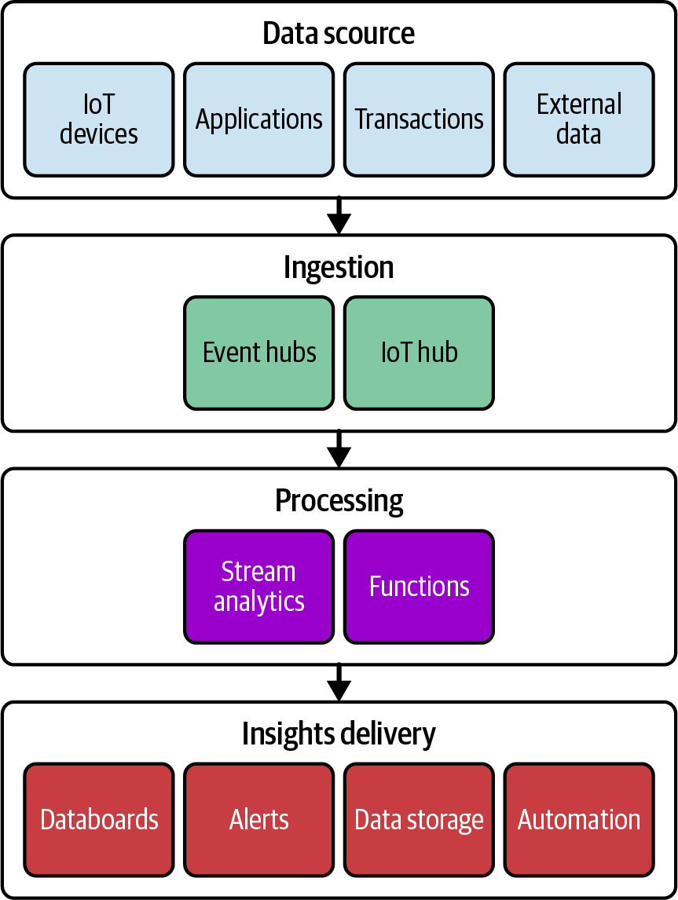
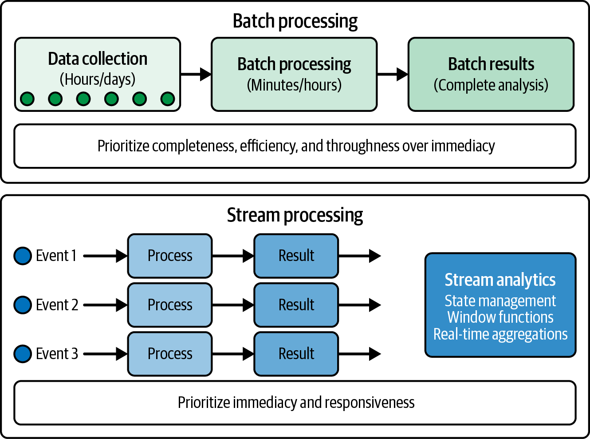

# Chapter 10 Real-time Analytics

The world today is hyperconnected, and analyzing data as it's created represents a tranformative capability for organizations across industries.
Whether monitoring financial transactions for fraus, optimizing traffic flow in smart cities, or personalizing cusomter experiences on ecommerce platforms, real-time analytics enables immediate insight and action that were impossible with traditional approaches.
This shift from retrospective analysis to instantaneous undertanding fundamentally changes how organizations operate and compete.

Think of real-time analytics as the difference between watching historical footage versus observing events as they unfold.
Traditional batch analyics resembles reviewing security camara footage the next day--valuable for understanding what happened but too late for immediate intervention.
Real-time analytics is like having security personnel monitor live camara feeds, enabling them to respond immediately to emerging situations.
This fundamental shift from reactive to proactive analytics transforms both technological approaches and business capabilities.

Figure below illustrates how data flows from diverse sources through ingestion and processing to deliver immediate insights.
The diagram shows streaming data entering the system on the top, passing through ingestion services and processing engines, and finally serving immediate insights through dashboards, alerts, and operational systems on the bottom.

For the DP-900 exam and anyone working with Azure, understanding real-time analytics is essential.
Azure provides a comprehensive ecosystem of services designed specifically for ingesting, processing, analyzing, and acting on data in real time.
These capabilities enable organizations to create systems that continuously monitor data streams and respond intelligently to changing conditions without human intervention.

**Coverage of Curriculum Objectives**

This chapter addresses the following DP-900 exam objectives:

- Describe considerations for real-time data analytics.
- Decribe the difference between batch and streaming data.
- Identify Microsoft cloud services for real-time analytics.

## Understanding Real-Time Analytics

Real-time analytics fundamentally changes the relationship between data and decision making.
Traditional analytics often involves collecting data over time, storing it in databases or data warehouses. and then periodically analyzing it to identify patterns and insights.
This approach, while valuable for histroical analysis and long-term planning, introduces significant delays betweeen when events occur and when organizations can react to them.
Real-time analytics eliminates this delay, enabling immediate awareness and response to events as they happen.

**Exam Tip**

The DP-900 exam frequently tests you ability to differentiate sceanrios where real-time analytics provides significant advantages over traditional batch processing.
Look for clues in questions about time sensitivity, immediate response requirements, or continuous monitoring needs that indicate real-time approaches would be appropriate.

**EOET**

### The Time-Value Relationship of Data

The value of data often correlates directly with its freshness.
Like many perishable goods, data can loose significant value as time passes from its creation to its analysis and application.
This time-value relationship varies dramatically across different scenarios, creating a spectrum of analytical needs from truly real-time to near-real time to periodic batch analysis.

Consider fraud detection in credit card transactions.
When a fraudulant purchase occurs, the value of detecting it diminishes rapidy with time.
Identifying fraud within milliseconds can block the transaction before it completes.
Detection within seconds might prevent subsequent fradulent purchases.
Discovery within minutes could still limit financial damage.
But finding the fraud during overnight batch processing likely means substantial losses have already occured.
In this scenario, the time-value curve drops precipitously, making real-time analysis essential.

Contrast this with inventory planning for a retail store.
While recent sales data provides valuable input, the difference between analyzing sales patterns within seconds versus hours generally doesn't dramatically impact restocking decisions.
The time-vlaue curve declines much more gradually, making near real-time or even batch processing potentially sufficient.

Understanding this time value relationship helps organizations determine where real-time analytics delivers substantial business value versus where traditional approaches remain adequate.
The most sophisiticated organizations develop a nuanced view that applies different analytical approaches based on the specific time sensitivity of each use case.

When the time-value curve drops sharply--when immediate awareness and response significantly outperform delayed analysis--real-time analytics becomes essential.
Following are some common scenarios where this occurs:

- Operational monitoring systems that detect equipment failures, network intrusions, or service disruptions require immediate awareness to minimize damage.
Every second of delay in identifying issues can translate to significant financial or reputational costs.
- Customer experience optimization relies increasingly on real-time personalization based on current behaviors.
Showing relevant recommendations while a customer browses an ecommerce site provides dramatically better results than sending suggestions the next day based on yesterday's behavior.
- Safety and security applications, from traffic management systems to industrial safety monitoring, depend on instantaneous detection of dangerous conditions.
These scenarios have near-vertical time-value curves, where even seconds of delay can have severe consequences.
- Dynamic pricing systems in industries like transportation, hospitality, and energy adjust rates based on current supply and demand conditions.
These mechanisms deliver optimal results when they incorporate the very latest market information in their calculations.

**Exam Tip**

The DP-900 exam emphasizes understanding when real-time analytics delivers substantial business value.
Focus on recognizing sceanarios where immediate insight and action provide significant advantages over delayed analysis

### The Evolution from Batch to Real-Time Analytics

To appreciate the transformative nature of real-time analytics, you need to understand how analytical approaches have evolved over time.
This journey from periodic batch processing to continuous real-time analysis reflects botch technological advances and changing business requirements.

Traditional batch analytics emerged in a era of more limited computational resources and simplier data environments.
Organizations would collect data throughout the day, then process it during overnight windows when systems had spare capacity.
This approach worked well when business processes operated on daily cycles and when competitive advantage didn't depend on immediate responsiveness.
Reports generated each morning would inform the day's activities, creating a predictable rhythm of data collection, processing, and application.

As competitive pressures increased and digital transformation accelerated, organizations began to seek faster analytical cycles.
This led to the development of microbatch processing, which reduced analytical windows from days to hours or even minutes.
Instead of running major analysis jobs once daily, systems would process smaller batches of data more frequently.
This approach maintained the fundamental batch paradigm but shortened the delay between data creation and analysis.

The true revolution came with stream processing, which fundamentally changed the analytical paradigm.
Rather than collecting data and periodically processing it, steam analyics continuously processes each piece of information as it arrives.
This eliminates the artifical boundaries between data collection and analysis, creating a continuous flow from event occurence to insight generation and action.
The result is analytical systems that can detect patterns, identify anomalies, and trigger responses within milliseconds of event occuring.

**Exam Tip**

While the DP-900 exam cocers fundamental real-time analytics concepts, advanced patterns llike Lambda and Kappa architectures that combine batch and streaming approaches are beyond the exam scope but worth noting for real-world implementations.

**EOET**

This evolution continues today with the development of complex event processing systems that can correlate multiple events across different streams to identify sophisticated patterns in real time.
These advanced capabilities enable organizations to detect nuanced situations that would be invisible when looking at individual events or single dataa streams in isolation.

The technological progression from batch to stream processing parallels a business evolution from reactive to proactive to predictive operations.
Real-time analytics enables organizations not just to respond quickly to events that have already occured but increasingly to anticipate and prevent issues before they fully develop.
This predictive capability represents the frontier of real-time analytics, where immediate analysis of current conditions informs predictions about future states, enabling truly proactive management.

### The Architecture of Real-Time Analytics

Real-time analytics requires a fundamentally different architectural apporach than tranditional batch processing.
While batch systems typically follow an ETL paradigm with clear separation between stages, real-time systems must continuously ingest, process, and deliver insights without these distinct boundaries.
This architectural shift affects every component of the analytics pipeline.

A well-designed real-time analytics architecture generally includes several key components working together to convert continuous data streams into actionable insights.

The data source layer encompasses the diverse origins of streaming data--IoT devices sending telemetry, mobile applications reporting user activities, financial systems recording transactions, websites tracking visitor behaviors, and industrial equipment reporting operational metrics.
Unlike batch systems that might connect to sources periodically, real-time architectures maintain conitinous connection to these sources, often through publish-subscribe messaging patterns.

The ingestion layer recieves and buffers incoming data streams, handling the potentially massive volume and velocity of real-time information.
This critical component must scale dynamically to accomodate variable input rates while preventing data loss during volume spikes.
Modern ingestion systems provide durability guarantees even under extreme load conditions, ensuring complete data capture regardless of downstream processing capacity.

The processing layer represents the analytical heart of the system, continuously analyzing incoming data to detect patterns, calculate metrics, identify anomalies, or recognize complex events.
This component employs techniques like windowing (analyzing data within time-based or count-based boundaries), stateful processing (maintaining context across events), and pattern detection.
The processing occurs continuously as data arrives, rather than waiting for batch boundaries.

The storage layer captures both raw streaming data and processed results, but with significant differences from batch storage.
While batch systems might optimize primarily for analytical query performance, real-time storage must balance multiple requirements: low-latency access for immediate analysis, high-throughput ingestion for continuous data capture, and efficent long-term retention for histroical analysis and compliance.
This often leads to multitiered storage approaches where recent data resides in high-performance stores while older information moves to more cost-effective solutions.

The serving layer delivers insights to consumers through dashboards, alerts, APIs, or direct integration with operational systems.
Unlike batch systems that might update reports daily, this layer continuously refreshes visualizations, triggers notifications, or invokes automated responses as new insights emerge.
The focus shifts from comprehensive reports to targeted, actionable information delivered at the momemnt of maximum relevance.

Throughout these components, a monitoring and management layer provides observability into the health and performance of real-time pipeline.
This cross-cutting concern becomes especially critical in streaming systems, where issues can affect the accuracy and timeliness of ongoing analysis rather than simply delaying periodic batch jobs.

This architectural approach enables organizations to process data constantly rather than periodically, eliminating the inherent delays associated with batch processing.
However, it also introduces new challenges around handling out-of-order data, managing system state, ensuring exactly-once processing semantics, and maintaining system performance under variable loads.
Addressing these challenges requires specialized technologies and design patterns that differ significantly from traditional batch analytics.

## Batch Versus Streaming Data

While we've touched on some differences between batch and streaming apporaches, let's examine this distinction more throughly.
Understanding the characteristics, advantages, and appropriate use cases for each paradigm helps organizations select the right apporach for different analytical needs.

The figure highlights the fundamental difference between batch and stream processing approaches.
The batch model (top) shows data accumulating before periodic processing, while the streaming model (bottom) demonstrates continuous processing as each data point arrives.
The diagram emphasives how batch processing introduces inherent delays between data creation and insight generation, while streaming enables immediate analysis.

### Characteristics of Batch Processing

Batch processing represents the traditional approach to data analytics, with a history stretching back to the earliest days of computing.
Despite technological advances and the rise of streaming alternatives, batch processing remains appropriate and efficent for many scenarios.
To understand when to use this approach, we need to recognize its fundamental characteristics.

At its core, batch processing operates on bounded datasets--collections of data that have definite beginning and endind points.
These might be daily transaction records, monthly customer activity logs, or quarterly financial results.
The bounded nature of these datasets enables several key characteristics of batch procesing.

First, batch processes typically have complete visibility into the entire dataset before producing results.
This completeness enables sophisticated analytical techniques that require multiple passes through the data or that analyze relationships across the entire dataset.
Complex aggregations, joins betwen different data sources, and global optimizations become possible when the full dataset is availbe for processing.

Second, batch processes generally prioritize throughput over latency.
Since they operate on data that's already been collected rather than requiring immediate processing of new events, they can optimize for efficent resource utilization and maximum data processing rates.
This often leads to higher overall throughput at the cost of increased end-to-end processing time.

Third, batch proccesses tend to follow predictable, scheduled execution patterns.
Organizations typically run batch jobs at regular intervals--nightly, weekly, or monthly--creating a rhythmic cycle of data collection, processing, and analysis.
This predictability simplifies resource planning, as systems can allocate computing capacity according to known processing windows.

Finally, batch processing typically employs sophisticated fault tolerance mechanisms that prioritize data completeness and accuracy over processing speed.
If errors occurs during processing, batch systems can retry operations, restore from checkpoints, or even restart entire jobs to ensure accurate results.
This approach acknowledges that getting the right anser eventually is more important than getting an approximate answer immediately.

These characteristics make batch processing well suited for several scenarios.

For example, historical analysis and reporting thrive under batch processing, where completeness and accuracy outweigh immediacy.
Financial reporting, compliance documentation, and business intelligence dashboards comparing performance across extended periods benefit from the thoroughness of batch approaches.

Complex analytical workloads that require multiple processing stages or that integrate diverse datasets often work best as batch processes.
Data science workflows, machine learning model training, and complex pattern detection acros historical data leverage the computational efficency of batch processing.

Resource-intensive processing that would strain systems if attempted in real time can operate efficency through scheduled batch windows.
Tasks like rebuilding recommendation models, recalculating complex network relationships, or processing high-resolution images benefit from the controlled resource allocation of batch approaches.

**Real-World Scenario**

A financial institution processes loan applications through a nightly batch system that incorporates credit history, income verification, property apprasials, and risk assessments.
This approach allows comprehensive analysis of all factors before making lending decisions, prioritizing accuracy and completemess over immediate approvals.
While not providing instant decisions, this overnight batch process still meets customer expectations for mortgage applications while ensuring thorough risk evaluation.

**EORWS**

### Characteristics of Streaming Data

In constrast to the bounded, periodic nature of batch processing, streaming data represents a continuous, never-ending flow of information.
This fundamental difference in data characteristics necessitates entirely different processing approaches.
Understanding these characteristics helps clarify when streaming analytics delivers substantial advantages.

Streaming data is inherently unbounded--it has no defined beginning or end but continues flowing indefinitely.
The continuous nature reflects many real-world processes: customer interactions with websites, sensor readings from IoT devices, financial market transactions, and social media activity.
These information sources don't produce cleanly packaged datasets with clear boundaries but generate endless sequences of events.

The unbounded nature of streaming data leads to several important characteristics.
First, streaming data typically arrives with time sensitivity, where the value of each data point diminishes rapidly after creation.
While batch data might retain consistent value whether processsed immediately or hours later, streaming data often contains signals requiring prompt detection and response.
This time sensitivity drives the need for immediate processing rather than periodic analysis.

Second, streaming data generally arrives at variable rates rather than in predictable volumes.
A social media monitoring system might see dramatic spikes during major events, while an IoT platform might experience daily patterns reflecting human activity cycles.
This variability challenges processing systems to scale dynamically rather than allocating fixed resources as many batch systems do.

Third, streaming data often requires stateful processing that maintains context across events.
While batch processes can analyze complete datasets to identify patterns, streaming systems must detect meaningful signals incrementally as data arrives.
This requires maintaining state information--tracking cumulative metrics, remembering recent events, or building evolving profiles--to provide the context needed for analysis.

Finally, streaming data frequently contains time-based relationships that affect its processing.
Event might arrive out of chronological order due to network delays or device characteristics.
Analytical windows might need to span time periods to identify patterns.
Common windowing approaches include tumbling windows (fixed, nonoverlapping time periods), sliding windows (overlapping time periods), and session windows (variable periods based on activity).
These temporal aspects introduce complexities that don't exist in batch processing, where the entire dataset is available for analysis regardless of creation time.

These charactersistics make streaming analytics essential for several key scenarios.

Monitoring and alerting applications depend on continuous data analysis to detect anomalies, threshold violations, or emerging patterns that require attention.
Whether monitoring network security, industrial equipment performance, or patient vital signs, these applications need immediate awareness of changing conditions.

Real-time decision systems leverage streaming analytics to make automated choices based on current conditions.
Dynamic pricing engines, fraud detection systems, and automated trading platforms all require instantaneous analysis to function effectively.

Customer experience optimization increasingly depends on understanding and responding to user behavior as it happens.
Personalization engines, recommendation systems, and contextual assistance features deliver maximum value when they incorporate the most recent user actions.

Operational intelligence across transportation networks, utility grids, telecommunications systems, and supply chains relies on continuous awareness of current conditions.
These complex systems benefit from real-time dashboards and control systems that reflect actual conditions rather than historical states.

**Exam Tip**

The DP-900 exam tests your understanding of when streaming analytics provides essential capabilities versus where batch procesing remains appropriate.
Focus on recognizing time sensitivity, continuous data characteristics, and immediate response requirements that indicate streaming approaches are needed.

**EOET**

### When to Use Each Approach

Given their fundamental differences, how should organizations determine which processing approach best fits their analytical needs?
Several key considerations influene this decision, helping to match technical approaches with business requirements.

Time sensitivity represents perhaps the most crucial factor. When the value of insights diminishes rapidly after events occur--when minutes or seconds matter--streaming analytics becomes essential.
Applications requiring immediate anomaly detection, real-time decision making, or instantanous personalization benefit from the minimal latency of streaming approaches.
Conversely, when analytical value remains relatively constant whether delivered immediately or hours later, batch processing may provide sufficient timelines while offering advantages in effciency and completeness.

Analytical complexity influences approach selection significantly.
Batch processing excels at complex, multistage analytical workflows that require multiple passes through data or sophisticated joins across diverse datasets.
The ability to see the entire dataset enables global optimizations and complex algorithms that may be difficult or impossible in streaming contexts.
Streaming analytics, while increasingly sophisticated, still faces greater challenges with complex analytical requirements due to its incremental processing nature.

Data completeness requirements affect requirements affect paradigm choice substantially.
Some analytical scenarios demand exhaustive processing of every relevant data point to deliver valid results.
Financial reconciliation, compliance reporting and certain scientific analyses fall into this category, generally favoring batch approaches that can ensure comprehensive data inclusion.
Other scenarios can deliver valuable insights from partial or sampled data, making them suitable for streaming approaches even with their inherent possibility of missing information during processing transitions or failures.

Technical infrastructure considerations often influence processing decisions.
Organizations with substantial investments in batch processing systems may extend these platforms rather than adopting entirely new streaming architectures.
Conversely, cloud native organizations building new analytical capabilities may embrace streaming-first approaches that leverage modern cloud services designed for real-time analytics.

The most sophisticated organizations recognize that batch and streaming aren't competing alternatives but complementry approaches addressing different analytical needs.
These organizations develop nuanced strategies that apply each paradigm where it delivers maximum value, often implementing lambda architectures that combine both apporaches within unified analytical frameworks.
This pragmatic perspective focuses on matching processing characteristic to business requirements rather than advocating universally for either batch or streaming.

**Exam Warning**

The DP-900 exam often presents scenarios asking you to select the most appropriate processing approach.
Be careful not to automatically choose streaming for every scenario.
Instead, recognize when batch processing provides adequate timeliness while offering advantages in completeness, efficency, or analytical complexity.

## Microsoft Cloud Services for Real-Time Analytics

Having explored the concepts and characteristics of real-time analytics, let's examine how Microsoft implements these capabilities in Azure.
The cloud has revolutionized real-time analytics by providing fully managed services that eliminate much of the infrastructure complexity traditionally associated with stream processing.
Azure offers a comprehensive ecosystem of services designed specifically for ingesting, processing, analyzing, and visualizing streaming data.

### Azure Event Hubs

At the foundation of many real-time analytics architectures lies Azure Event Hubs, a cloud native event ingestion service designed to capture and buffer massive volumes of streaming data.
Think of Event Hubs as a specialized digital funnel--capable of recieving millions of events per second from distributed sources, preserving their order within partitions, and making them available for down-stream processing.

Event Hubs serve as the entry point for streaming data from diverse sources: IoT devices sending telemetry, web applications tracking use activities, logging systems recording service operations, or custom applications producing event streams.
Its primary responsibility involvves efficently capturing this continuous flow of information, providing temporary buffering, and enabling multiple down-stream systems to process the same events independently.

Several key capabities make Event Hubs paricularly valuable for real-time analyics scenarios.

Massive scalability enables ingestion of millions of events per second with sub-millisecond latency.
This performance capacity handles both consistent high-volume streams and unexpected traffic spikes that might overwhelm less robust ingestion systems.
Organizations can start with minimal capacity and scale dynamically as streaming volumes grow.

Partitioning provides the fundamental organizing priciple of streaming data within Event Hubs.
The service distributes incoming events across partitions based on partition keys, maintaining strict ordering of events within each partition.
This structure enables parallel processing while preserving sequence relationships for event sharing the same key--a critical capability for analyzing related events in the correct order.

The publisher-subscriber model allows multiple independent consumers to process the same event streams without interfering with each other.
Each consumer tracks its own position within the stream, enabling diverse applications to analyze the same events at different rates or using different processing approaches.
This capability supports sophisticated architectures where multiple analytical system operate concurrently on the same data streams.

Time retention features maintain events for configurable periods, typically between one and seven days.
This temporary persistance enables replay of recent events for analytical purposes or recovery after downstream processsing failures.
The retention provides a buffer that decouples event producers from consumers, allowing each component to operate at its own pace within reasonable time frames.

Event Hubs particularly excels in high-volume ingestion scenarios that benefit from its partitioning approach and temporary retention capabilities.

IoT telemetry collections represent a perfect fit for Event Hubs, with its ability to handle millions of device messages while preserving their sequence within device-specific partitions.
The service's support for AMQP (Advanced Message Quening Protocol, an enterprise messaging standard) and MQTT (Message Quening Telemetry Transpor, a lightweight protocol designed for IoT devices) enables direct integration with many IoT devices and gateways.

Application monitoring systems increasingly adopt event-driven architectures (systems that respond to events as they occur rather than operating on fixed scheduules) that feed operational metrics, logs, and trace information into analytics pipelines.
Event Hubs serves as an ideal ingestion point for these monitoring events, enabling real-time operational awareness across distributed applications.

Activity tracking for websites, mobile applications, and digital services generates valuable behavioral data for analysis.
Event Hubs efficently captures these user interaction events, making them available for immediate processing at power personalization, anomaly detection, or experience optimization