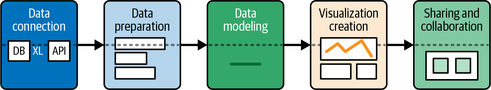

# Chapter 11. Data Visualization with Power BI

In a world awash with data, the ability to transform raw numbers into meaningful insights represents one of the most valuable skills in modern business.
Data visualization stands at the intersection of analytical thinking and visual communication, enabling us to discover patterns, identify trends, and communicate findings in ways that drive understanding and action.
Microsoft Power BI has emerged as a transformative tool in this space, democratizing access to sophisticated data visualization and analysis capabilties that were once available only to specialized analysts.

Think of Power BI as the bridge between your organization's data and the decisions it informs.
Tranditional approaches to business intelligence often created bottlenecks where technical experts had to mediate between data and business users.
Power BI fundamentally changes this dynamic by providing intutive tools that enable business professionals to directly explore data, create visualizations, and share insights without requring deep technical expertise.
Theis democratization accelerates the journey from data to insight to action, enabling organizations to become truly data driven in their decision making.

The Power BI visualization framework showin in figure shows how data flows from diverse sources through transformation and modeling to create interactive visualizations and dashboards.
The diagram illustratres the progression from data connection on the left through preparation, modeling, visualization, and sharing on the right, highlighting how Power BI unifies thes previously seprate processes into a cohesive analytical experience

For the DP-900 exam and anyone working with Azure's data ecosystem, understanding Power BI is essential.
As Microsoft's flagship business intelligence platform, Power BI integrates seamlessly with Azure data services, forming a crucial component in the modern data toolkit.
Whether you're visualizing results from Azure Synapse Analytics, creating dashboards from Azure Data Explorer queries, or building reports from Azure SQL Database, Power BI provides the visualization layer that translates sophisticated data processing into accessible business insights

**Coverage of Curriculum Objectives**

This chapter addresses the following DP-900 exam objectives:

- Describe data visualization in Microsoft Power BI.
- Identify capabilities of Power BI.
- Describe features of data models in Power BI.
- Identify apporpriate visualizations for data.

## Understanding Data Visualization

Before diving into the specifics of Power BI, it's important to understand the foundational principles of data visualization and why it has become such a critical component of modern data strategies.
At its core, data visualization leverages the human brain's remarkable capacity for visual processing to make complex information more accessible, patterns more obvious, and insights more compelling.

**Exam Tip**

The DP-900 exam often presents scenarios asking you to idenfify apporpriate visualization approaches for specific business requirements.
Focus on understanding the connection between business questions and data types, and the visualizations that effectively answer those questions.

## The Power of Visual Communication

The human brain processes visual infomation extraordinarily effeciently--neuroscience research indicates that most of the brain is devoted to visual processing when compared to touch and hearing.
This biological advantage gives visual communication tremendous power to convey complex infomation quickly and memorably.
Effective data visualizations leverage this neural capacity to translate abstract numbers into visual patterns that we can intuitively grasp, often revealing insights that might remain hidden in rows and columns of numbers.

This visual advantage becomes increasingly important as organizations contend with the growing volume and complexity of data.
When an analyst reviews a spreadsheet with dozens of columns and thousands of rows, identifying patterns requires substanial mental effort and time.
The same data presented through thoughful visualization can reveal patterns, outliers, and trends almost immediately.
This efficency doesn't just save time.
It fundamentally changes how we interact with information, enabling more exploratory apporaches and rapid iteration through analytical questions.

Beyond more efficency, visualization often reveals insights that might never emerge from examining raw data.
Our visual system excels at patterm recognition in ways that complement statistical analysis.
A skilled analyst might identify a correlation coefficent between variables, but visualization can reveal whether that correlation is consistent across the data range, is influenced by outliers, or contains interesting subpatterns that warrant further investigaion.
This complementary relationship between quantitive analysis and visual exploration forms the foundation of modern business intelligence.

Visualization also transforms how we communicate findings to others.
While technical speacialists might comfortably interpret complex tables or statistical outputs, most business decision makers absorb information more effectively through visual formats.
A well-designed dashboard or report doesn't merely present data.
It tells a story, highlights key insights, and guides viewers toward informed decisions.
This narrative quality makes visualization particularly valuable for driving organizational alignment around data-informed strategies.

## The Evolution of Business Intelligence

To appreciate Power BI's significance, it helps to understand the evolution of business intelligence and the challenges that tradtional approaches face. Early business intelligence followed a highly centralized model where IT departments controlled data access and specialized analysts created reports.
While this model ensured data quality and governance, it created signfiant bottlenecks: business users often waited weeks or months for new reports, limiting the organization's ability to respond quickly to new questions or changing conditions.

The first wave of democratization came through self-service reporting tools that gave business users more direct access to data and reporting capabilities.
However, these tools often separated different aspects of the analytical workflow across multiple systems: data preparation might occur in one tool, modeling in another, visualization in a third, and sharing through yet another platform.
This fragmentation created friction in the analytical process and required users to develop expertise across multiple systems.

Power BI represents the next evolution--a unified platform that integrates the complete analytical workflow from data connection through prepatation, modeling, visualization, and sharing.
This integrated approach dramatically reduces the technical barriers to sophisticated analysis, enabling barriers to sophisticated analysis, enabling business users to answer their own questions without waiting for specialized support.
The result is more agile, responsive decision making that leverages data assets more effectively across the organization.

This democratization doesn't eliminate the need for data professionals.
Rather, it transforms their role from report creators to platform enablers who establish data models, goverance frameworkds, and analytical patterns that business users can leverage. 
The result is a collaborative ecosystem where technical specialists and business experts work together more effectively, with each contributing their unique expertise to the analytical process.

**EXAM TIP**

For the DP-900 exam, understand that Power BI represents a unified approach to business intelligence that integrates previously separate processes (data connection, preparation, modeling, visualization, and sharing) into a cohesive platform accessible to both business users and data professionals.

**EOET**

### The Analytical Workflow

Understand how Power BI support the complete analytical workflow helps contexualize its various component and capabilities.
This workflow represents the journey from raw data to actionalbe insights, incorporating several key stages that work together to transforma information into understanding.

The analytical journey typically begins with data connection--acessing the diverse sources where relevany information resides.
Modern organizations rarely store all their valuable data in a single location;instead, it's distributed across operational systems, data warehouses, cloud platforms, SaaS applications, and local files.
Power BI provides hundreds of built-in connectors that simplify access to this distributed landscape, enabling analysts to bring together infomation regardless of where it physically resides.

Once connected, data often requires transformation before it's suitable for analysis.
Raw operational data typically contains inconsistencies, missing values, or structural issues that must be addressed to enable reliable analysis.
Sometimes the required information exists but needs restructuing to answer specific analytical questions.
The data preparation stage addresses these challenges, clearning, and shaping information into a form that supports the intended analysis.

With clean, properly strutured data available, the modeling stage established relationships between different data elements and defines the analytical foundation.
This stage creates a semantic layer that translates raw data into business concepts, establishing metrics, hierarchies, and relationship that align with how the organization understands its operations.
Effective modeling makes complex data accessible to business users by expressing it in familiar terms rather than technical structures.

The visualization stage transforms modeled data into charts, graphs, maps, and other visual formats that reveal patterns and communicate findings.
This stage leverages visual design principles to high-light important insights, provide context for interpretation, and enable interactive exploration.
Effective visualization doesn't merely present data attractively.
It throughfully selects visual formats that highlight the most importatant aspects of the information for the specific questions being addressed.

Finally, the sharing stage delivers insights to stakeholders who can take action based on the analysis.
This might involve publishing interactive dashboards, distributing static reports, embedding visualizations in operational applications, or collaborating on analytical findings.
The sharing state closes the loop from data to decision, ensuring that analytical work drives real business impact rather than remaining isolated in analytical tools.

Throughout this workflow, Power BI provides integrated capabilities that enable smooth progression from one stage to the next without switching between disparate tools.
This integration significantly reduces the technical barriers to sophisticated analysis, enabling business users to complete the entire journey from question to insight within a unified environment.

The figure shows the analytical workflow as implemented in Power BI, highlighting how different Power BI tools support each stage of the journey from data to insight.
The diagram shows Power BI Desktop spanning the connection, preparation, modeling, and visualization stages, while Power BI Service extends across visualization and sharing.
Power BI Dataflows support the preparation stage, and Power BI Report Builder provides additional visualization capabilities.
The workflow emphasizes how Power BI provides integrated capabilities across the entire analytical process.

## Power BI Capabilities

With this foundational understanding of data visualization and the analytical workflow, let's explore the specific capabilities that Power BI provides to support data-driven decision making.
Power BI isn't a single application but rather a family of connected tools and services that work together to deliver a comprehensive business intelligence platform.

### Power BI Components

The Power BI ecosystem includes several core components that serve different parts of the analytical workflow and different user needs.
Understanding these components and how they interrelate helps organizations implement effective Power BI strategies that balance self-service flexibility with appropriate goveranance and control.

Power BI Desktop represents the primary authoring environment for creating reports and data models.
This free Windows application provides comprehensive capabilities for connecting to data, transforming it into suitable analytical structures, establishing data models, and creating interactive visualizations.
Desktop serves as the development environment where most complex analytical work occurs before publishing to the Power BI Service for broader consumption.

Power BI Service provides the cloud-based platform for sharing, collaborating on, and consuming Power BI content.
After developing reports in Desktop, analysts publish them to Power BI Service, where they can be organized into workspaces, assembled into dashboards, scheduled for automatic refresh, and shared with appropriate audiences.
Service also provides web-based editing capabilities for creating and modifying reports directly in the browser, though with somewhat fewer capabiliites than the full Desktop application.

Power BI Mobile offers tailored applications for iOS, Andriod, and Windows devices that enable consumption of Power BI content while on the go.
These applications provide secure access to reports and dashboards optimized for touch interfaces and smaller screens, ensuring that decision makers can access critical insights regardless of their location.
Mobile apps support both online access to the latest data and offline viewing of previously accessed reports when connectivity isn't available.

Power BI Report Builder supports paginated reports--precisely formatted, pixel-perfect documents optimized for printing or PDF generation.
While standard Power BI reports excel at interactive analysis, paginated reports address scenarios requiring exact layout control, such as invoices, statements, or regulatory documents.
Report Builder complements the core Power BI tools by addressing these specialized formatting requirements that interactive reports aren't designed to handle.

Power BI Dataflows enable centralized data preparation that multiple reports can leverage.
Rather than having each report implement its own data transfromation logic, dataflows establish reusable preparation pipelines that promote consistency and efficency.
These dataflows can be created through the same visual interface available in Power BI Desktop or through more advanced options for data engineers, providing appropriate tools for diffrent user expertise levels

**Real-world Scenario**

A healthcare provider uses Power BI components for different audiences and needs.
Clinical analysts uses Power BI Desktop to develop sophisticated reports analyzing patient outcomes and treatment effectiveness.
They publish these reports to Power BI service where department heads access interactive dashboards showing key performance indicators.
Doctors and nurses use the Power BI Mobile app to check patient metrics while making rounds.
The finanace department uses Report Builder to create precisely formatted cost reports for regulatory submission.
Throughout the organization, dataflows ensure that patient, treatment, and financial data is consistently prepared for analysis regardless of which team is using it.

**EORWS**

The components work together to form a comprehensive ecosystem that supports different aspects of the analytical workflow development environment needed by analysts crearing sophisiticated reports.
Power BI Desktop provides the robust development environment needed by analysts creating sophisiticated reports.
Power BI service delivers the sharing and collaboration platform that connects creators with consumers.
Mobile apps ensure access regardless of location.
Report Builder addresses specialized formatting needs.
Dataflows promote reusability and consistency in data preparation.
By providing integrated components tailored to different needs, Power BI enables effective collaboration between technical and business users throughout the analytical process.

### Connectivity and Data Access

The journey from data to insight necessarily behins with acessing relevant infomartion.
Power BI excels at connecting to the remarkably diverse data landscape that modern organizations maintain, providing hundreds of built-in connectors that simplify integration across data sources.
This connectivity capability transforms how organizations leverage their distributed data assets, enabling comprehensive analysis across previously siloed information.

Power BI's database connectivitiy spans the spectrum from traditional on-premises databases to modern cloud platforms.
Built-in connectors support Microsoft SQL Serverr, Oracle, MySQL, PostgreSQL, and other common database systems regardless of whether they're hosted on premises or in cloud environments.
These connectors handle the technical complexities of database connectivity while providing options for importanting data into the Power BI model or querying it directly through DirectQuery mode.

Cloud platform integration provides seamless connectivity with Azure data services and other cloud platforms.
Power BI connects natively to Azure SQL Database, Azure Synapse Analytics, Azure Data Explorer, Cosmos DB, and other Azure data services.
This integration extends beyond Microsoft's ecosystem to include AWS services like Redshift and S3, Google's BigQuery, and other cloud platforms, enabling comprehensive analysis regardless of where data resides.

Application connectivity enables analysis of data from hundreds of business applications and services. Built-in connectors for Salesforce, Dynamics 365, SAP, ServiceNow, Google Analytics, and many other applications provide access to valuable operational data without requiring technical extraction processes.
These application connectors particularly benefit business analysts who need to analyze data from the systems they use daily but lack the technical expertise to extract it through custom integration methods.

File and content system support ensures access to information stored in less structured formats across organizational repositiories.
Power BI easily connects to data in Excel files, CSV documents, XML files, JSON data, and other common formats.
This connectivity extends to content systems like SharePoint, OneDrive, Google Drive, Dropbox, and other platforms where organizations store document-based information, enabling analysis of data regardles of its storage format.

Intenet and service connectivity provides access to online data sources ranging from web services and REST APIs, Azure DevOps, GitHub, and many other service-based data sources.
The platform also provides access to curated public datasets through the Power BI Datamarket, enabling enrichment of internal data with external information for more comprehensive analysis.

This expectional connectivity transforms how organizations approach analysis by dramatically reducing the technical barriers to comprehensive data integration.
Rather than requiring specialized ETL processes or developer resouces to access distributed information, business analysts can directly connect to relevant sources through intutive interfaces.
The result is more agile, responsive analysis that leverages more of the organization's data assets to drive better decision making.

### Data Transformation and Preparation

Raw data rarely arrives in the perfect form for analysis.
Power BI provides robust capabilities for transforming and preparing data, enabling analysts to clean, reshape, and enhance information before visualization.
These capabilities bridge the gap between how data is stored for operational purposes and how it needs to be structured for effective analysis.

Power Query serves as the primary data preparation engine within Power BI, providing a visual interface for defining transformation steps without requiring programming expertise. Through this interface, analysts can filter rows, remove or rename columns, change data types, split or merge columns, unpivot data for better analysis, and perform hundreds of other transformations through initutive dialogues. 
Behind the scenes, Power Query generates M code (Power Query Formula Language) that defines these transformations as a reproducible sequence that applies automaticallly when data refereshes.

For advanced users, Power Query supports direct editing of the underlying M code, enabling more sophisticated transofrmations beyong what the visual interface provides.
This multilayered approach makes data preparation accessible to business analysts while providing the depth needed by data professionals, accomodating different skill levels within the same platform.

Data cleansing capabilities address the quality issues commonly found in raw operational data.
Power BI can automatically detect and fix inconsistent values, handle missing data through removal or replacement, and standardize formatting for dates, numbers, and text.
These cleansing capabilities ensure that analysis builds on reliable informtion rather than being undermined by data quality issues.

Structural transformations reshape data to better support analytial needs.
Power BI can pivot or unpivot data to convert between wide and tall formats, split hierachical fields into separate columns, generate data tables that enable time intelligence, and implement other structural changes that align dtaa with analytical requirements.
These transformations bridge between how systems naturally store data and how it needs to be structured for effective visualization and analysis.

Data enrichment features enhance source information with additional context that improves analytical value.
Power BI can merge multiple tables to combine related information, append similar tables to consolidate data from different periods or systems, add custom columns calculated from existing fields, and implement sophisticated grouping operations.
These enrichment capabilities enable more nuanced analysis by connecting and extending data beyond what individual source systems provide.

Query folding optimization automatically pushes apporpriate transformations back to source database systems rather than processing them within Power BI.
When connecting to databases like SQL Server or Azure Synapse Analytics, Power BI intelligently translates transformation steps into native SQL queries that execute on the source system.
This optimization leverages the procesing power of database platforms while minimizing data transfer, significantly improving performance for large datasets.

### Data Modeling

At the heart of effective business intelligence lies the data model--the semantic layer that transforms raw data into business-meaningful concepts, relationships, and calculations.
Power BI provides sophisticated modeling capabilities that establish the analytical foundation upon which virtualizations build, enabling business users to interact with data in familiar terms rather than technical structures.

Relationship management establishes connections betwen different tables in the model, enabling integrated analysis across related information.
Power BI automatically detects potential relationships based on column names and values, while also providing manual controls for defining more complex connections.
These relationships enable natural navigation across business dimensions- such as analyzing sales by customer, product, and time period--without requiring users to understand the technical joins that connect underlying tables.

The relationship in Power BI support various cardinality types (one-to-many, many-to-one, many-to-many) and filtering behaviors (single direction, bidirecitonal), accommodating complex business models while maintaining performance.
This flexiblity enables representation of sophisticated business relationships while providing appropriate control over how filters propagate through the model during analysis.

Power BI's tabular modeling approach, based on the Microsoft Analysis Services engine, organizes data into tables and columns that users can understand without database expertise.
Rather than exposing technical structures like database schemas, the model presents information in business terms--sales amound rather than `transaction.amount_decimal` and customer name rather than `cust_lname_tx`. This business-oriented representation makes data more accessible to nontechnical users while maintaining the necessary analytical rigor.

The Data Analysis Expressions (DAX) language provides a formula language specifically designed for analytical calculations within tabular models.
DAX enalbes the definition of calculated columns that dervice new values within tables, measures that calavulate aggregations based on user selections, and calbulated tables that generate new structurs based on exisiting data. 
Through these calculation capbiliites, Power BI transforms basic data into rich analytical metrics that directly answer business questions.

DAX particularly excels at time intelligence caluclations that analyze performance over time periods, comparisions between different period, and cumulative values across time.
Functions like `SAMEPERIODLASTYEAR`, `TOTALYTD` and `DATEADD` simplify otherwise complex-time-based analysis, enalbing business users to track performance trends without implementing sophisticated data handling logic.
These time intelligence capabilities prove especially valuable for monitoring business performance against historical benchmarks and targets.

Advanced modeling features address more complex analytical requirements through sophisiticated capabilities.
Row-level security restricts data access based on user identity, ensuing that individuals see only information appropriate for their role. 
Perspectives create focused views of the model for different business purposes.
Model calculation groups establish reusable calculation patterns.
Composite models combine imported data with DirectQuery connections to balance performance with freshness.
These advanced features enable Power BI to support enterprise-scale analytical needs while maintaining appropriate governance.

**EXAM TIP**

For the DP-900 exam, understand that Power BI's modeling capabilities create a semantic layer that translates technical data structures into business-meaningful concepts and calculations, enabling business users to analyze information in familar terms rather than technical structures.

## Visiualization and Analysis

With data connected, prepared, and modeled, Power BI's visualization capabilities transform infomation into interactive insights that reveal patterns and drive decisions.
Rather than providing just a fixed library of charts, Power BI delivers a comprehensive visualization platform that combines a rich selection of built-in visuals with extensive customization options and an expandable framework for specialized needs.

The built-in visualization library incluses dozens of standard charts and graphs covering the core analytical requirements that most business scenarios demand.
Bar and column charts for comparing values across categories, line and area charts for analyzing trends over time, scatter, and bubble charts for examining relationships between variables, pie and donut charts for showing composition, tables and matrices for presenting detailed information--these fundamental visuals address the most common analytical needs directly out of the box.

Beyond these standard options, Power BI includes specialized visualizations for particular analytical purposes: maps for geographic analysis, treemaps, and sunbursts for hierachical data, waterfalls for cumulative impact, funnels for sequential processes, gauges, and cards for key metrics, decomposition trees for mulilevel analysis, and many others.
This specialized library ensures appropriate visualization options for diverse analytical requirements without requiring custom development.

There are diverse visualization in Power BI and are arranged by analytical purpose.
The top section displays comparison visuals like bar charts, column charts, and radar charts.
The middle section shows trend visualization including line charts, area charts, and waterfalls.
The bottom section illustrates relationship visualizations such as scatterplots, treemaps, and network diagrams.
Each visual type is shown with a small example illustration in the right pane, demonstrating the range of visualization approaches available for different analytical purposes.

Interactive features transform static visualizations into dynamic analytical tools that users can manipulate to explore data from different perspectives.
Cross-filtering enables selection in one visual to automatically highlight related infomation in other visuals, revealing relationships across different aspects of the data.
Slicers and filters provide intutive controls for focusing analysis on specific dimensions or values.
Drill-down capabilities enable navigation from summary information to increasing levels of detail.
These interactive elements transform the analytical experience from passive consumption to active exploration.

The custom visualization framework extends Power BI's capabilities through an open platform for specialized visuals.
The marketplace includes hundreds of custom visuals created by Microsoft and third-party developers, addressing specialized needs from advanced statistical analysis to industry specific visualizations.
Organizations can also develop proprietary visuals using the open source Power BI Custom Visuals SDK, enabling visualization approaches tailored to specific business requirements or corporate design standards.

Visual formatting options provide extensive control over the appearance and behavior of visualizations, enabling reports that align with organizational branding while maximizing analyitical clarity.
Power BI includes comprehensive settings for colors, fonts, labels, backgrounds, borders, and other visual elements, along with responsive layout capabilities that adapt to different screen sizes and form factors.
These formatting options balance aesthetic quality with analytical functionality, ensuring that reports are both visually appealing and informative.

AI-assisted analysis enhances traditional visualization with AI capabilities that automatically discover patterns and explain trends.
Power BI can automatically identify key influencers driving a metric, detect anomalies in time-series data, perform decomposition analysis to explain changes over time, and generate natural language summaries of key findings.
These AI features help users discover insights they might otherwise miss, accelerating the analysis process while reavling deeper patterns within the data.

### Sharing and Collaboration

The value of analytical insights emerges when they reach the people who take action based on the information.
Power BI provides comprehensive capabilities for sharing and collaborating on analyses, ensuring that insights flow effectively throughout the organization to drive better decisions.

Power BI workspaces serve as collaborative containers for organizing and managing related content.
These workspaces function as shared environments where teams can collectively develop, publish, and maintain reports, dashobards, and datasets.
Access controls determine who can contribute to the workspace versus who can simply view its contents, enabling appropriate governance while promoting collaboration among analytical teams.
Workspaces typically align with organizational structures like departments or project teams, creating natural boundaries for content organization and security.

Dashboards provide curated views that combine visualizations from multiple reports into unified analytical surfaces.
Unlike reports, which typically organize multiple visualizations about a single business area, dashboards integrate the most important visuals from different reports to provide comprehensive overviews.
These dashvoards enable exexutives and managers to monitor key metrics across business functions without navigating multiple reports, simplifying high-level performance monitoring while providing paths to detailed analysis when needed.

Apps package related content for distribution to broader audiences throughout the organization.
A Power BI app might include multiple reports and dashboards organized into a coherent experience for a particular user group or analytical purpose.
Apps support phased release management where content developers can stage and test changes before updating the production version, ensuring quality while enabling continous improvement.
For consumers, apps provide a curated entry point to related content without requiring navigation through the broader workspace structure.

Mobile experiences ensure that insights remain accessible regardless of user location.
Power BI's mobile applications provide optimized interfaces for phones and tablets, with responsive layouts that adapt visualizations to smaller screens and touch-based interaction.
Mobile annotations allow on-the-go collaboration, enabling field personnel to highlight findings or raise questions direcly within the mobile experience.
Location-based filtering can automatically focus reports on the user's current geography, a capability that is particularly valuable for regional sales or service teams.

**Exam Warning**

The DP-900 exam may ask about data refresh and access limitations in different Power BI licensing levels. Remember that free Power BI accounts cannot access refresh capabilities in Power BI Service, while Pro and Premium licenses provide different refresh frequencies and sharing options.
Know that basic differences between these licensing tiers from a technical capability perspective.

**EOEW**

Embedding capabilities integrate Power BI analytics directly into operational applications, portals, and websites.
Rather than requiring users to switch contexts between their operational systems and analytical tools, embedding delivers insights within the applications people already use daily.
This integration ranges from simple iframe embedding in internal portals to sophisticated integration in customer-facing applications using the Power BI API.
The embedded approach particularly benefits operational users who need analytical context for transactional decisions without switching to separate analytical tools.

Export and integration options connect Power BI with other productivity and collaboration tools.
Users can export visualizations and data to Excel for additional analysis, PowerPoint for presentations, or PDF for distribution.
Integration with Microsoft Teams embeds reports directly in collaborative workspaces, enabling data-driven discussions without leaving the team environment.
These integration capabilities ensure that insights flow freely between analytical and productivity contexts, enhancing collaboration around data-driven decisions.

## Data Models in Power BI

While visualizations provide the visible interface that users interact with, the underlying data model determines what questions they can effectively answer and how intuitively they can navigate between different analytical perspectives.
Understanding how Power BI implements data modeling helps explain why some reports provide fluid, responsive analytical experiences while others feel limited or fragmented.

### Model Structures and Relationships

The foundation of effective Power BI modeling lies in properly structured tables connecte through well-defined relationships.
These structures determine how data elemeents relate to each other and how users can navigate between different analytical dimensions during exploration.

The star schema design represents the most common and effective approach for analytical models in Power BI.