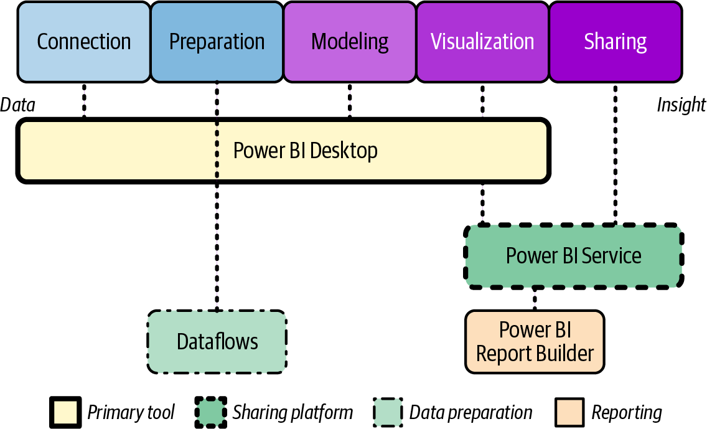

# Chapter 11. Data Visualization with Power BI

In a world awash with data, the ability to transform raw numbers into meaningful insights represents one of the most valuable skills in modern business.
Data visualization stands at the intersection of analytical thinking and visual communication, enabling us to discover patterns, identify trends, and communicate findings in ways that drive understanding and action.
Microsoft Power BI has emerged as a transformative tool in this space, democratizing access to sophisticated data visualization and analysis capabilties that were once available only to specialized analysts.

Think of Power BI as the bridge between your organization's data and the decisions it informs.
Tranditional approaches to business intelligence often created bottlenecks where technical experts had to mediate between data and business users.
Power BI fundamentally changes this dynamic by providing intutive tools that enable business professionals to directly explore data, create visualizations, and share insights without requring deep technical expertise.
Theis democratization accelerates the journey from data to insight to action, enabling organizations to become truly data driven in their decision making.

The Power BI visualization framework showin in figure shows how data flows from diverse sources through transformation and modeling to create interactive visualizations and dashboards.
The diagram illustratres the progression from data connection on the left through preparation, modeling, visualization, and sharing on the right, highlighting how Power BI unifies thes previously seprate processes into a cohesive analytical experience

For the DP-900 exam and anyone working with Azure's data ecosystem, understanding Power BI is essential.
As Microsoft's flagship business intelligence platform, Power BI integrates seamlessly with Azure data services, forming a crucial component in the modern data toolkit.
Whether you're visualizing results from Azure Synapse Analytics, creating dashboards from Azure Data Explorer queries, or building reports from Azure SQL Database, Power BI provides the visualization layer that translates sophisticated data processing into accessible business insights

**Coverage of Curriculum Objectives**

This chapter addresses the following DP-900 exam objectives:

- Describe data visualization in Microsoft Power BI.
- Identify capabilities of Power BI.
- Describe features of data models in Power BI.
- Identify apporpriate visualizations for data.

## Understanding Data Visualization

Before diving into the specifics of Power BI, it's important to understand the foundational principles of data visualization and why it has become such a critical component of modern data strategies.
At its core, data visualization leverages the human brain's remarkable capacity for visual processing to make complex information more accessible, patterns more obvious, and insights more compelling.

**Exam Tip**

The DP-900 exam often presents scenarios asking you to idenfify apporpriate visualization approaches for specific business requirements.
Focus on understanding the connection between business questions and data types, and the visualizations that effectively answer those questions.

## The Power of Visual Communication

The human brain processes visual infomation extraordinarily effeciently--neuroscience research indicates that most of the brain is devoted to visual processing when compared to touch and hearing.
This biological advantage gives visual communication tremendous power to convey complex infomation quickly and memorably.
Effective data visualizations leverage this neural capacity to translate abstract numbers into visual patterns that we can intuitively grasp, often revealing insights that might remain hidden in rows and columns of numbers.

This visual advantage becomes increasingly important as organizations contend with the growing volume and complexity of data.
When an analyst reviews a spreadsheet with dozens of columns and thousands of rows, identifying patterns requires substanial mental effort and time.
The same data presented through thoughful visualization can reveal patterns, outliers, and trends almost immediately.
This efficency doesn't just save time.
It fundamentally changes how we interact with information, enabling more exploratory apporaches and rapid iteration through analytical questions.

Beyond more efficency, visualization often reveals insights that might never emerge from examining raw data.
Our visual system excels at patterm recognition in ways that complement statistical analysis.
A skilled analyst might identify a correlation coefficent between variables, but visualization can reveal whether that correlation is consistent across the data range, is influenced by outliers, or contains interesting subpatterns that warrant further investigaion.
This complementary relationship between quantitive analysis and visual exploration forms the foundation of modern business intelligence.

Visualization also transforms how we communicate findings to others.
While technical speacialists might comfortably interpret complex tables or statistical outputs, most business decision makers absorb information more effectively through visual formats.
A well-designed dashboard or report doesn't merely present data.
It tells a story, highlights key insights, and guides viewers toward informed decisions.
This narrative quality makes visualization particularly valuable for driving organizational alignment around data-informed strategies.

## The Evolution of Business Intelligence

To appreciate Power BI's significance, it helps to understand the evolution of business intelligence and the challenges that tradtional approaches face. Early business intelligence followed a highly centralized model where IT departments controlled data access and specialized analysts created reports.
While this model ensured data quality and governance, it created signfiant bottlenecks: business users often waited weeks or months for new reports, limiting the organization's ability to respond quickly to new questions or changing conditions.

The first wave of democratization came through self-service reporting tools that gave business users more direct access to data and reporting capabilities.
However, these tools often separated different aspects of the analytical workflow across multiple systems: data preparation might occur in one tool, modeling in another, visualization in a third, and sharing through yet another platform.
This fragmentation created friction in the analytical process and required users to develop expertise across multiple systems.

Power BI represents the next evolution--a unified platform that integrates the complete analytical workflow from data connection through prepatation, modeling, visualization, and sharing.
This integrated approach dramatically reduces the technical barriers to sophisticated analysis, enabling barriers to sophisticated analysis, enabling business users to answer their own questions without waiting for specialized support.
The result is more agile, responsive decision making that leverages data assets more effectively across the organization.

This democratization doesn't eliminate the need for data professionals.
Rather, it transforms their role from report creators to platform enablers who establish data models, goverance frameworkds, and analytical patterns that business users can leverage. 
The result is a collaborative ecosystem where technical specialists and business experts work together more effectively, with each contributing their unique expertise to the analytical process.

**EXAM TIP**

For the DP-900 exam, understand that Power BI represents a unified approach to business intelligence that integrates previously separate processes (data connection, preparation, modeling, visualization, and sharing) into a cohesive platform accessible to both business users and data professionals.

**EOET**

### The Analytical Workflow

Understand how Power BI support the complete analytical workflow helps contexualize its various component and capabilities.
This workflow represents the journey from raw data to actionalbe insights, incorporating several key stages that work together to transforma information into understanding.

The analytical journey typically begins with data connection--acessing the diverse sources where relevany information resides.
Modern organizations rarely store all their valuable data in a single location;instead, it's distributed across operational systems, data warehouses, cloud platforms, SaaS applications, and local files.
Power BI provides hundreds of built-in connectors that simplify access to this distributed landscape, enabling analysts to bring together infomation regardless of where it physically resides.

Once connected, data often requires transformation before it's suitable for analysis.
Raw operational data typically contains inconsistencies, missing values, or structural issues that must be addressed to enable reliable analysis.
Sometimes the required information exists but needs restructuing to answer specific analytical questions.
The data preparation stage addresses these challenges, clearning, and shaping information into a form that supports the intended analysis.

With clean, properly strutured data available, the modeling stage established relationships between different data elements and defines the analytical foundation.
This stage creates a semantic layer that translates raw data into business concepts, establishing metrics, hierarchies, and relationship that align with how the organization understands its operations.
Effective modeling makes complex data accessible to business users by expressing it in familiar terms rather than technical structures.

The visualization stage transforms modeled data into charts, graphs, maps, and other visual formats that reveal patterns and communicate findings.
This stage leverages visual design principles to high-light important insights, provide context for interpretation, and enable interactive exploration.
Effective visualization doesn't merely present data attractively.
It throughfully selects visual formats that highlight the most importatant aspects of the information for the specific questions being addressed.

Finally, the sharing stage delivers insights to stakeholders who can take action based on the analysis.
This might involve publishing interactive dashboards, distributing static reports, embedding visualizations in operational applications, or collaborating on analytical findings.
The sharing state closes the loop from data to decision, ensuring that analytical work drives real business impact rather than remaining isolated in analytical tools.

Throughout this workflow, Power BI provides integrated capabilities that enable smooth progression from one stage to the next without switching between disparate tools.
This integration significantly reduces the technical barriers to sophisticated analysis, enabling business users to complete the entire journey from question to insight within a unified environment.

The figure shows the analytical workflow as implemented in Power BI, highlighting how different Power BI tools support each stage of the journey from data to insight.
The diagram shows Power BI Desktop spanning the connection, preparation, modeling, and visualization stages, while Power BI Service extends across visualization and sharing.
Power BI Dataflows support the preparation stage, and Power BI Report Builder provides additional visualization capabilities.
The workflow emphasizes how Power BI provides integrated capabilities across the entire analytical process.

## Power BI Capabilities

With this foundational understanding of data visualization and the analytical workflow, let's explore the specific capabilities that Power BI provides to support data-driven decision making.
Power BI isn't a single application but rather a family of connected tools and services that work together to deliver a comprehensive business intelligence platform.

### Power BI Components

The Power BI ecosystem includes several core components that serve different parts of the analytical workflow and different user needs.
Understanding these components and how they interrelate helps organizations implement effective Power BI strategies that balance self-service flexibility with appropriate goveranance and control.

Power BI Desktop represents the primary authoring environment for creating reports and data models.
This free Windows application provides comprehensive capabilities for connecting to data, transforming it into suitable analytical structures, establishing data models, and creating interactive visualizations.
Desktop serves as the development environment where most complex analytical work occurs before publishing to the Power BI Service for broader consumption.

Power BI Service provides the cloud-based platform for sharing, collaborating on, and consuming Power BI content.
After developing reports in Desktop, analysts publish them to Power BI Service, where they can be organized into workspaces, assembled into dashboards, scheduled for automatic refresh, and shared with appropriate audiences.
Service also provides web-based editing capabilities for creating and modifying reports directly in the browser, though with somewhat fewer capabiliites than the full Desktop application.

Power BI Mobile offers tailored applications for iOS, Andriod, and Windows devices that enable consumption of Power BI content while on the go.
These applications provide secure access to reports and dashboards optimized for touch interfaces and smaller screens, ensuring that decision makers can access critical insights regardless of their location.
Mobile apps support both online access to the latest data and offline viewing of previously accessed reports when connectivity isn't available.

Power BI Report Builder supports paginated reports--precisely formatted, pixel-perfect documents optimized for printing or PDF generation.
While standard Power BI reports excel at interactive analysis, paginated reports address scenarios requiring exact layout control, such as invoices, statements, or regulatory documents.
Report Builder complements the core Power BI tools by addressing these specialized formatting requirements that interactive reports aren't designed to handle.

Power BI Dataflows enable centralized data preparation that multiple reports can leverage.
Rather than having each report implement its own data transfromation logic, dataflows establish reusable preparation pipelines that promote consistency and efficency.
These dataflows can be created through the same visual interface available in Power BI Desktop or through more advanced options for data engineers, providing appropriate tools for diffrent user expertise levels

**Real-world Scenario**

A healthcare provider uses Power BI components for different audiences and needs.
Clinical analysts uses Power BI Desktop to develop sophisticated reports analyzing patient outcomes and treatment effectiveness.
They publish these reports to Power BI service where department heads access interactive dashboards showing key performance indicators.
Doctors and nurses use the Power BI Mobile app to check patient metrics while making rounds.
The finanace department uses Report Builder to create precisely formatted cost reports for regulatory submission.
Throughout the organization, dataflows ensure that patient, treatment, and financial data is consistently prepared for analysis regardless of which team is using it.

**EORWS**

The components work together to form a comprehensive ecosystem that supports different aspects of the analytical workflow development environment needed by analysts crearing sophisiticated reports.
Power BI Desktop provides the robust development environment needed by analysts creating sophisiticated reports.
Power BI service delivers the sharing and collaboration platform that connects creators with consumers.
Mobile apps ensure access regardless of location.
Report Builder addresses specialized formatting needs.
Dataflows promote reusability and consistency in data preparation.
By providing integrated components tailored to different needs, Power BI enables effective collaboration between technical and business users throughout the analytical process.

### Connectivity and Data Access

The journey from data to insight necessarily behins with acessing relevant infomartion.
Power BI excels at connecting to the remarkably diverse data landscape that modern organizations maintain, providing hundreds of built-in connectors that simplify integration across data sources.
This connectivity capability transforms how organizations leverage their distributed data assets, enabling comprehensive analysis across previously siloed information.

Power BI's database connectivitiy spans the spectrum from traditional on-premises databases to modern cloud platforms.
Built-in connectors support Microsoft SQL Serverr, Oracle, MySQL, PostgreSQL, and other common database systems regardless of whether they're hosted on premises or in cloud environments.
These connectors handle the technical complexities of database connectivity while providing options for importanting data into the Power BI model or querying it directly through DirectQuery mode.

Cloud platform integration provides seamless connectivity with Azure data services and other cloud platforms.
Power BI connects natively to Azure SQL Database, Azure Synapse Analytics, Azure Data Explorer, Cosmos DB, and other Azure data services.
This integration extends beyond Microsoft's ecosystem to include AWS services like Redshift and S3, Google's BigQuery, and other cloud platforms, enabling comprehensive analysis regardless of where data resides.

Application connectivity enables analysis of data from hundreds of business applications and services. Built-in connectors for Salesforce, Dynamics 365, SAP, ServiceNow, Google Analytics, and many other applications provide access to valuable operational data without requiring technical extraction processes.
These application connectors particularly benefit business analysts who need to analyze data from the systems they use daily but lack the technical expertise to extract it through custom integration methods.

File and content system support ensures access to information stored in less structured formats across organizational repositiories.
Power BI easily connects to data in Excel files, CSV documents, XML files, JSON data, and other common formats.
This connectivity extends to content systems like SharePoint, OneDrive, Google Drive, Dropbox, and other platforms where organizations store document-based information, enabling analysis of data regardles of its storage format.

Intenet and service connectivity provides access to online data sources ranging from web services and REST APIs, Azure DevOps, GitHub, and many other service-based data sources.
The platform also provides access to curated public datasets through the Power BI Datamarket, enabling enrichment of internal data with external information for more comprehensive analysis.

This expectional connectivity transforms how organizations approach analysis by dramatically reducing the technical barriers to comprehensive data integration.
Rather than requiring specialized ETL processes or developer resouces to access distributed information, business analysts can directly connect to relevant sources through intutive interfaces.
The result is more agile, responsive analysis that leverages more of the organization's data assets to drive better decision making.

### Data Transformation and Preparation

Raw data rarely arrives in the perfect form for analysis.
Power BI provides robust capabilities for transforming and preparing data, enabling analysts to clean, reshape, and enhance information before visualization.
These capabilities bridge the gap between how data is stored for operational purposes and how it needs to be structured for effective analysis.

Power Query serves as the primary data preparation engine within Power BI, providing a visual interface for defining transformation steps without requiring programming expertise. Through this interface, analysts can filter rows, remove or rename columns, change data types, split or merge columns, unpivot data for better analysis, and perform hundreds of other transformations through initutive dialogues. 
Behind the scenes, Power Query generates M code (Power Query Formula Language) that defines these transformations as a reproducible sequence that applies automaticallly when data refereshes.

For advanced users, Power Query supports direct editing of the underlying M code, enabling more sophisticated transofrmations beyong what the visual interface provides.
This multilayered approach makes data preparation accessible to business analysts while providing the depth needed by data professionals, accomodating different skill levels within the same platform.

Data cleansing capabilities address the quality issues commonly found in raw operational data.
Power BI can automatically detect and fix inconsistent values, handle missing data through removal or replacement, and standardize formatting for dates, numbers, and text.
These cleansing capabilities ensure that analysis builds on reliable informtion rather than being undermined by data quality issues.

Structural transformations reshape data to better support analytial needs.
Power BI can pivot or unpivot data to convert between wide and tall formats, split hierachical fields into separate columns, generate data tables that enable time intelligence, and implement other structural changes that align dtaa with analytical requirements.
These transformations bridge between how systems naturally store data and how it needs to be structured for effective visualization and analysis.

Data enrichment features enhance source information with additional context that improves analytical value.
Power BI can merge multiple tables to combine related information, append similar tables to consolidate data from different periods or systems, add custom columns calculated from existing fields, and implement sophisticated grouping operations.
These enrichment capabilities enable more nuanced analysis by connecting and extending data beyond what individual source systems provide.

Query folding optimization automatically pushes apporpriate transformations back to source database systems rather than processing them within Power BI.
When connecting to databases like SQL Server or Azure Synapse Analytics, Power BI intelligently translates transformation steps into native SQL queries that execute on the source system.
This optimization leverages the procesing power of database platforms while minimizing data transfer, significantly improving performance for large datasets.

### Data Modeling

At the heart of effective business intelligence lies the data model--the semantic layer that transforms raw data into business-meaningful concepts, relationships, and calculations.
Power BI provides sophisticated modeling capabilities that establish the analytical foundation upon which virtualizations build, enabling business users to interact with data in familiar terms rather than technical structures.

Relationship management establishes connections betwen different tables in the model, enabling integrated analysis across related information.
Power BI automatically detects potential relationships based on column names and values, while also providing manual controls for defining more complex connections.
These relationships enable natural navigation across business dimensions- such as analyzing sales by customer, product, and time period--without requiring users to understand the technical joins that connect underlying tables.

The relationship in Power BI support various cardinality types (one-to-many, many-to-one, many-to-many) and filtering behaviors (single direction, bidirecitonal), accommodating complex business models while maintaining performance.
This flexiblity enables representation of sophisticated business relationships while providing appropriate control over how filters propagate through the model during analysis.

Power BI's tabular modeling approach, based on the Microsoft Analysis Services engine, organizes data into tables and columns that users can understand without database expertise.
Rather than exposing technical structures like database schemas, the model presents information in business terms--sales amound rather than `transaction.amount_decimal` and customer name rather than `cust_lname_tx`. This business-oriented representation makes data more accessible to nontechnical users while maintaining the necessary analytical rigor.

The Data Analysis Expressions (DAX) language provides a formula language specifically designed for analytical calculations within tabular models.
DAX enalbes the definition of calculated columns that dervice new values within tables, measures that calavulate aggregations based on user selections, and calbulated tables that generate new structurs based on exisiting data. 
Through these calculation capbiliites, Power BI transforms basic data into rich analytical metrics that directly answer business questions.

DAX particularly excels at time intelligence caluclations that analyze performance over time periods, comparisions between different period, and cumulative values across time.
Functions like `SAMEPERIODLASTYEAR`, `TOTALYTD` and `DATEADD` simplify otherwise complex-time-based analysis, enalbing business users to track performance trends without implementing sophisticated data handling logic.
These time intelligence capabilities prove especially valuable for monitoring business performance against historical benchmarks and targets.

Advanced modeling features address more complex analytical requirements through sophisiticated capabilities.
Row-level security restricts data access based on user identity, ensuing that individuals see only information appropriate for their role. 
Perspectives create focused views of the model for different business purposes.
Model calculation groups establish reusable calculation patterns.
Composite models combine imported data with DirectQuery connections to balance performance with freshness.
These advanced features enable Power BI to support enterprise-scale analytical needs while maintaining appropriate governance.

**EXAM TIP**

For the DP-900 exam, understand that Power BI's modeling capabilities create a semantic layer that translates technical data structures into business-meaningful concepts and calculations, enabling business users to analyze information in familar terms rather than technical structures.

## Visiualization and Analysis

With data connected, prepared, and modeled, Power BI's visualization capabilities transform infomation into interactive insights that reveal patterns and drive decisions.
Rather than providing just a fixed library of charts, Power BI delivers a comprehensive visualization platform that combines a rich selection of built-in visuals with extensive customization options and an expandable framework for specialized needs.

The built-in visualization library incluses dozens of standard charts and graphs covering the core analytical requirements that most business scenarios demand.
Bar and column charts for comparing values across categories, line and area charts for analyzing trends over time, scatter, and bubble charts for examining relationships between variables, pie and donut charts for showing composition, tables and matrices for presenting detailed information--these fundamental visuals address the most common analytical needs directly out of the box.

Beyond these standard options, Power BI includes specialized visualizations for particular analytical purposes: maps for geographic analysis, treemaps, and sunbursts for hierachical data, waterfalls for cumulative impact, funnels for sequential processes, gauges, and cards for key metrics, decomposition trees for mulilevel analysis, and many others.
This specialized library ensures appropriate visualization options for diverse analytical requirements without requiring custom development.

There are diverse visualization in Power BI and are arranged by analytical purpose.
The top section displays comparison visuals like bar charts, column charts, and radar charts.
The middle section shows trend visualization including line charts, area charts, and waterfalls.
The bottom section illustrates relationship visualizations such as scatterplots, treemaps, and network diagrams.
Each visual type is shown with a small example illustration in the right pane, demonstrating the range of visualization approaches available for different analytical purposes.

Interactive features transform static visualizations into dynamic analytical tools that users can manipulate to explore data from different perspectives.
Cross-filtering enables selection in one visual to automatically highlight related infomation in other visuals, revealing relationships across different aspects of the data.
Slicers and filters provide intutive controls for focusing analysis on specific dimensions or values.
Drill-down capabilities enable navigation from summary information to increasing levels of detail.
These interactive elements transform the analytical experience from passive consumption to active exploration.

The custom visualization framework extends Power BI's capabilities through an open platform for specialized visuals.
The marketplace includes hundreds of custom visuals created by Microsoft and third-party developers, addressing specialized needs from advanced statistical analysis to industry specific visualizations.
Organizations can also develop proprietary visuals using the open source Power BI Custom Visuals SDK, enabling visualization approaches tailored to specific business requirements or corporate design standards.

Visual formatting options provide extensive control over the appearance and behavior of visualizations, enabling reports that align with organizational branding while maximizing analyitical clarity.
Power BI includes comprehensive settings for colors, fonts, labels, backgrounds, borders, and other visual elements, along with responsive layout capabilities that adapt to different screen sizes and form factors.
These formatting options balance aesthetic quality with analytical functionality, ensuring that reports are both visually appealing and informative.

AI-assisted analysis enhances traditional visualization with AI capabilities that automatically discover patterns and explain trends.
Power BI can automatically identify key influencers driving a metric, detect anomalies in time-series data, perform decomposition analysis to explain changes over time, and generate natural language summaries of key findings.
These AI features help users discover insights they might otherwise miss, accelerating the analysis process while reavling deeper patterns within the data.

### Sharing and Collaboration

The value of analytical insights emerges when they reach the people who take action based on the information.
Power BI provides comprehensive capabilities for sharing and collaborating on analyses, ensuring that insights flow effectively throughout the organization to drive better decisions.

Power BI workspaces serve as collaborative containers for organizing and managing related content.
These workspaces function as shared environments where teams can collectively develop, publish, and maintain reports, dashobards, and datasets.
Access controls determine who can contribute to the workspace versus who can simply view its contents, enabling appropriate governance while promoting collaboration among analytical teams.
Workspaces typically align with organizational structures like departments or project teams, creating natural boundaries for content organization and security.

Dashboards provide curated views that combine visualizations from multiple reports into unified analytical surfaces.
Unlike reports, which typically organize multiple visualizations about a single business area, dashboards integrate the most important visuals from different reports to provide comprehensive overviews.
These dashvoards enable exexutives and managers to monitor key metrics across business functions without navigating multiple reports, simplifying high-level performance monitoring while providing paths to detailed analysis when needed.

Apps package related content for distribution to broader audiences throughout the organization.
A Power BI app might include multiple reports and dashboards organized into a coherent experience for a particular user group or analytical purpose.
Apps support phased release management where content developers can stage and test changes before updating the production version, ensuring quality while enabling continous improvement.
For consumers, apps provide a curated entry point to related content without requiring navigation through the broader workspace structure.

Mobile experiences ensure that insights remain accessible regardless of user location.
Power BI's mobile applications provide optimized interfaces for phones and tablets, with responsive layouts that adapt visualizations to smaller screens and touch-based interaction.
Mobile annotations allow on-the-go collaboration, enabling field personnel to highlight findings or raise questions direcly within the mobile experience.
Location-based filtering can automatically focus reports on the user's current geography, a capability that is particularly valuable for regional sales or service teams.

**Exam Warning**

The DP-900 exam may ask about data refresh and access limitations in different Power BI licensing levels. Remember that free Power BI accounts cannot access refresh capabilities in Power BI Service, while Pro and Premium licenses provide different refresh frequencies and sharing options.
Know that basic differences between these licensing tiers from a technical capability perspective.

**EOEW**

Embedding capabilities integrate Power BI analytics directly into operational applications, portals, and websites.
Rather than requiring users to switch contexts between their operational systems and analytical tools, embedding delivers insights within the applications people already use daily.
This integration ranges from simple iframe embedding in internal portals to sophisticated integration in customer-facing applications using the Power BI API.
The embedded approach particularly benefits operational users who need analytical context for transactional decisions without switching to separate analytical tools.

Export and integration options connect Power BI with other productivity and collaboration tools.
Users can export visualizations and data to Excel for additional analysis, PowerPoint for presentations, or PDF for distribution.
Integration with Microsoft Teams embeds reports directly in collaborative workspaces, enabling data-driven discussions without leaving the team environment.
These integration capabilities ensure that insights flow freely between analytical and productivity contexts, enhancing collaboration around data-driven decisions.

## Data Models in Power BI

While visualizations provide the visible interface that users interact with, the underlying data model determines what questions they can effectively answer and how intuitively they can navigate between different analytical perspectives.
Understanding how Power BI implements data modeling helps explain why some reports provide fluid, responsive analytical experiences while others feel limited or fragmented.

### Model Structures and Relationships

The foundation of effective Power BI modeling lies in properly structured tables connecte through well-defined relationships.
These structures determine how data elemeents relate to each other and how users can navigate between different analytical dimensions during exploration.

The star schema design represents the most common and effective approach for analytical models in Power BI.
This design organizes data into fact tables containing quantiative measurements (like sales amounts or production quantities) and dimension tables containing the contextual attributes for analyzing those measurements (like products, customers, or time periods).
The fact tables connect to dimension tables through relationships, creating a starlike structure with the fact table at the center connected to surrounding dimension tables.

The star schema approach aligns perfectly with how users naturally think about analysis--examining measurements (facts) across different business dimensions.
It enables intutive exploration where users can seamlessly analyze sales by product category, then by customer segment, and then by customer segment, and then by time period, without having to understand the technical relationships connecting these tables.
The star schema also optimizes performance by clearly seperating the typically large fact tables from the smaller dimension tables that provide analytical context.

For more complex business scenarios, snowflake schemas extend the star approach by normalizing dimension tables into multiple related tables.
For example, rather than having a single product dimension with all product-related attributes, a snowflaske might seperate product, categories, and manufacturers into distinct tables.
This normalization can improve data management for rapidly changing dimensions but introduces additional relationship complexity that may impact both performance and user comprehension.
Power BI supports these more complex structures when necessary while generally recommending star schemas for their analytical clarity and performance characteristics.

Relationship types in Power BI determine how filters propagate between tables during analysis.
Most relationships follow a one-to-many cardinality where each row in the "one" table can related to multiple rows in the "many" table, but each row in the "many" table relates to exactly one row in the "one" table.
For example, each product category contains many products, but each product belongs to exactly one category.
These one-to-many relationships reflect natural business hierachies and enable intutive filtering from the "one" side to the "many" side.

In more complex scenarios, Power BI supports many-to-many relationships where row in each table can relate to multiple rows in the other table.
For example, each customer might purchase many products, and each product might be purchased by many customers.
These many-to-many relationships often require bridge tables containing the associations between entities, adding complexity to the model structure.
While Power BI handles these relationships, they require careful design to maintain performance and analytical clarity.

Filter direction controls how selections in one table affect related tables during analysis.
By default, filters flow from the "one" side of relationships to the "many" side but not in reverse direction.
This single-direction filtering prevents unexpected query results where selections in fact table might inadvertently filter dimension tables, causing confusion for users.
In specific scenarios where bidirectional filtering benefits the analytical experience, Power BI allows explicit configuration of bidirectional relationships, though these require careful consideration due to their performance implications and potential for creating ambiguous filter contexts.

**Exam Tip**

For the DP-900 exam, understand that effective Power BI data models typically follow star schema designs with dimension tables connected to fact tables through one-to-many relationships.
This structure optimizes both analytical clarity and query performance while enabling analysis in terms that directly align with how organizations measure performance.

Calculated columns derivce new values within tables based on other columns, creating permanently stored results that appear like any other column.
These calculations might standardize formatting (converting names to proper case), create flags based on conditions (marking high-value customers), or derive new attributes from existing ones (extracting year from date).
Calculated columns are computed when data refreshes and consume storage within the model, making them appropriate for values that many visualizations will reference or that support row-level filtering.

Measures, by contrast, define aggregations that calculate dynamically based on the current filter context rather than storing predetermined results.
A measure for "Total Sales" dynamically calculates the appropriate sum based on whatever filters the user has applied--whether viewing all sales, sales for a specific region, or sales for a particular product category in a specific time period.
This dynamic calculation enables consistent metric definitions that automatically adapt to the user's analytical focus, providing reliable results regardless of visualization context.

The distinction between calculated columns and measures significantly impacts both model performance and analytical flexibility.
Calculated columns consume storage but offer faster retrieval for frequently used values.
Measures require computation during analysis but provide more dynamic results that adapy to filtering context.
Understanding when to use each approach represents a key modeling skill that experienced Power BI developers cultivate through practice and performance testing.

DAX provides the formula language for defining these calculations, offering specific functions for common analytical needs:

    Time intelligence functions
        These simplify analysis across time periods, enabling comparisons like year-over-year growth, rolling averages, or year-to-date accumulations.
        Functions like `SAMEPERIODLASTYEAR`, `DATEADD`, and `TOTALYTD` handle the complexity of calander logic enabling business users to track performance trends without implementing sophisticated date manipulation.
    
    Filter context functions
        These control how calculations respond to the current selection state, enabling conditional logic based on user interactions. `CALCULATE` allows explicit modification of context, `ALL` removes filters to provide baseline comparisions, and `FILTER` applies additional conditions within measures.
        These context functions enable sophisticated analytical patterns that adapt to user explorations paths.
    
    Iterator functions
        These perform row-by-row operations and aggregations beyond simple summation.
        `SUMX`, `AVERAGEX`, and related functions calculate expressions for each row before aggregating the results, enabling weighted averages, conditional aggregations, and other complex calculations that basic aggregates cannot express.
        These iterators prove particuarly valuable for financial and statistical analysis requiring nuanced computation logic.

The combination of these calculation capabilities transform raw data into a rich analytical model that directly answers business questions in familiar terminology.
Rather than requiring users to mentally calculate key metrics from base fields, a well-designed model provides these metrics as predefined measures that enable consistent definition and interpretation through the organization.

### Row-Level Security

As organizations share more broadly through Power BI, controlling who can access specific information becomes increasingly important. Row-level security (RLS) provides a sophisticated approach to data access control, enabling a single report to automatically show different data to differnt users based on their identity or role.

Unlike tradtional security models that control access at the report or dashboard level, RLS operates at the data row level within the model.
This granular approach enables scenarios where regional manager see only data for their own regions, sales representatives access only their own customer information, or department heads view only their own departmental financials--all from the same report and without creating separate versions for each audience.

The implementation of RLS centers on roles and rules defined withing the data model.
Security roles define groups of users with similar access requirements, such as "West Region Managers" or "Finance Department Analysts".
Within each role, DAX filter expressions establish rules that determine which data rows members of that role can access. For example, a region-based rule might specify `[Region] = "West"` or `[Region] = USERPRINCIPAL("Region")`, dynamically filtering based on attributes in the user's organizational profile.

This role-based approach simplifies security management by enabling permission assignment at the role level rather than requiring individual user configuration.
When organizational changes occur, administrators simply update role membership rather than reconfiguring data access rules.
For users with multiple access profiles--such as a regional manager who also has global reporting responsibilities--Power BI supports membership in multiple roles, showing all data accessible through any assigned role.

The dynamic filtering provided by RLS operates automatically and transparently during report interaction.
Users see only the data they have permission to access, with all visualizations, filter, and calculations respecting these security boundaries.
The security remains enforced regardless of how users interact with reports--whether through the Power BI Service, mobile applications, embedded reports, or exported data--ensuring consistent protection across access methods.

**Real-World Scenario**

A global retail organization implements row-level security in its store performance dashboard based on the organizational hierachy.
Store managers see data only for their individual locations, district managers view information for all stores in their districts, regional directors access data across their regions, and corporate executives see the complete global dataset.
This approach delivers personalized analytics to each management level from a single report definition, ensuring consistent metrics and visualization while respecting organizational data access boundaries.

**EORWS**

For the DP-900 exam, understanding the basic concept of row-level security matters more than implementation details.
Remember that RLS enables a single report to show different data to different users based on their identity, with security enforced at the data row level rather than through seperate reports for different audiences.

### DirectQuery and Import Modes

Power BI offers different storage modes that determine how data is accessed and processed during analysis.
These modes present important trade-offs between data freshness, query performance, and model size limitations that influence architectural decisions for Power BI implementations.

Import mode represents the defauly and most common approach, where Power BI imports a copy of the source data into its highly compressed in memory storage engine.
This imported data powers all visualizations and calculations within the report, enabling extermely fast query performance as all data resides in memory in an optimized format.
The import approach particularly benefits scenarios with moderate data volumes where analytical responsiveness outweigbs real-time data requirements.

Several key advantages make import mode the preferred choice for many scenarios.
Query performance remains consistently excellend regardless of source system capabilities, as all queries run against the optimized in-memory copy.
The full Power BI calculation enginer supports sophisiticated DAX expressions and relationships that might not translate to source system queries.
Users can continue analyzing imported data even when diconnected from source systems, enabling offline scenarios through Power BI Desktop or mobile applications.

However, import mode also presents limitations. Imported data represents a snapshot form the time of refresh rather than live information, creating potential delays between operational changes and their analytical visibility.
The entire dataset must fit within Power BI's memory limitations (generally 10 GB for Power BI Premium and 1 GB for shared capacity).
Complex models with numerous tables and relationships may approach these limits, requiring careful optimization.
Frequent refresh requirements can place substaintial load on source systems and consume significant Power BI resource capacity.

DirectQuery mode takes a fundamentally different approach by leaving data in the source system and translating Power BI interactions into native queries against that source.
When users interact with visualizations, Power BI dynamically generates queries (typically SQL) that execute directly against the source database rather than against imported data.
This approach ensures that visualizations always reflect the latest source data while avoiding the need to import potentially massice datasets into Power BI's memory.

This direct approach particularly benefits several scenarios.
For datasetes too large to practically import into Power BI's memory, DirectQuery provides analytical access without size limitations beyond what the source system can handle.
When data changes frequenly and analysis requires the very latest information, DirectQuery ensures that visualizations always reflect current values without waiting for scheduled refreshes.
For organizations with substantial investments in source system optimization, DirectQuery leverages these capabilities rather than duplicating data processing with Power BI.

Like import mode, DirectQuery presents its own trade-offs.
Query performance depends heavily on source system capabilities, with slow source databases creating potentially frustrating analytical experiences.
Not all DAX functions and modeling capabilities are available in DirectQuery mode, as calculations must translate into operations the source system can execute.
Filter operations affect query scope and complexity, sometimes creating performance challenges for highly interactive reports with numerous slicers and filters.

Composite models provide a hybrid approach that combines import and DirectQuery tables within a single model.
Some tables import their data for optimal performance, while others remain in DirectQuery mode for real-time access or to avoid importing excessively large dimensions.
This flexivle approach enables architects to make appropriate mode decisions for each table rather than applying a single approach to the entire model.
Dual storage mode takes this flexibility further by allowing individual tables to operate in both mode simultaneously, dynamically choosing the appropriate mode based on the specific query context.

**Exam Tip**

For the DP-900 exam, understand the fundamental trade-off between import mode (which offers superior performance but with point-in-time data) and DirectQuery mode (which provides real-time data access but depends on source system performance).
Remember that composite models can combine both approaches within a single analytical solution.

**EOET**

## Visualizations in Power BI

With a comprehensive data model established, visualization represents the final step in transforming raw information into accessible insights.
Power BI offers a rich library of visualization types, each designed to communicate specific aspects of data effectively.
Understanding which visualization types best suit different analytical purposes helps create reports that reveal patterns clearly rather than obscuring them behind inappropriate visual choices.

### Choosing the Right Visualization

The selection of appropriate visualizations directly impacts effectively users understand the underlying data.
Rather than simply choosing visualizations based on aesthetic preferences or variety, effective Power BI development matches visualization types to the specific analytical questions they best address.

Comparison visualizations help users understand differences between values across categories or groups.
Bar and column charts excel at this purpose, leveraging the human brain's ability to compare the lengths of bars accurately.
These charts work particularly well for comparing discrete categories like products, regions, or departments.
For comparisions involving multiple measures across categories, clustered column charts or small multiples might reveal patterns more clearly.
When comparing current values against targets, bullet charts provide specialized designs that show progress toward goals within the context of performance ranges.

When visualization needs extend beyond simple comparisions to understanding part-to-whole relationships, different approaches become appropriate.
Pie and donut charts show the composition of a whole divided into categories, though they become difficult to interpret accurately with more than five to seven slices.
Treemaps provide an alternative that uses nested rectangles sized according to value, enabling visualization of hierachical categories while still showing relative proportions.
Stacked bar charts combine comparison and composition by showing both total values and their consituent parts, though at the cost of making comparisons between components more difficult.

Trend analysis over time requires visualizations designed specifically for temporal patterns.
Line charts excel at showing continous trends, making them ideal for metrics tracked over time periods.
Area charts extend this capability by filling the area below the line, emphasizing cumulative impact or showing stacked components over time.
When analysis needs to focus on changes between specific time points rather than continuous trends, column charts might prove more effective despite their discrete nature.
For complex time-based analysis showing both seasonality and long-term trends, small multiples of line charts organized by time period can reveal patterns that single charts might obscure.

Relationship analysis between variable requires specialized visualizations that reveal connections, correlations between variable, optinally using point size and color to incorporte additional dimensions.
For network relationships between entities, network diagrams show connection patterns that might remain hidden in traditional charts.
When analyzing how values distribute across ranges, histograms group data into bins to show frequency distributions that reveal central tendendies and outliers.

Geographic analysis presents unique visualization requirements addressed through specialized map visuals.
Filled maps (choropleth) shade geographic regions based on associated values, effectively showing regional patterns across countries, states, or custom territories.
Point maps display individual locations as dots or bubbles, optionally sized by associated measures to show both position and magnitude.
For scenarios involving movement between locations, flow maps connect origins and destinations with lines weighted by volume, revealing transportion patterns or migration flows.

These various visualization types each excel at specific analytical purposes while potentially creating confusion when misapplied.
An effective Power BI developer matches visualization types to analytical requirements, considering both the question being answered and the characteristics of the underlying data.
This thoughful matching transforms visualization from mere decoration into a powerful analytical tool that reveals patterns effectively and accurately.

**Exam Tip**

The DP-900 exam often presents sceanrios asking you to indentify the most appropriate visualization type for specific analytical questions.
Focus on understanding which visualizations best serve different purposes: bar/column charts for comparisons, line charts for trends, scatterplots for relationships, and maps for geographic data.
Remeber that the best visualization depends on the specific question being answered rather than visual appeal alone.

**EOET**

### Understanding Dashboard and Report Design

Beyond individual visualizations, effective Power BI implementation requires thoughtful organization of visuals into cohesive reports and dashboards.
This design process transforms collections of individual charts into integrated analytical experiences that guide users through data exploration and understanding.

Visual hierachy establishes the relative importance of information through size, position and emphasis. 
Major metrics and key insights typically appear prominently in larger visuals at the top or left of reports (following natural reading patterns), with supporting details in smaller visuals in less prominent positions.
This hierachy guides users through the analytical narrative from high-level findings to supporting details, helping them absorb information in a logical progression rather than becoming overwhelmed by undifferentiated data.

Layout and grouping organizes related visualizations into logical secrions that reinforce relationships between metrics and dimensions.
Effective reports group visuals addressing the same business questions or processes, using consistent section layouts across pages to create predictable patterns that users can navigate intuitively.
This thoughful organization reduces cognitive load by establishing clear information architecture rather than presenting disconnected collections of visualizations.

Interactively design determines how visualizations respond to user interactions and work together to enable exploration.
Cross-filtering connections allow selection in one visual to highlight related information in others, revealing relationships that might otherwise remain hidden.
Drill-through actions enable users to navigate from summary visuals to detailed reports that provide deeper context.
Bookmarks save specific report states that capture important analytical views for future reference.
These interactive elements transform static reports into dynamic exploration tools that adapt to user inquiry paths.

Information density balances comprehensiveness against clarity based on user needs and usage context.
Executive dashboards typically emphasize clarity through focused metrics with minimal detailed visualizations, supporting deeper exploration and investigation.
Mobile experiences require careful density management for smaller screens, often focusing on fewer metrics with progressive disclosure of details through interaction.
This density calibration should align with both user expertise and consumption context to avoid overwhelming inexperienced users while still providing sufficent detail for sophisticated analysis.

Accessibility or inclusivity ensure that reports remain effective for all users regardless of abilities or circumstances.
Color choices should maintain sufficent contrast and include redudant encodings beyong color alone to support users with clor vision defiencies.
Text sizes need to accomodate different visual acuities, with importanant information conveyed through more than just small text.
Alt text descriptions for visualizations enable screen reader interpretation for users with visual impairment.
These accessibility considerations extend the reach of analytical content to diverse audiences while often improving usability for all users regardless of ability.

Performance optimization ensures that reports respond quickly to user interactions, maintaining the flow of analytical exploration without frustrating delays.
Effective optimization strategies include limiting visuals per page to essential elements, using appropriate aggregations instead of row-level details, implementing efficent filter relationships, and leveraging incremental refresh for large datasets.
These optimizations become particularly important for DirectQuery reports where each interaction potentially generates queries against source systems, making thoughtful performance management essential for satisfactory user experiences.

### Implementing Advanced Visualization Techniques

Beyond basic charts and design principles, Power BI offers advanced visualization capabilities that address sophisticated analytical needs and enhance communication effectiveness.
These techniques extend the platform's capabilities for both analytical depth and presentation impact.

Custom visualizations from the AppSource marketplace extend Power BI's built-in library with specialized visuals for particular analytical purposes.
These range from advanced statistical visuals like box plots and violin plots to specialized business visuals like Gannt charts and waterfall charts.
The marketplace includes both free visuals from Microsoft and the community alongside premium offerings from third-party vendors.
For organizations with unique visualization requirements, the custom visual SDK enables development of proprietary visuals tailored to specific business needs or coporate standards.

Conditional formatting dynamically changes visual appearance based on data values or analytical context.
Simple implementations might change color based on value ranges--showing metrics in green, yellow, or red based on performance thresholds.
More sophisticated approaches might adjust multiple visual properties simultanesously. such as combining color, icon, and font weight changes to highlight imporatant values.
This dynamic formatting draws attention to significant information without requiring separate visuals for different conditions, enabling more compact and intuitive presentations.

Small multiples (also called trellis charts) repear the same visualization for different category values, enabling comparison across categories while maintaining consistent visual structure.
Rather than combining multiple categories into a single complex visual, this approach creates seperate instances of the same visual type for each category--showing the same metrics for different regions, products, or time periods in identical mini-charts arranged in a grid.
This technique particularly helps when comparing patterns or trends across categories rather than just individual values, revealing similarities and differences that might be obscured in consolidated visuals.

Narrative text and annotations complement quantitive visualizations with explanatory context that helps users interpret the significance of what they're seeing.
Text boxes provide narrative overviews that explain key findings or methodological context.
Text annotations within charts highlight specific data points or patterns deserving attention.
Together, these textual elements transform collections of charts into analytical stories that guide users through key insights rather than leaving interpretation entirely to the viewer.

Advanced interactivity extends beyond basic filtering to create guided analytical experiences that adapy to user exploration.
Tooltip pages replace simple data tooltips with rich mini-reports that appear when hovering the cursor over data points, providing multidimensional context without cluttering the main report.
Drill-through filters enable navigation from summary views to detailed analysis pre-filtered to the selected context.
Bookmarks linked to buttons allow users to switch betweeen different analytical perpectives with a single click.
These advanced interactions transform reports from static presentations into dynamic exploration tools that respond intelligently to user interests.

AI-powered visualization leverage AI to automatically discover and explain patterns within data.
Key influencer analysis identifies factors most strongly associated with particular outcomes, helping to explain what drives specific results.
Decomposition trees enable multidimensional exploration guided by AI that highlights the most significant paths.
Smart narrative automatically generates textual summaries of key findings without visualizations.
Q&A visuals interpret natural language questions to create appropriate visualizations on demand.
These AI capabilities accelerate insight discovery while making sophisticated analyical techniques accessible to users without specialized expertise.

## Bringing it All Together: Power BI in Practice

Now that you've explored the concepts, components, and capabiliities of Power BI, let's examine how these elements come together in a real-world scenario.
This practical perspective helps illustrate how organizations leverage Power BI to transform raw data into actionable insights that drive better business decisions.

Consider Northern Distributors, a fictional regional distribution company managing a complex supply chain across multiple product categories, warehouses, and retail partners.
The company is implementing Power BI to gain comprehensive visibility into its operations, identify optimization opportunities, and deliver targeted insights to different roles throughout the organization.
It's journey illustrates the practical application of the concepts we've dicussed throughout this chapter.

### The Data Landscape

Northern Distrubutors faces classic buisness intelligence challenges that require a unified analyical approach spanning multiple systems and data sources.

Its operational environment includes an ERP system tracking inventory, orders, and financials; a warehouse management system monitoring product movement and storage; a transportation management system tracking shipments and fleet performance; and a CRM platform managing customer relationship and salws activities.
Each system contains valuable information, but the fragmentation makes comprehensive analysis challenging without a unified analytical layer.

Product and partner data spans thousands of SKUs across dozens of categories, with different profit margins, storage requirements, and inventory turnover rates.
The company works with hundreds of retail partners ranging from major chains to independent stores, each with unique ordering patterns, delivery requirements, and payment terms.
Understanding performance requires analyzing these complex relationships across multiple dimensions simultaneously.

Financial data includes revenue, costs, and profitability metrics tracked at differennt levels of granularity.
The finance team needs to analyze porfitability by product, customer, region, and time period to identify both opportunities and concerns.
Historical trends help forecast future performance, while variance analysis identifies areas requiring attention or intervention.

Operational metrics track inventory levels, order fulfillment rates, delivery times, return rates, and other KPIs that indicate distribution efficency and service quality.
These metrics requires both high-level monitoring for executives and detailed analysis for operational managers responsible for specific areas or processes.

This diverse data landscape creates significant analytical challenges without a unified business intelligence approach.
Individual systems provide limited reporting focused on their specific domains, but understanding cross-functional relationships requires integrated analysis that connects information across organizational boundaries.
Power BI provides the platform to create this integrated view while delivering apporpriate insights to different roles throughout the company.

### The Power BI Implementation

To address these challenges, Northern Distributors implemented a comprehensive Power BI solution that integrates data across systems and delivers targeted analytics to different user groups.

For data integration, the company established a multilayered approach addressing both immediate reporting needs and long-term analytical governance.
Power BI Dataflows handle initial data extraction and standardization, creating reusable transformation logic that multiple reports leverage.
These dataflows connects to source systems through a combination of direct database connections and API integrations, extracting relevant data while applying consistent business rules and transformations.

For the core analytical foundation, it created a comprehensive data model following star schema principles.
Fact tables contain quantitative measurements like sales, shipments, inventory transactions, and financial entries.
Dimension tables provide analytical context through product hierarchies, customer classifications, geographic regions, and detailed date dimensions with fiscal periods and seasonality flags.
Relationship connect these tables, enabling intutive navigation across busines dimensions without requiring users to understand the underlying data structure.

Its calculation layer transforms raw data into meaningful business metrics through DAX measures and calculated columns.
Standard financial measures ensure consistent definitions for revenue, costs, margin, and profitability across all reports.
Inventory measures track stock levels, turnover rates, and days-of-supply with appropriate business logic.
Service measures calculate order fulfillment rates, on-time delivery percentages, and other KPIs that indicate operational performance.
These calculations provide consistent metric definitions that everyone in the organization uses, eliminating debates about how numbers are derived.

For insight delivery, the company created role-focused reports and dashboards targeting specific user needs.
Execute dashboards provide high-level metrics with drill-down capabilities for exploring concerning areas.
Sales reports analyze customer and product performance with detailed filtering and comparatice analysis.
Operations dashboards monitor warehouse and transportation metrics with alerts for expectations requiring attention.
These targeted experiences deliver relevant insights to each role while maintaining consistent definitions and visualizations across reports.

Throughout the implementation, security ensures appropriate data access based on organizational roles.
Row-level security retricts sales representatives to their assigned accounts and regions, while allowing managers to see broader performance within their areas.
The security model balances appropriate access restrictions with sufficent visibility for effective decision making, ensuring that users can see what they need without exposing senstitive information inappropriately.

### The Implementation Approach

Rather than attempting to build this entire solution at once, Northern Distributors took an incremental approach that delivered value at each stage while building towards its comprehensive vision.

The company began with a focused sales analysis implementation addressing the most pressing business questions.
The inital phase connected core sales and customer data, built fundamental measures for revenue and profitability, and created reports analyzing performance by product, customer, and region.
The resulting insights enabled the sales team to identify both growth opportunities and concerning trends, delivering immediate value while establishing the foundation for broader capabilities.

Building on this foundation, the company next incorporated operational analytics across warehousing and transportation.
This phase expanded the data model to include inventory movements, shipment details, and service metrics.
Power BI reports provided visibility into operational efficency, highlighting bottlenecks and optimization opportunities.
The integration between sales and operations data revealed valuable connections between customer ordering patterns and fulfillment challenges, enabling process improvements that enhanced service levels.

With both sales and operations visibility established, Northern Distributors implemented financial analytics that connected performance metrics to profitability outcomes.
This phase incorporated cost allocations, budget comparisons, and trend analysis that helped explain financial results through operational and sales activities.
The resulting insights enabled more sophisticated profitability analysis that identified the true drivers of financial performance beyond simple revenue metrics.

The company's most recent phase focused on predictive analytics and proactive alerting.
This capability analyzes historical patterns to forecast future outcomes, identifying potential inventory shortages, delivery delays, or customer churn risks before they materialize. 
Automated alerts notify appropriate personal when metrics trend toward concerning thresholds, enabling proactive intervention rather than reactive response.

This phase approach delivered value at each stage while building toward a comprehensive analytics ecosystem.
It allowed the organization to learn from each phase before proceeding to the next, adjusting its implementation based on user feedback and emerging requirements.
It also enabled the organization to demonstrate tangible business impact early in the process, building organizational momentum and support for continued investment.

### The Business Outcomes

The Power BI implementation delivered significant business impact for Northern Distributors, transforming how the company operated across multiple dimensions.

Inventory optimization improved dramatically, with reductions in excess stock while maintaining service levels.
By analyzing historical sales patterns, seasonal trend, and lead times within a unified view, company personnel were able to identify opportunities to reduce safety stock for stable products while ensuring adequate inventory for volatile items.
The resulting working capital imrpovements enhanced financial performance while maintaining the service levels customers expected.

Customer profitability analysis revealed surprising insights about the company's account portfolio.
The integrated view of sales, operations, and finance data demonstrated that some high-revenue customers generated minimal profits due to challenging delivery requirements, frequent returns, or substantail service demands.
Conversely, some smaller accounts delivered expectional profitability through efficent ordering patterns and low serivce costs.
This analysis enabled targeted strategy adjustments that improved overall profitability without sacrificing key customer relationships.

Operational efficency increased through data-driven process improvements identified through Power BI analysis.
Cross-functional metrics revealed how decisions in one area affected performance in others--how purchasing patterns influenced warehouse efficency, how delivery scheduling affected transportation utilization, and how product packaging choices impacted handling costs.
By understanding these relationships, the company implemented process changes that improved overall efficency rather than simply optimizing individual functions in isolation.

Decision agility improved substantially as Power BI replaced monthly static reports with near-real-time analytics available on demand.
When market conditions or operational challenges emerged, mangagers could immediately analyze relevant data rather than waiting for scheduled reporting cycles.
This timely insight enabled faster, more confident decisions that addressed issues before they esclated into significant problems.
The self-service capabilities empowered business users to answer their own analyticla questions without requiring IT assistance for each new inquiry.

These outcomes demostrate how Power BI transforms technical capabiliites into business value.
By focusing implementations on specific business challenges and measuring outcomes in business terms, Northern Distrubutors ensured that its analytical investment delivered tangible returns beyond creating attractive dashboards.
The unified analytical view across previously siloed systems revealed insight that would have remained hidden in fragementated reporting, enabling more effective strategy and operations throughout the organization.

## Summary

The evolution of Power BI represents a fundamental tranformation in how organizations approach business intelligence, democratizing access to sophisticated analytical capabilities while integrating previously seperate processes into a cohesive experience.
Power BI enables the complete analytical journey from data connection through preparation, modeling, visualization, and sharing within a unified platform accessible to both business users and data professionals.

Throughout this chapter, we explored how:

- Power BI integrates the complete analytical workflow from data connection through preparation, modeling, visualization, and sharing.
- The platform includes connected components (Desktop, Service, Mobile, Report Builder, Dataflows) that address different aspects of this workflow.
- Data models establish the semantic foundation that transforms raw data into business-meaningful structures and calcuations.
- Visualization selection should align with analytical purpose rather than aesthetic preference alone.

**Exam Tip**

The DP-900 exam frequently presenets sceanarios asking you to identify appropriate Power BI capabilities for specific requirements.
Focus on understanding which components and features address different analytical needs, from data preparation to modeling to visualization to sharing

**EOET**

**Exam Essentials**

For success on the DP-900 exam, focus on these key areas:

- Understanding Power BI components:
    - Know the primary purpose of each Power BI component (Desktop, Service, Mobile, Report Buider, Dataflows).
    - Understand how these components work together to support the analytical workflow.
    - Recognize which component best addresses specific requirements in different sceanrios.
    - Understand the basic differences between licensing tiers from a technical capability perspective.
- Grasping data modeling concepts:
    - Understand star schema design principles and their application in Power BI models.
    - Know the difference between calculated columns and measures and when to use each.
    - Recognize how relationships establish connections between tables and how they affect filtering.
    - Understand the basic concept of row-level security for data access control.
- Identifying appopriate visualizations:
    - Know which visualization types best serve different analytical purposes.
    - Understand the relationship between data characteristics and suitable visualization choices.
    - Recognize basic design principles for effective dashboards and reports.
    - Identify appropriate visualization techniques for comparison, relationship, trend, and compositional analysis.
- Comprehending Power BI's connectivity and deployment:
    - Undertand the different ways Power BI can connect to data sources.
    - Know the differnce between Import and DirectQuery modes and their appropriate use cases.
    - Recongize how Power BI integrates with other Microsoft services and platforms.
    - Understand basic sharing and collaboration capabilities within the Power BI ecosystem.

## Beyound the Exam

While DP-900 certification provides an excellend foundation in Power BI's concepts and capabilities, real-world implementations often involve additonal considerations beyond exam coverage.
Having implemented Power BI solutions across industries, I've observed several factors that significantly influence success but might not appear directly in certification exams.

### Organizational Factors

Despite its technical nature, successful Power BI implementation depends as much on organizational factors as on technical capabilities.
Several key organizational elements significantly influence implemenation outcomes.

Analytics culture represents perhaps the most critical success factor for Power BI initiatives.
Organizations where decisions historically rely on intuition rather than data analysis often struggle to adopt even well-desinged Power BI solutions.
Successful implementations include change management efforts that demonstrate analytical value through specific business examples, train leaders in data-driven approaches, and recognize teams that effectively leverage insights.
This cultural foundation determines whether beautiful reports actually influence decisions or simply become ignored artifacts.

Governance structures balance self-serive flexibility with appopriate controls that ensure quality and consistency.
Effective governanac establishes clear oles and responsibilities, defining who can create offical reports vesus personal analysis, who publishes to specific workspaces, and who maintains shared datasets.
Naming conventions, visual standards, and metadata management ensure that users can find and understand relevant content.
These goverance frameworks enable organizational scale without creating either excessive restrictions or unmanaged analytical chaos.

Skills development across differnt roles significantly influences adoption success. While Power BI offers intuitice interfaces, effective use still requires understanding analytical concepts, data modeling principles, and visualization best practices.
The most successful organizations implement role-appropriate training paths--fundamentals for casual consumers, report creation for business analysts, data modeling for power users, and administration for IT teams.
This tiered approach ensures that everyone develops capabilities appropriate to their analytical responsibilities.

I recently worked with a manufacturing company whose inital Power BI rollout struggled desptie solid technical implementation.
The turning point came when the company established a "Center of Excellence" combining business and technical experts who provided training, consultation, and report certification.
This organizational innovation, combined with executive sponsorship that publicly used Power BI in leadership meetings, transformed adoption rates and analytical impact throughout the company.

### Implemenation Realities

Beyond the conceptual understanding that certification exams assess, real-world implementations face practical challenges that require pragmatic approaches.

Data quality issue invariably emerge when implementing Power BI against real business data.
Missing values, inconsistent formats, duplicate records, and conflicting information across systems challenge the creation of reliable analytics.
Effective implementations incorporate data cleaning strategies, quality monitoring, and appropriate handling of exceptions within the Power BI model.
Rather than waiting for perfect source data (which rarely exists), successful approaches implement progressive improvement while ensuring that users understand data limitations.

Performance optimization becomes increasingly important as reports grow more complex and user bases expand.
Real-world implementations require careful attention to model design (mini-mizing calculated columns, leveraging appropriate storage modes), query optimization (restricting unnessary data retrieval, implemening efficent relationships), and report design (limiting visuals per page, using appropriate aggregations).
These technical optimizations ensure responsive analytical experiences that maintain user engagement rather than creating fustration through excessive wait times.

Integration with Microsoft 365 significantly influences deployment approaches for many organizations.
Power BI's connecctions with Teams, SharePoint, Excel, and other Microsoft tools enable integrated experiences that embed analytics within collaboration and productivity environments.
Successful implementations leverage these integrations to deliver insights within tools users already use daily, reducing context switching while increasing analytical adoption.
The most effective approaches align Power BI deployment with broader Microsoft 365 governance strategies rather than treating it as an isolated platform.

I once worked with a healthcare organization that implemented a particularly effective approach by embedding Power BI reports directly within Microsoft Teams channels organized around specific improvement initiatives.
This integration placed analytics directly with the collaborative environment where teams discussed issues and planned interventions, making data a natural part of these conversations rather than a separate tool to access.
This contextual delivery dramatically increased analytical engagement compared to their previous portal-based approach requiring separate navigation.

### Emerging Directions

The Power BI platform continues to evolve rapidly, with several emerging direction extending beyond current certification coverage.

AI-powered capabilities increasingly complement traditional visualization with automated insight discovery and natural language interfaces.
Power BI's AI features can automatically identify key influencers driving metrics, detect anomalies in data series, decompose complex changes into contributing factors, and generate narrative summaries explaining key findings.
These capabilities make sophisticated analytical techniques accessible to business users without requiring specialized experise, accelerating insight discovery while expanding analytical reach throughout organizations.

Fabric integration represent Microsoft's evolution toward an integrated analytics platform spanning business intelligence, data science, data engineering, and real-time analytics.
Power BI now forms one component within this broader Microsoft Fabric ecosystem, sharing a common foundation with other analytical capabilities.
This integration enables smoother transitions between different analytical approaches--from standard reporting to advanced analytics to machine learning--without requiring data movement or platform switching.
Organizations increasingly view Power BI within this broader Fabric context rather than as an isolated visualization tool.

Composite models and hybrid tables extend Power BI's architectural flexibility by enabling mixed storage modes within individual tables and models.
These capabilities enable sophisticated approaches that optimize for both performance and freshness, importing aggregated historical data while directly querying real-time detail.
The resulting architectures provide responsive analytical experiences even against massive datasets that would exceed import capacity, while still leveraging the performance benefits of imported data where apporpriate.

As you move beyond certification to real-world implementation, remember that effective Power BI deployment represents a journey rather than a destination.
Technologies will continue to evolve, but the fundamental principles of connecting diverse data, creating appropriate models, and desinging effective visualizations remain constant.
The solid foundation provided by understanding Power BI's core capabilities will server you well as you navigate this evolving landscape.

