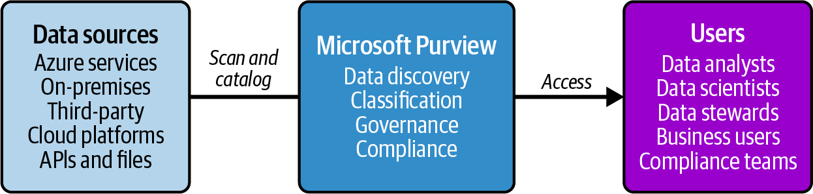
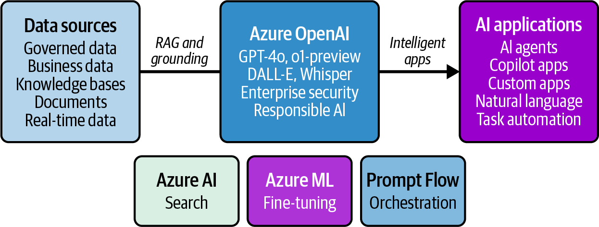

# Chapter 12. Advanced Azure Data Concepts

The data landscape has evolved dramatically since the early days of isolated databases and simple reporting.
Today's organizations face unprecendented challenges: data scattered across cloud and on-premises systems, regulatory requirements that change more quickly than technology can adpat, and the explosive rise of AI that demands both governed data and responsible implementation.
This final chapter explorers two critical domains that extend beyond the DP-900 exam but represent the future of data work: comprehensive data governance and the integration of AI technologies, particularly large language models (LLMs) and intelligent agents.

## Beyond the Exam Scope

This chapter explores advanced Azure data concepts that extend beyond the DP-900 exam scope:

- Microsoft Purview for comprehensive data governance
- LLMs and AI agents in Azure
- The convergence of governed data and AI


Think of your DP-900 knowledge as mastering the fundamentals of navigation--understanding maps, compasses, and basic wayfinding.
This chapter equips you with advanced instruments: satellite GPS for dat governance that provides real-time visibility across your entire data estate, and AI technologies that act like intelligent copilots, helping you discover insights and automate decisions you never thought possible.

Whether you're preparing for advanced certifications, solving complex business challenges, or simply curious about where data technology is headed, this chapter provides essential context for your continued journey.
You'll explore how Microsoft Purview brings order to data chaos, how LLMs are transforming how we interact with information, and how these capabilities combine to create the next generation of intelligent data systems.

## The Modern Data Governance Imperative

As organizations accumulate vast amounts of data across multiple systems, clouds, and formats, the challenge isn''t just storing and processing this information.
It's understanding what you have, where it lives, who can access it, and how it flows through your organization.
Data governance has evolved from a compliance checkbox to a strategic capability that enables everything from regulatory compliance to AI innovation.

Consider a global retail organization with POS systems in thousands of stores, ecommerce platforms spanning multiple countries, customer service systems, supply chain databases, and marketing analytics platforms.
Each system contains valuable data, but without governance, this becomes a liability rather than an asset.
Customer information might be duplicated across systems with different quality standards.
Sensitive data could be accessible to unauthorized users.
Critical business data might be stored in formats that prevent effective analysis.

Modern data governance addresses these challenges through comprehensive discovery, classification, lineage tracking, and access management.
But unlike traditional approaches that required manual cataloging and extensive IT involvement, cloud native governance solutions provide automated discovery and intelligent classification that scales with your data estate.

### Understanding Microsoft Purview

Microsoft Purview represents a fundamental shift in how organizations approach data governance, providing unified visibility and control across their entire data landscape.
Rather than treating governance as an afterthought or compliance requirement, Purview positions data governance as an enabling capability that makes data more valuable and accessible while maintaining appropriate controls.

The figure illustratres how Microsoft Purview operates as an intermediary hub betwen diverse data sources and end users.
On the left, varuous data sources, including Azure services, on-premises systems, third-party platforms, cloud environments, and APIs, feed into Purview platform performs core functions of data discovery, classification, governance, and compliance management.
On the right, different user groups including data analysts, data scientists, data stewards, business users, and compliance teams access the governed data through Purview's unified interface.
This architecture enables organizations to maintain centralized control and visibility over their entire data estate while providing users with streamlined access to trusted, well-governed data assets.



At its core, Purview creates a comprehensive map of your data estate, automatically discovering and cataloging information across cloud and on-premises systems.
But this isn't just about creating an inventory.
Purview understands the content, context, and connections within your data, providing insights that transform how organizations work with information.

The platform combines several critical capabilities into a unified experience:

- *Automated discovery and cataloging* eliminates the manual effort traditionally required to maintain data inventories.
Purview continuously scans your data sources, automatically identifying new datasets and changes to existing information.
This automated approach ensures that your governance layer stays current with your evolving data landscape.

- *Intelligent Classification* goes beyond simple data types to understand the business meaning and sensitivity of your information.
Using built-in classifiers and machine learning, Purview can identify personally identificable infomation (PII), financial data, health records, and other sensitice content across diverse file formats and database structures.
While Purview includes pre-built classifers for common data types, organizations can also create custom classifiers tailored to industry-specific or company-specific requirements, such as proprietary product codes or internal document classifications.

- *Data lineage visualization* traces how information flows through your systems, from original sources through various transformations to final consumption.
This capability is crucial for understanding data dependencies, impact analysis, and compliance requirements.
Purview integrates seamlessly with Azure Data Factory and other Azure resources to automatically capture lineage information as data flows through pipelines, providing real-time visiblity into data transformations and dependencies.

- *A collaborative data catlog* enable business users to discover and understand available data through search, browsing, and business glossaries.
Rather than relying on IT teams to locate relevant data, users can self-serve while maintaining appropriate governance controls.

**Real-world Sceanrio**

A healthcare organization implemented Purview to prepare for a major analytics initiative.
Within the first month, Purview automatically discovered over 2,000 datasets across the organization's environment and identified 847 tables containing patient information that weren't previously cataloged.
This disovery enabled the organization to implement proper access controls and compliance measures before beginning its analytics project, avoiding potential regulatory violations.

**EORWS**

### Implementing Data Governance at Scale

Traditional ad hoc data management often results in siloed information, inconsistent naming conventions, duplicate datasets, and unknown data quality issues.
Teams struggle to find relevant data, leading to redundant work and missed insights.

The transition from ad hoc data management to comprehensive governance requires careful planning and phased implementation.
Organizations that attempt to implement governance across their entire data estate simultaneously often become overwhelmed by the scope and complexity.
Successful implementations start with high-value, high-risk data and gradually expand coverage while delivering incremental value.

Microsoft Purview supports this incremental approach through its flexible deployment model.
Organizations typically being by connecting their most critical data sources--perhaps their customer database and financial systems--to establish foundational governance capabilities.
This intial phase focuses on discovery, classification, and basic access management for the most sensitive or valuable data.

Consider how a financial services organization might approach Purview implementation:

    Phase 1: Critical Data Discovery
    
    The organization begins by connecting its core banking systems, CRM platform, and regulatory reporting databases to Purview.
    The automated scanning immediately provides visibility into data it never had before, including discovery of shadow IT databases and forgotten data stores.

    Here's an example of how Purview automatically classifies senstive data elements in a typical customer database:
        ```SQL
        -- Example of sensitive data automatically classified by Purview
        SELECT 
            customer_id,
            full_name,          -- Classified as "Person Name"
            ssn,                -- Classified as "U.S. Social Security Number"
            account_balance,    -- Classified as "Financial Information"
            credit_score        -- Classified as "Credit Information"
        FROM customer_accounts
        ```
    Phase 2: Access Management and Lineage

    With critical data catloged and classified, the organization implements RBACs and begins mapping data lineage across its most important business process.
    This phase reveals how customer data flows from origination through various systems to regulatory reports, enabling better impact analysis and change management.
    Access controls integrate with Microsoft Entra ID (formerly Azure Active Directory), enabling organizations to leverage existing identity management infrastructure and security policies.

    Phase 3: Business Enablement

    The final phase focuses on making governed data accessible to business users through self-service discovery and business glossaries.
    Data analysts can now find and understand available data without requiring IT assistance, while maintaining compliance with established governance policies.

This phased approach delivers value at each stage while building organizaitonal confidence and expertise with governance processes.

## The Rise of AI and Large Language Models

While data governance provides the foundation for responsible data management, AI--particularly LLMS--represent a revolutionary shift in how we interact with and derrive value from data.
The emergence of technologies like ChatGPT, Claude, and Azure OpenAI has fundamentally changed what's possible when humans and machines collaborate on data analysis, content generation, and decision support.

LLMs represent a breakthrough in AI that enables machines to understand and generate humanlike text at unprecedented scale and quality.
Unlike traditional analytics that require precise queries and specific data structures.
LLMs can understand natural language questions and provide contextual responses that feel conversational and intutive.

### Understanding Large Language Models in Azure

Azure OpenAI Service brings the power of advanced language models to enterprise environments with the security, compliance, and integration capabilities that organizations require.
Rather than accessing these capabilities throuhg consumer interfaces, Azure OpenAI provides enterprise-grade access to models like GPT-4o, o1-preview, and o1-mini, enabling organizations to build sophisticated AI applications while maintaining control over their data and ensuring compliance with regulatory requirements.

The figure demonstrates how Azure OpenAI Service acts as the central intelligence hub that transforms raw data into intelligent applications.
On the left, diverse data sources including governed data, business documents, knowledge bases, and real-time data streams feed into the Azure OpenAI platform through retrieval-augmented generation (RAG) patterns and grounding techniques.
The central Azure OpenAI Service provides advanced language models like GPT-4o and O1-preview, along with multimodal capabilties through DALL-E and Whisper, all backed by enterprise-grade security and responsible AI frameworks.
On the right, these capabilities power various AI applications including autonomous agents, copilot interfaces, and custom business applications that can process natural language and automate complex tasks.
Supporting services at the botton--Azure AI Search for data retrieval, Azure ML for model customization, and Prompt Flow for orchestration--enhance the platform's capabilities and enable sophisticated AI workflows that blend enterprise data with LLM intelligence.



**Technology Spotlight: Azure OpenAI Service 2025 Updates**

Azure OpenAI Service has seen significant enhancements in 2025, including:

    Latest models
        Access to GPT-4o, o1-preview, and o1-mini for advanced reasoning and problem-solving tasks
    
    Computer use preview
        An experimental model that can control mouse and keyboard input while getting context from screenshots

    Global batch processing
        Generally available for large-scale, high-volume procesing tasks
    
    Enhanced fine-tuning
        Vision fine-tuning with GPT-4o now generally available, allowing images in training data
    
    AutoGen integration
        Multiagent conversation framework enabling multiple specialized AI assistants to collaborate
    
    Data zone deployments
        Dyanmic traffic routing to optimal data centers for improved availability

Note that some advanced models may have limited availabilty and require special access approval from Microsoft.

The service includes enterprise features like virtual network support, private endpoints, and customer-managed encryption keys, ensuring that AI capabilities can be deployed securely within enterprise environments.
**End of highlights**

Consider how an LLM might transform data analysis for a business user.
Instead of learning SQL syntax or navigating complex business intellidence tools, they could ask natural language questions.
Here's how the two approaches compare:

    Traditional Approach

        ```SQL

        SELECT 
            product_category,
            SUM(revenue) as total_revenue,
            AVG(customer_satisfaction) as avg_satisfaction
        FROM sales_data s
        JOIN customer_feedback c ON s.order_id = c.order_id
        WHERE s.sale_date >= '2024-01-01'
        GROUP BY product_category
        ORDER BY total_revenue DESC

        ```

    LLM-Enabled Approach

        Query: "Show me which product categories generated the most revenue this year, along with average customer satification scores for each category".

        The LLM understands the intent, generates the appropriate query, executes it against the data, and presents results in a converstaional format with insights and recommendations.

While LLMs simplify data access, organizations should maintian technical oversight to verify that generated queries are appropraite/optimized for the specific context.

### Building AI agents with Azure

Beyond simple question-and-answer interactions, Azure enables the creation of sophisticated AI agents--autonomous systems that can perform complex tasks, make decisions, and take actions based on data and business rules.
These agents represent the next evolution of AI, moving from passive response systems to proactice assistants that can manage workflows, analyze trends, and even execute business processes.
An AI agent differs from a simple chatbot in its ability to:

- Maintain context across long conversations and complex tasks.
- Access multiple data sources to gather comprehensive information.
- Execute actions beyond just providing information.
- Learn and adapt base on feedback and results.
- Collaborate with other systems and agents.

Consider how an Ai agent might support a supply chain manager.
Here's an example of how an AI agent might handle a complex supply chain scenario.

User: "We're seeing delivery delays from our Southeast Asia suppliers. Can you analyze the situation and recommend adjustments?"

The AI agent:

1. Acess real-time shipping data from logisitic systems
2. Analyzes weather patterns affecting transporation routes
3. Reviews supplier performance metrics and alternative vendors
4. Calculates cost implications of route changes
5. Generates recommendations with risk assessments
6. Automatically creates purchase orders for alternative suppliers
7. Schedules follow-up analysis to monitor improvements

This agent doesn't just answer questions. It performs comprehensive analysis, take action, and continue monitoring the situation autonomously.
While agents can automate many tasks, human oversight remains essential for critical business decisions, ensuring accountability and intervention when needed.

**Exam Tip**

While AI agents extend beyond the scope of the DP-900 exam, understanding the foundational data concepts they require is crucial for success in advanced certifications and real-world implementations.
Agents need access to well-governed, high-quality data to function effectively, demonstrating why data fundamentals remain essential even as AI capabilities advance.

**EOET**

### Practicing Responsible AI and Data Ethics

The power of LLMs and AI agents brings significant responsibilities.
Organizations must enure that these technologies are user ethically, fairly, and transparently while protecting individual privacy and maintaining human oversight of critical decisions.

Microsoft's Responsible AI framework provides guidelines for developing and deploying AI systems that are:

    Fair and inclusive
        AI systems should treat all people equitably and avoid discriminatory outcomes based on protected characteristics.
    
    Reliable and safe
        AI systems should perform consistently and safely, with appropriate safeguards against harmful or unintended behaviors.
    
    Transparent and explainable
        Users should understand how AI systems make decisions, particularly for high-stakes scenarios.
    
    Private and Secure
        AI systems should protect individual privacy and maintain security throughout the data lifecycle
    
    Accountable
        Organizations should maintain human oversight and responsibility for AI system outcomes

These principles become particularly important when AI systems work with sensitive data or make decisions that affect people's lives, livelihoods, or well-being.

## The Convergence: Governed AI

The most exciting developments occue at the intersection of comprehensive data governance and advanced AI capabilities.
When organizations comine Microsoft Purview's governance foundation with Azure OpenAI's intelligent capabilities, they create systems that are both powerful and responsible--AI that understands not just what data exists but also what data should be used for specific purposes and who should have access to different insights.

### Governance-Aware AI Systems

Traditional AI implementations often struggle with data quality, bias, and compliance issues because they lack comprehensive understanding of their underlying data.
By integrating governance capabilities with AI systems, organizations can build "governance-aware" AI that makes better decisions about data usage and provides more trustworthy results.

Consider how a governance-aware AI agent might handle a business intelligence request.

User request: "Analyze customer churn patterns and identify the top facots driving customer departures."

*Governance-aware AI process:*

1. *Access validation*: Confirms user has permissions for cusomter data analysis.
2. *Data quality assessment*: Idenifies high-quality customer databases through Purview metadata.
3. *Compliance check*: Ensures that analysis complies with data retention and privacy policies
4. *Bias detection*: Reviews data for potential biases that might skew analysis
5. *Lineage awareness*: Understands data sources and transformations affecting accuracy
6. *Result contextualization*: Provides insights with appropriate caveats about data limitations

This governance-aware approach produces more reliable insights while maintaining compliance with organizational policies and regulatory requirements.

### Building the Future of Data Work

The combination of comprehensive governance and advanced AI capabilities enables entirely new approaches to data work.
Instead of requiring specialized technical skills to extract value from data, organizations can democratize data across while maintaining appropriate controls and safeguards:

    Self-service analytics with governance
        Business users can ask natual language questions and recieve accurate, compliant answers without requiring IT intervention or risking data misuse.
    
    Automated compliance monitoring
        AI agents continuously monitor data usage patterns, identifying potential compliance issues before they become violations.
    
    Intelligent data discovery
        AI-powered search helps users find revelant data across the organization while respecting access controls and data sensitivity classifications.
    
    Proactive Quality management
        AI systems automatically monitor data quality, identifying and flagging potential issues before they impact business decisions

This future isn't hypothetical.
Organizations are implementing these capabilities today, combining Microsoft Purview's governance foundation with Azure OpenAI's intelligent capabiliites to create data platforms that are both powerful and responsible.

## Your Journey Beyond DP-900

As you conclude your exploration of Azure's data fundamentals, it's important to recognize that DP-900 certification represents not an endpoint but a beginning.
The concepts, services, and approaches you've learned provide a solid foundation for an exciting journey into the furture of data and AI.

### The Skills That Matter

The data landscape continues to evolve rapidly, but several foundational skills remain consistently valuable:

    Data thinking
        The ability to understand how data flows through organizations, how it creates value, and how it should be governed and protected.
        This conceptual understanding transcends specific technologies and remains valuable as tools evolve.
    
    Business alignment
        The capability to connect technical possibilities with business needs, translating between data capabilities and organizational objectives.
        This skill becomes more important as data systems become more sophisticated and AI capabilities expand.
    
    Ethical reasoning
        The judgement to evaluate the responsible use of data and AI technologies, considering privacy, fairness, and societal impact alongside technical and business requirements.
    
    Continuous learning
        The mindset and methods for staying current with rapidly evolving technologies while maintaining focus on enduring principles and practices.

These skills, combined with the technical foundation provided by DP-900 certification, position you to succeed regardless of how specific technologies evolve.

### Pathways Forward

Your DP-900 certification opens doors to numerous specilization paths, each building on the fundamentals you've mastered:

    Data engineering
        This focuses on building and managing the infrastructure that moves, transforms, and stores data at scale.
        This path emphasizes Azure Data Factory, Synapse Analytics, and Databricks, with advanced certifications like DP-203.
    
    Data analysis
        This concentrates on extracting insights and creating visualizations that drive business decisions.
        This path emphasizes Power BI, Azure Synapse Analytics, and statistical analysis techniques, with certifications like PL-300.
    
    Data science
        This develops predictive models and advanced analytics that enable organizations to anticipate trends and optimize decisions.
        This path emphasizes Azure Machine Learning, Python/R programming, and statistical modeling, with certifications like DP-100.
    
    AI engineering
        This builds intelligent applications that incorporate language models, computer vision, and other AI capabilities into business solutions.
        This path emphasizes Azure OpenAI, Cognitive Services, and responsible AI practices, with emerging certifications in AI development.
    
    Data architecture
        Designs comprehensive data strategies that align technical capabilities with business requirements while ensuring governance, security, and scalability.
        This path combines elements from all other specializations with enterprise architecture principles.

These paths aren't mutually exclusive.
Many successful professionals develop expertise across multiple areas while maintaining primary focus on their core specialty.

### The Azure Advantage

Azure's comprehensive ecosystem provides unique advantages for your continued data journey:

    Integrated services
        Work together seamlessly, reducing the complexity typically associated with multivendor environments--the foundation you've built with DP-900 certification will apply across Azure's entire data platform.
    
    Enterprise-grade capabilities
        Ensure that solutions you build can scale from prototype to global production while maintaining security, compliance, and reliability requirements.
    
    An innovation platform
        Provides early access to emerging technologies like advanced AI models, ensuring that you can stay current with the latest developments in data and AI
    
    Global reach
        Enables solutions that serve users worldwide, with data residency and compliance capabilities that support international operations.
    
    Hybrid flexiblity
        Accommodates existing investments while enabling cloud modernization, supporting organizations regardless of their current technology landscape

These advantages compound over time, making Azure expertise increasingly valuable as organizations expand their data and AI capabilities.

## Summary

This chapter explored advanced Azure capabilities that extend beyond DP-900 fundamentals, focusing on three critical area that represent the future of data work.

Microsoft Purview for data governance provides comprehensice visibility and control across entire data estates, enabling organizations to undertand what data they have, where it lives, and how it flows through their systems.
Through automated discovery, intelligent classification, and collaborative cataloging, Purview transforms data governance from a compliance burdern into an enabling capability.

AI and LLMs revolutionize how we interact with data, enabling natural language queries, intelligent automation, and sophisticated analysis that was previously impossible.
Azure OpenAI Service brings enterprise-grade AI capabilities to data platforms, while AI agents enable autonomous task execution and decision support.

The convergence of governance and AI creates the most exciting possibilities, where governance-aware AI systems make better decisions about data usage while maintaining compliance and ethical standards.
This convergence enables new forms of self-service analytics, automated compliance monitoring, and intelligent data discovery.

These advanced capabilities build directly on the DP-900 fundamentals you've mastered, demonstrating how foundational knowledge in data storage, processing, and security enables participation in the next generation of data and AI systems.

**Beyond the Exam**

While these topics extend the scope of the DP-900 exam, understanding their relationship to foundational concepts is valuable:

    - Data governance evolution:
        - Manual processes becoming automated AI augmenting human decision making
        - Governance enabling rather than restricting innovation
        - Security and compliance remaining paramount
    - AI integration:
        - Natural language interfaces transforming data access
        - Agents enabling autonomous task execution
        - Foundation knowledge remaining crucial
        - Ethical considerations gaining imporantance
    - Future readiness:
        - Technical skills providing the foundation
        - Business alignment determining value
        - Continous learning ensuring relevance
        - Responsible practices building trust

## Conclusion: Your Data Future Starts Now

Aas we reach the end of our DP-900 journey together, take a moment to appreciate how much ground we've covered.
We began with fundamental concepts of data storage and processing, explored the rich ecosystem of Azure data services, and concluded with a glimpse into the future of governed AI.
You've built a comprehensive understanding of how modern organizations create value from data while managing complexity, ensuring security, and enabling innovation.

But this conclusion is really a commencement.
The data revolution is accelerating, not slowing down.
Every day brings new possibilities for how data and AI can solve problems, create opportunities, and improve lives.
The foundation you've built through DP-900 certification will position you to be part of this exiciting future.

The world needs skilled data professionals who understand not just how to work with data but how to do so responsibly, effectively, and ethically.
You now posses the founational knowledge to be one of those professionals.
Whether you specialize in engineering the infrastructure that power analytics, creating the visualization that illuminate insights, building the models that predict the future, or architecting the strategies that align technology with business goals, you're equipped to make a meaningful contribution.

The future of data work is bright, and with your DP-900 foundation, you're well positioned to help shape that future.
The next chapter of your journey begins now.
Where will you take your data skills next?

Remember, you're not just learning about data systems; you're preparing to be part of the generation that transforms how humanity understands and acts on information.
That's an exciting opportunity and a significant responsiblity.
Embrace both with confidence, knowing that your solid foundation in Azure data fundamentals will serve you well no matter where your journey leads you.

The future of data is yours to build.
Go forth and build it well.

## Beyond This Book

While this book provided comprehensive coverage of DP-900 concepts and glimpses into advanced capabilities, your learning journey is just begining.
The data and AI landscape evolves continuously, requiring ongoing education and hands-on experience to maintain expertise.

### Practical Next Steps

Hands-on experience remains the most effective way to deepen your understanding.
Create Azure free accounts, experiment with the services covered in this book, and build small projects that reinforce theortetical knowledge with practical application.

Community engagement accelerates learning through shared experiences and diverse perspectives.
Join Azure user groups, participate in online forums, and attend conferences where you can learn from others' successes and challenges.

Continuous experimentation with new services and features keeps your skillls current as Azure evolves.
Microsoft regularly releases new capabilities that extend existing services in powerful ways.

Real-world application provides the context that transofrms technical knowledge into business value.
Look for opportunities to apply what you've learned in your current role or through volunteer projects.

### How to Stay Current

The Microsft Learn platform provides free, continously updated training on Azure services, including new capabilities, and emerging best practices.
This resource ensures that you can stay current with platform evolution.

Microsoft's offical Azure Blog and documentation provide authoritive information about service updates, best practices, and emerging capabilities.
Following these sources helps you understand not just what's new but also why changes matter.

Industry publications and analyst reports provide broader context about trends affecting data and AI technologies, helping you understand how Azure capabilities fit within the broader technology ecosystem.

### Final Thoughts

Your DP-900 certification represents the beginning of an exciting journey into the world of data and AI.
The founation you've built provides the knowledge and confidence needed to tackle complex challenges, contribute to innovative solutions, and help shape the furture of how organizations work with data.

The skills you've developed--understanding data concepts, working with Azure services, thinking about governance and security--will serve you well regardless of how specific technologies evolve.
But more importantly, you've developed the mindset needed to approach data challenges systematically and responsibly.

The future belongs to organizations and individuals who can harness the power of data and AI while maintaining human values and ethical practices.
With your solid foundation in Azure data fundamentals, you're well equipped to be part of that future.