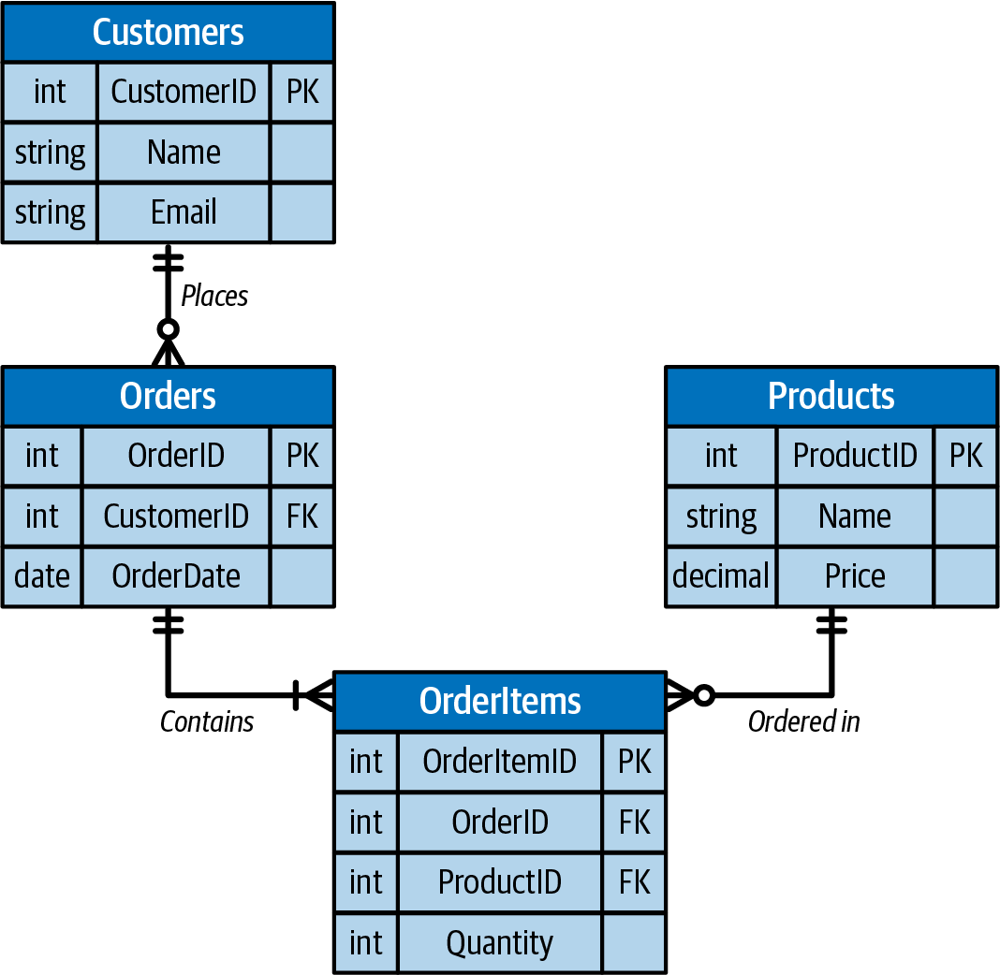
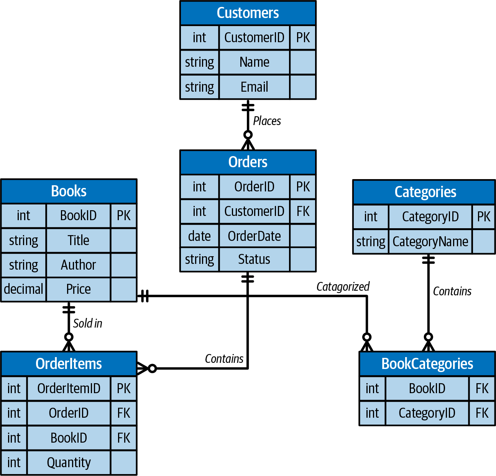
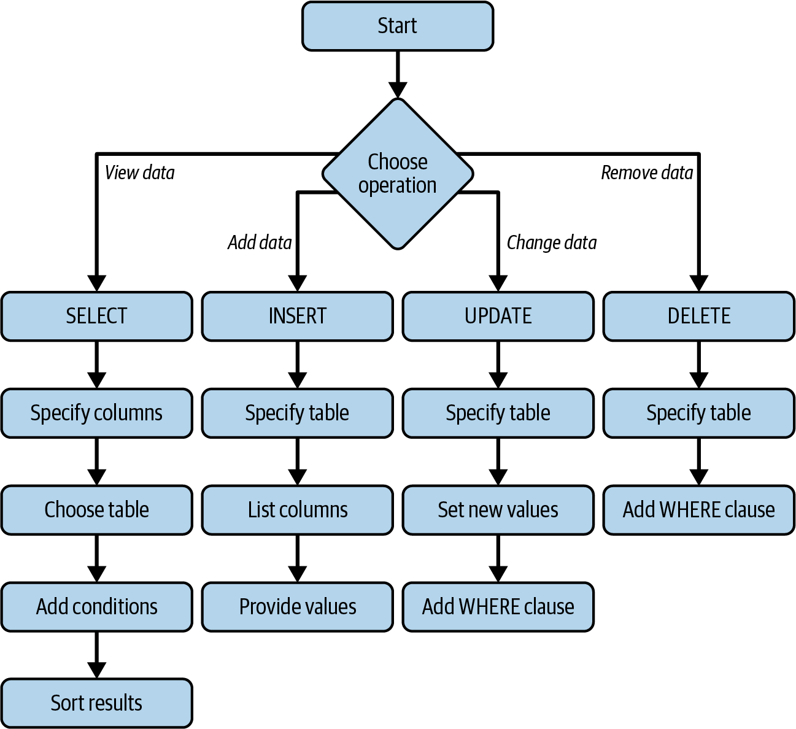
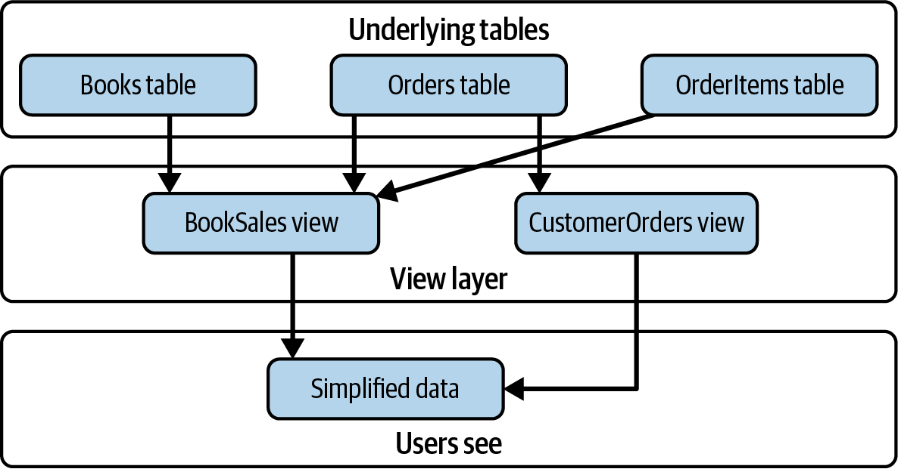
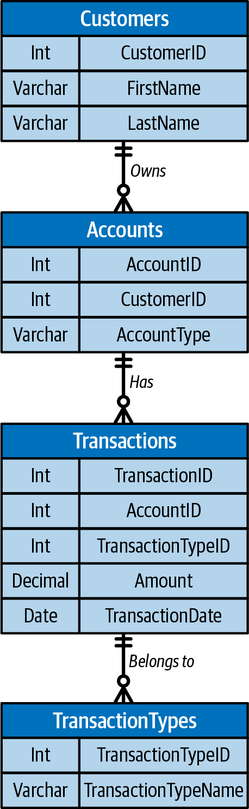
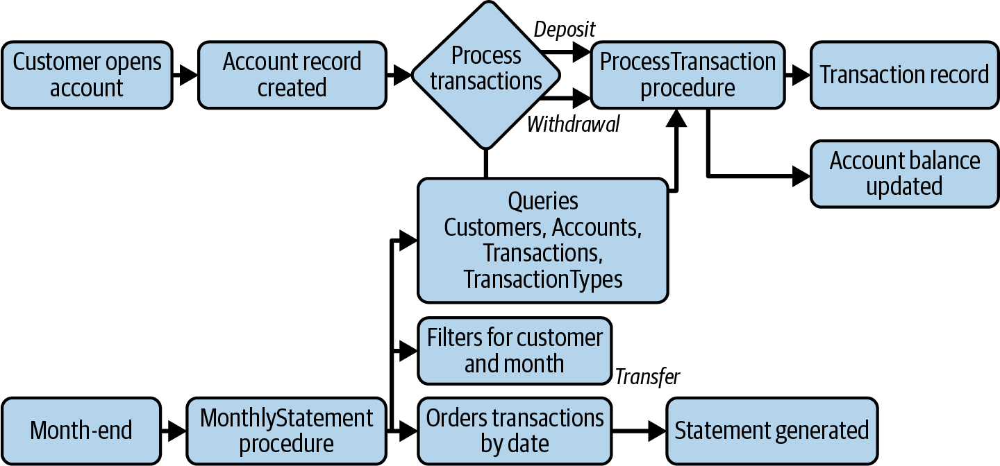

# Chapter 5: Relational Data Concepts

In addition to changing how we store data, the shift to cloud computing has enhanced how we interact with relational databases, one of computing's most enduring and vital technolgies.
Whether you're working with a traditional on-premises database or a fully managed cloud service like Azure SQL Database, understanding relational fundamentals is crucial.
For the DP-900 exam and for anyone working with data platforms, these concepts form the foundation of data management.
While this chapter introduces core database concepts, we'll focus primarly on practical understanding rather than technical implementation details.

**Coverage of Curriculum Objectives**

This chapter addresses the following DP-900 exam objectives:

- Understand core relational data features and relationships.
- Implement normalization principles effectively.
- Work with fundamental SQL statements.
- Understand essential database objects and their roles.

**EOCCO**

## Core Relational Concepts

In today's data landscape, we encounter both structured and unstructured data.
Structured data follows a predefined schema with consistent fields and data types--perfect for transactional systems and reporting.
Unstructured data, like images, videos, and documents, requires different storage approaches, often using Blob Storage or data lakes.
In AI applications, structured data feeds machine learning models with clean training data, while unstructured data undergoes processing through computer vision or natural language processing before analysis.
Understanding these differences helps determine the appropriate storage solution: relational databases for structured data, and object storage or NoSQL systems for unstructured content.

Despite the buzz around AI and NoSQL databases remain important. Why?
The answer lies in their unique ability to organize and manage structured data in a way that maintains consistency, reduces redundancy, and enables complex queries.
Traditional spreadsheets might work for simple data storage, but when organizations need to manage thousands or millions of records with complex relationships, relational databases become essential.

**Exam Tip**

The DP-900 exam emphasizes practical understanding of relational concepts rather than theoretical database design.
Focus on how these concepts apply in real-world scenarios.

**EOET**

Think about how a retail company manages its operations.
It needs to track products, customers, orders, and inventory--all interconnected pieces of information.
A relational database organizes this data efficiently:

- Prodcuts have prices, descriptions, and inventory levels.
- Customers have names, addresses, and order histories.
- Orders contain multiple products and belong to specific customers.
- Inventory tracks stock levels across different locations.

**Note**

Modern cloud platforms like Azure have streamlined how we work with relational databases, but the fundamental concepts remain unchanged.

**EON**

These fundamental relationships form the backbone of how relational databases operate.
To implement these relationships effectively, we need to understand the basic building blocks of relationships effectively, we need to understand the basic building blocks to relational databases, starting with their primary data structure: tables.

### Understanding Tables

At their core, relational databases store information in tables--structured collections of related data.
Unlike spreadsheets, which offer flexibility at the cost of consistency, database tables enforce strict rules about what kind of data can be stored and how it's organized.
Think of a table as a contract with your data: every piece of information must follow specific rules to maintain order and relability.

#### Columns and fields

Columns define the type of information that can be stored in a table.
Each column specifies both the kind of data (like numbers, text, or dates) and rules about what values are acceptable.
For instance, a `ProductID` column might require unique numbers, while a `ProductName` column stores text and cannot be left empty.
`Price` columns typically use decimal numbers and must contain positive values.
These specifications ensure that every piece of data fits the table's intended purpose.

#### Records and rows

While columns define the structure, rows contain the actual data.
Each row represents one complete record in the table.
For example, in a `products` table, a row might contain all the information about a single product: its ID number, name, price, and other details.
Every row must follow the rules defined by the column specifications.
A typical `products` table might contain rows like:

- Product #1001, "Cloud Database Basics", $29.99
- Product #1002, "Azure Fundamentals", $39.99

#### Primary keys

When a table needs a way to uniquely identify each row, you can use primary keys.
Often implemented as automatically generated number, through modern approaches (especially v7 and newer) increasingly use UUIDs, which offer additional possible values, sortability, and near-zero collision risk, primary keys ensure taht every record can be distinguished from all others.
Primary keys are constrained by both `UNIQUE` and `NOT NULL` properties, effectively making them uniqur identifers for any row.
Many databases support `AUTO_INCREMENT` functionality, which automatically generates sequential values for numeric primary keys.
Sometimes multiple columns work together to form a composite key.
Primary keys are essential for creating relationships between tables, allowing data to be connected across the database.

**Exam Tip**

The DP-900 exam frequently tests understanding of table structure and how different elements work together.
Focus on practical application rather than theoretical concepts.

To see these concepts in action, let's examine a basic example of an order management system in the figure below.
Before we do, however, it's important to undertand foreign keys. A *foreign key* is a column in one table that refrences the primary key of another table, creating a link between them.
For instance, an `Orders` table might have a `CustomerID` column that reference the primary key in the `Customers` table, establishing which customer placed each order



The system demostrtes how tables work together to create a complete business solution.
The `Customers` table stores customer information, with each row representing one customer's complete profile.
The `Orders` table tracks when customers place orders, linking to customer records through their unique identifers.
The `Products` table maintains product details independently, while the `OrderItems` table serves as a bridge, connecting orders with their products.

While table provide the structure for our data, we need two more elements to ensure data integrity: appropriate data types and constraints.
These rules act as guardians, ensuring that only valid information enters our database.

### Data Types and Constraints

When designing database tables, we need to specify what kind of information each column can hold and what rules it must follow.
These specifications form the foundation of data integrity in our database.

#### Basic data types

Every column in a database must have a specific data type that defines what kind of information it can store.
Think of these as specialized containers, each designed to hold particular kinds of data efficiently and safely.

*Numeric types* handle all forms of numbers.
Integer columns (INT) store whole numbers, perfect for IDs and counts, for example, `CustomerID INT` or `QuantityInStock INT`.
Decimal types like `DECIMAL (10,2)` manage precise financial calculations, ensuring accuracy in prices and totals.
Float types handle scientific calculations where precision requirements differ from financial calculations.

*Text types* manage character data with different size requirements. `CHAR` columns store fixed-length text, useful for codes and abbreviations that never vary in length, such as `CHAR(2)` for state codes.
`VARCHAR` columns effeciently handle variable-length text like names or descriptions, such as `VARCHAR(255)` for product names.
Text columns manage longer content such as product descriptions or comments.

*Date and time types* handle temporal data.
`DATE` columns store calandar dates like birthdates, and `DATETIME` columns combine both, perfect for tracking when orders are placed or when inventory changes occur.

**Exam Tip**

While Azure databases support many advanced data types, the DP-900 exam focuses on understanding basic types and their common uses.
Familiarity with `INT`, `VARCHAR`, `DATE`, and `DECIMAL` is sufficent for the exam--your don't need to know advanced or nuanced types.

**EOET**

#### Data rules with constraints

While data types specify what kind of information a column can hold, constraints define the rules that data must follow.
Think of constraints as guards that protect your data's integrity.

The `NOT NULL` constraint ensures that essential information is always present.
For example, every product needs a name, so the `ProductName` column would use this constraint to prevent empty values.

`UNIQUE` constraints prevent duplicate values where they don't make sense.
Customer email addresses must be unique to avoid confusion, while product codes need to be distinct to prevent inventory mix-ups.

`DEFAULT` contraints provide fallback values when none are specified.
When a customer places an order, the `OrderDate` can automatically default to the current date if not explicitly set.

**Beyond Types and Rules: Building Connections**

While data types and constraints help us managed individual pieces of information, real-world data rarely exists in isolation.
A customer's order connects to both the customer who placed it and the products they purchased. To represent these real-world connections, we need to understand how tables relate to each other through relationships and keys.

## Understanding Relationships and Keys

In a real-world database, information rarely exists in isolation.
Consider how a retail business operates: customer place orders, orders contain products, and products belong in categories.
These natural connections need to be represented in our database structure.
Understanding how to establish and maintain these relationships is fundamental to working with databases effectively.

** Exam Tip**

For the DP-900 exam, focus on indentifying and understanding basic relationship types rather than complex database design principles.

**EOET**

### Types of Table Relationships

Relational databases support three primary types of relationships, each serving a specific purpose in connecting related data.

#### One-to-one relationships

The simplest but least common relationship type occurs when each record in one table corresponds to exactly one record in another table.
Think of an employee and their passport information.
While you could store passport details in the `employee` table, separating them might make sense for security or organizational reasons.
In this case, each employee has exactly one passport record, and each passport record belongs to exactly one employee.

#### One-to-many relationships

The most common relationship type occurs when a record in one table can relate to multiple records in another table.
The classic example is customers and their orders.
A single customer can plave many orders over time, but each order belongs to exactly one customer.
This relationship naturally models many real-world scenarios, from departments having multiple employees to categories containing multiple products.

#### Many-to-many relationships

Sometimes records in both tables need to relate to multiple records in the other table.
Consider products and orders: one order typically contains multiple products, and each product can appear in many different orders.
This relationship requires a special junction table (sometimes called a *bridge* or *linking table*) to connect the two tables.
In our example, an `OrderItems` table would connect Products and Orders, tracking which products appear in which orders and in what quantities.

### Use of Foreign Keys to Establish Table Relationships

To implement these relationships in practice, databases use foreign keys to connect related records.
A foreign key in one table refrences the primary key of another table, creating a link between them.
For example:

- In the `Orders` table, a `CustomerID` foreign key references the `Customers` table's primary key, connecting each order to its customer.
- In the `OrderItems` table, both `OrderID` and `ProductID` foreign keys reference their respective tables, enabling the many-to-many relationship between orders and products.

**Exam Tip**

While you can use various column types as keys, the DP-900 exam focuses on simple numeric IDs for primary keys.

**EOET**

### A Practical Example

To understand how these relationships work in practice, let's explore a basic scenario: an online bookstore.
Consider how a bookstore needs to track customers, customer's orders, books, and book categories in the figure below



Our bookstore database demostrates several key relationship types working together:

When customers place orders, we create a one-to-many relationship between the `Customers` and `Orders` tables.
Each customer might order multiple times throughout the year, but every order belongs to exactly one customer.
The `CustomerID` foreign key in the `Orders` table makes the connection possible.

Books and categories share a more complex relationship.
A book like *Cloud Computing Basics* might belong in both the "Technology" and "Professional Development" categories, and these categories naturally contain many different books.
This many-to-many relationship comes to life through a junction table that tracks which books belong in which categories.

The practical example shows how relational databases mirror real-world business relationships.
But how do we actually work with this connected data? That's where SQL comes in.
SQL gives us the tools to extract meaningful information from our database, whether we need to find a customer's order history or generate a list of books in a specific category.

## Basic SQL Queries

While the cloud has transformed how we manage databases, SQL remains the primary way to interact with relational databases.
Think of SQL as a specialized language designed specifically for talking to databases--it allows you to ask questions about your data and make changes when needed.
In this section, we'll explore the fundamental SQL operations you need to understand for the DP-900 exam.

**SQL Language Categories**

SQL statements fall into three main categories:
    
    Data Manipulation Language (DML)
        Commands that work with data (`SELECT`,`INSERT`, `UPDATE`, `DELETE`)
    
    Data Definition Language (DDL)
        Commands that define database structure (`CREATE`, `ALTER`, `DROP`)

    Data Control Language (DCL)
        Commands that manage permissions (`GRANT`, `REVOKE`)

**EOSLC**

For the DP-900 exam, focus primarly on DML commands, which handle day-to-day data operations.

**Exam Tip**

The DP-900 exam tests basic SQL concepts rather than complex query writing.
Focus on understanding what each type of query does and when to use it.

### Retrieving Data with SELECT

Imagine you're managing a bookstore's database.
Every day, you need to answer questions like "What books do we have by Jane Smith?" or "Which books cost more than $50?"
The SELECT statement is how you ask these questions of your database.
It's the most fundamental and frequently used SQL operation, allowing you to retrieve and view your data in meaningful ways.

The basic structue of a `SELECT` statement has three main parts: the columns you want to see (`SELECT`), the table you want to look in (`FROM`), and any conditions that must be met (`WHERE`).
Here's the basic Syntax

```SQL

SELECT column1, column2
FROM TableName
WHERE condition;

```

Let's put this into practice with a real example.
Say a customer asks about Jane Smith's books.
You would write:

```SQL

SELECT Title, Price
FROM Books
WHERE Author = 'Jane Smith';

```

This query tells the database to look in the `Books` table, find all books where the author is Jane Smith, and show you the title and price of each one.
It's like asking a librarian to check the shelves for all books by a specific author and tell you their titles and prices.

#### Filtering with WHERE

The `WHERE` clause is your tool for filtering data, much like how you might filter your email inbox to see only messages from a specific sender.
It helps you narrow down large sets of data to just the information you need.
You can use various comparison operators to create these filters:

- Equal sign (`=`) for exact matches
- Greater than sign (`>`) or less than sign (`<`) for numerical comparisons
- Greater than or equal to sign (`>=`) or less than or equal to sign (`<=`) for range checks

For example, if you're planning a promotion for premium books, you might want to see all books priced over $50:

```SQL

SELECT Title, Price
FROM Books
WHERE Price > 50.00;

```

This query acts like a filter, showing you only the high-end books in your inventory.
Similarly, if you need to review recent orders for your monthly report, you could find all orders placed since the start of 2024:

```SQL

SELECT OrderID, OrderDate
FROM Orders
WHERE OrderDate >= `2024-01-01`;

```

This helps you focus on just the recent orders than sifting through your entire order history.

#### Sorting with ORDER BY

Data organization is crucial for analysis and reporting.
The `ORDER BY` clause helps you arrange your results in a meaningful sequence, must like how you might sort a spreadsheet by different columns.
You can sort in ascending order (A to Z, lowest to highest) or desending order (Z to A, highest to lowest).

For instance, you could use the following query if you're preparing a display of your most expensive books:

```SQL

SELECT Title, Price
FROM Books
ORDER BY Price DESC;

```

The query arranges books from highes to lowest price, perfect for identifying your premium inventory.
Sometimes you need to sort by multiple criteria, like when reviewing orders by date and amount:

```SQL

SELECT OrderID, OrderDate, TotalAmount
FROM Orders
ORDER BY OrderDate DESC, TotalAmount DESC;

```

This organization is particularly useful for financial reports, showing your most recent and highest value orders first, then organizing lower value orders within each date and amount:

**Exam Tip**

Pay attention to how different SQL clauses work together to filter and sort data.
Understanding their interaction is key to writing effective queries.

**EOET**

### Modifying Data

While retrieving data is important, databases need to be kept up-to-date as your business operates.
SQL provides three main ways to modify your data: adding new records (`INSERT`), changing existing records (`UPDATE`), and removing old records (`DELETE`).

#### Adding records with INSERT

When new books arrive at your store, you need to add them to your database.
The `INSERT` statement handles this task.
Think of it as filling out a form for each new book.
You specify which information (columns) you're providing and then give the actual values:

```SQL

INSERT INTO Books (Title, Author, Price)
VALUES ('Azure Data Fundamentals', 'Michael John Pena', 59.99);

```

This is like creating a new catalog entry for a single book.
But what if you recieve a shipment of multiple books?
SQL allows you to add several records at once, saving time and effort:

```SQL

INSERT INTO Books (Title, Author, Price)
VALUES
    ('Azure Data Fundamentals', 'Michael John Pena', 59.99);
    ('Azure Cosmos DB Designs and Practices', 'Mike Johnson', 49.99);

```

This bulk insert is particularly useful during inventory updates or when importing data from another system.

#### Modifying records with UPDATE

Prices change, errors need to be corrected, and information needs to be updated.
These are all situations where the `UPDATE` statement comes into play.
Think of `UPDATE` as editing an existing record in your database.
It's crucial to be precise about which records you want to change, which is why the `WHERE` clause is so important here.

For example, to update the price of a specific book

```SQL

UPDATE Books
SET Price = 34.99
WHERE BookID = 1001

```

The `WHERE` clause ensures that you only change the intended book's price.
You can also make broader changes, like applying a storewide discount to all premium books:

```SQL

UPDATE Books
SET Price = Price * 0.9
WHERE Price > 50.00;

```

This automatically calcualated and applies a 10% discount to all books currently priced over $50, saving you from having to update each price manually.

#### Removing records with DELETE

Over time, databases can accumulate outdated or unnecessary records.
The `DELETE` statement helps you clean up your database by removing records you no longer need. 
However, because deletion is permanent, it's crucial to be extremely careful with your `WHERE` clause to ensure that you only remove the intended records.

The following code removes a specific order that was canceled:

```SQL

DELETE FROM Orders
WHERE OrderID = 5001;

```

You might also need to perform routine cleanup, like removing old orders to maintain system performance:

```SQL

DELETE FROM Orders
WHERE OrderDate < '2023-01-01';

```

This removes all order from 2022 and earlier but keeps your recent order history intact.
Always double-check your `WHERE` clause before executing a `DELETE` statement, as recovering deleted data can be difficult or impossible.

#### Visualizing your SQL operations

The SQL operations we've covered--`SELECT`, `INSERT`, `UPDATE` and `DELETE`-- form the basic building blocks for interacting with your database.
Each operation follows a specific pattern, making them systematic and predictable once you understand their structure.

Figure below illustrates the decision flow for each SQL operation.
Starting from the top, you first choose which operation you need based on your goal:

- If you need to view data, the `SELECT` path guides you through choosing columns, selecting your table, adding any filtering conditions, and finally sorting your results.
- To add new data, the `INSERT` path shows that you'll need to specify your target table, list the columns, and provide the values.
- When changing existing data, the `UPDATE` path leads you throug specifying the table, setting new values, and adding conditions to identify which records to update.
- For removing data, the `DELETE` path demonstrates the importance of specifying both the table and the `WHERE` clause to identify which records to remove.



So far, we've worked with single tables in our examples.
However, most real databases store related information across multiple tables.
To get a complete picture of your data, you'll often need to combine information from different tables, and that's where `JOIN` operations comes in.

### Joining Tables

Most production-running databases store related information across multiple tables.
This separation of data is intentional: it helps maintain data integrity and reduces redundancy.
For example, instead of storing a customer's complete information with every order they make, we store customer details once in a `Customers` table and link it to multiple orders in an `Orders` table.

To get a complete picture of your data spread across these tables, you need `JOIN` operations.
The most common types include:

`INNER JOIN`
    Returns only matching records from both tables.

`LEFT JOIN`
    Returns all records from the left table, plus matches from the right.

`RIGHT JOIN`
    Returns all records from the right table, plus matches from the left.

`FULL OUTER JOIN`
    Returns all records from both tables.
    For example, an `INNER JOIN` between Orders and Customers shows only orders with valid customers, while a `LEFT JOIN` would show all orders even if customer data is missing.

Think of `JOIN` as a way to temporarily combine tables based on their relationships.
For instance, when processing orders, you might want to see both order details and customer information in a single view.

Here's how you can combine order and customer information:

```SQL

SELECT Orders.OrderID, Customers.Name, Orders.OrderDate
FROM Orders
JOIN Customers ON Orders.CustomerID = Customers.CustomerID;

```

This query connects each order with its corresponding customer using the `CustomerID` that's common to both tables.
The result gives you a comprehensive view showing the order ID, the customer's name, and when they placed the order-- information that orginally lived in seperate tables.

**Exam Tip**

While there are several types of `JOIN`s (`INNER`, `LEFT`, `RIGHT`, and `FULL`), the DP-900 exam focuses primarily on basic `INNER JOIN` opertaions, which only return matches found in both tables.

**EOET**

Understnading table relationships and joins is crucial because they reflect how data is organized in real-world business scenarios.
Whether you're tracking inventory, managing customer relationships, or analyzing sales patterns, you'll often need to bring together information from multiple tables to get meaningful insights.

## Common Database Objects

Tables provide the foundation for storing our data, but a modern database system relies on several additional objects to operate effectively.
These objects enhance system relies on several additional objects to operate effectively.
These objects enhance how we access, secure, and manage our data.
As cloud platforms like Azure continue to evolve, understanding these fundamental building blocks becomes increasingly important for anyone working with data platforms.

**Exam Tip**

The DP-900 exam focuses on understanding what each database object does and when to use it, rather than the technical details of creating them

**EOET**

#### Views: Simplifying Data Access

Views transform how we interact with our data by providing simplified, secure access to information spread across multiple tables.
When designing a database system, we often normalize our data across many tables to reduce redundancy.
However, this can make retrieving meaningful information more complex.
Views solve this challenge by creating virtual tables that combine and present data in ways that make sense for different business needs.

Consider a retail database system tracking sales, products, and customers.
While storing this information in separate tables makes sense for data integrity, sales managers need to see this information combined.
A view can seamlessly join these tables

```SQL

CREATE VIEW SalesAnalysis AS
SELECT
    s.OrderDate,
    p.ProductName,
    p.UnitPrice,
    s.Quantity,
    (p.UnitPrice * s.Quantity) as Revenue,
    c.CustomerName,
    c.Region
FROM Sales s
JOIN Products p ON s.ProductID = p.ProductID = p.ProductID
JOIN Customers c ON s.CustomerID = c.CustomerID;

```

This view provides several benefits.
First, it simplifies reporting by encapsulating complex join logic.
Second, it enforces consistency by ensuring that everyone uses the same calculations for metrics such as revenue.
Third, it enhances security by allowing us to grant access to specific data combinations without exposing underlying tables.



The figure above illustrates how views work in practice using a bookstore database example.
At the top layer, we have our underlying tables: `Books`, `Orders`, and `OrderItems`, which store the raw data.
In the middle layer, we see two views that have been created: `BookSales` and `CustomerOrders`.
These views combine data from the underlying tables in useful ways.
For instance, `BookSales` might combine data from `Books` and `OrderItems` to show sales metrics for each book, while `CustomerOrders` might join `Orders` with customer information to display order history.

The bottom layer shows what users actually see: simplified data that's relevant to their users.
Users don't need to understand the complex relationships between the underlying tables or write complicated join queries.
Instead, they interact with these predefined views that present the data in a clear, business-focused way.

Views become particularly powerful when working with cloud databases, where different applications and teams might need varying levels of access to the same data.
They act as an abstration layer, helping us manage changes to underlying table structures without disrupting the applications that depend on them.

Views help us organize and present our data effectively, but they don't inherently speed up the data retrieval process.
When we query a view, the database still needs to execute the underlying `SELECT` statement and process all the joined tables.
This brings us to another crucial database object: indexes.
While views determine what data users can see, indexes determine how quickly they can access it.
In fact, proper indexing becomes even more important when working with views that join multiple tables, as these operations can become resource intensive as your data grows.

### Indexes: Improving Data Retrieval

As databases grow larger, especially in cloud environments where we might be handling millions of records, finding specific data efficently becomes crucial.
Consider a customer service portal that needs to look up customer details instantly when they call.
Without any optimization, the database would need to scan through every single customer record to find the right one--an approach that quickly becomes impractical as your customer base grows.

Indexes solve this performance challenge by providing optimized pathways to our data.
In a customer management system, searching for customers by email address is a common operation:

```SQL

SELECT CustomerID, Name, Region
FROM Customers
WHERE EmailAddress = 'example@company.com'

```

When this query runs on a table without an index, the database must examine every customer record to find matching email addresses, a process known as a *table scan*.
For a table with millions of customers, this could take seconds or even minutes.
By creating an index:

```SQL

CREATE INDEX IX_Customers_Email ON Customers(EmailAddress);

```

The same query now completes almost instantly.
The database uses the index to jump directly to the matching record, much like using a phone book's alphabetical organization to find a specific name.

Modern relational databases support several index types, each optimized for different scenarios.
The *clustered index* determines the phyical organization of data in the table itself.
Think of it as the primary way the data is sorted, just as books in a library might be organized by their call numbers.
Each table can have only one clusterd index because the data can be physically stored in one order.
Most commonly, this is created on the primary key column.

*Nonclustered indexes* provides additional ways to locate data without reorganizing the table itself.
A table can have multiple nonclustered indexes to support different query patterns.
These are invaluable for columns frequently use in search conditions or join operations.
However, each additional index requires extra storage space and processing time during data modifications.

A newer innovation, particularly important for data warehousing and analytics, is the *columnstore index*.
Traditional indexes organize data by rows, but columnstore indexes store each column separetly and compress the data.
This radical change in storage structure makes them incredibly efficent for analytical queries that need to process large amounts of data, especially when calculating aggregates like sums or averages across millions of rows.

While indexes can dramatically improve query peformance, they come with costs.
Each index consumes additonal storage space and must be updated whenever the underlying data changes.
In cloud environments, where resources directly impact costs. this balance becomes even more critical.
Database administrators must carefully monitor query patterns and index usage to ensure that they're providing maximum benefit without unnecessary overhead.

Index design requires careful planning to balance performance gains against maintenance costs.
But optimizing data access is only part of the challenge in modern database systems.
Organizations also need ways to standardize how their applications interact with data, enforcing business rules consistently, and maintain security.
This is where stored procedures come into play.

While we've covered the three most common index types relevant to the DP-900 exam, other specialized index types exist for specific use cases, including filtered indexes, spatial indexes, and full-text indexes.

### Stored Procedures: Creating Reusable Code

In complex database applications, certain operations require multiple steps to complete correctly.
Take a banking sysem where transferring money between accounts isn't just a simple update operation--it requires checking balances, recording transaction history, and ensuring that both accounts remain consistent.
Writing this logic separatley in each application that needs it introduces risks of inconsistency and makes updates difficult to manage.

Stored procedures solve this challenge by packaging database operations into reusable units of work.
For example, a funds transfer procedure might look like this:

```SQL

CREATE PROCEDURE ProcessBookOrder
    @BookID int,
    @CustomerID int,
    @Quantity int,
    @OrderStatus varchar (50) OUTPUT
AS
BEGIN
    -- Check if we have enough stock
    DECLARE @StockAvailable int;

    SELECT @StockAvailable = StockQuantity
    FROM Books
    WHERE BookID = @BookID;

    IF @StockAvailable >= @Quantity
    BEGIN
        -- Update stock level
        UPDATE Books
        SET StockQuantity = StockQuantity - @Quantity
        WHERE BookID = @BookID;

        -- Create the order
        INSERT INTO Orders (CustomerID, OrderState, Status)
        VALUES (@CustomerID, GETDATE(), 'Confirmed');

        SET @OrderStatus = 'Order Placed Successfully'
    END
    ELSE
    BEGIN
        SET @OrderStatus = 'Insufficient Stock';
    END
END

```

When this procedure runs, it first checks if enough books are available by querying the `Books` table.
If there's sufficent stock, it performs two critical operations: reducing the stock quantity and creating a new order record.
If there isn't enough stock, it sets a status message to inform the calling application.
This entire process happens as one unit of work: either all steps complete successfully or none of them do 

**Exam Tip**

For the DP-900 exam, understnd the purpose of stored procedures rather than how to write them.

**EOET**

In cloud environments, stored procedures become even more valuable.
They reduce network traffic by keeping processing close to the data, improve security by limiting direct table access, and help maintain consistency across different applications and services that might be running in different regions or platforms.

Modern database systems have extended stored procedures beyond simple SQL operations.
Azure SQL Database, for example, allows procedures to interact with external services, process JSON data, and handle complex business rules.
This flexibility makes stored procedures a crucial tool for implementing business logic consistently across all applications that access the database.

The value of stored procedures extends beyong just code organization.
When applications interact with databases through stored procedures rather than direct SQL statements, database administrators can monitor and optimize these common operations more effectively.
They can analyze procedure execution patterns, tune performance bottlenecks, and even modify underling logic without requiring changes to the application themselves.

With data integrity and consistency being parmaount in modern systems, stored procedures provide the control and reliability organizations need.
However, like any powerful tool, they require careful management.
The next challange organizations face is ensuring that their data stays consistent when changes occur.
And this is where triggers enter the picture.

### Triggers: Creating Automatic Responses

*Triggers* are special stored procedures that spring into action the moment specific events occur in your database.
Think of them as automated responses that ensure that your data stays consistent, secure, and well managed.
Let's explore how these digital guardians work through a practical example from a medical records system.

In healthcare, maintaining an accurate audit trail is crucial.
Patient records are sensitive, and every change needs to be meticulously tracked.
Instead of relying on individual applications to remember to log every modifcation, a trigger can automatically capture these changes:

```SQL

CREATE TRIGGER PatientAudit
ON Patients
AFTER UPDATE
AS
BEGIN
    INSERT INTO AuditLog (
        PatientID,
        FieldChanged,
        OldValue,
        NewValue,
        ChangeDate,
        UserID
    )
    SELECT
        i.PatientID,
        'Status',
        d.Status,
        i.Status,
        GETDATE(),
        SYSTEM_USER
    FROM inserted i
    JOIN deleted d ON i.PatientID = d.PatientID
    WHERE i.Status <> d.Status;
END

```

This specific trigger does something powerful, whenever a patient record is updated, it automatically creates a log entry.
It captures who made the change, when it happened, and exactly what was modified.

Triggers serve various critical purposes:

    Maintaining data integrity
        Ensure related tables stay synchronized.
        When a customer is deleted, a trigger could automatically archive or delete their related orders.
    
    Enforcing business rules
        Prevent invalid data modifications.
        A trigger could stop a price update if the new price is below cost.
    
    Audit Trailing
        Automatically track changes for compliance or debugging.
        Every modification to sensitive data can be logged with who made the change and when.
    
    Cross-database updates
        Maintain consistency across multiple databases.
        A trigger could replicate certain changes to a reporting database.

Types of triggers include:

`AFTER` triggers
    Execute after the triggering action completes.
    Useful for audit loggin or cascading updates.

`INSTEAD OF` triggers
    Replace the triggering action with custom logic.
    Helpful for implementing complex validation or providing updatable views.

DDL triggers
    Respond to database structure changes.
    Can prevent unauthorized schema modifications or document changes.

In modern cloud databases, triggers have become even more sophisiticated.
They can now interact with external services, process complex data formats, and implement intricate business logic across distributed systems.

While tables store data and SQL statements interact with it, triggers add an extra layer of intelligence.
They automatically enforce rules, maintain consistency, and provide advanced functionality without requiring manual intervention for every specific scenario.

## Bringing it All Together: The Libarary Database in Practice

To illustrate how the various database concepts work together, let's consider a basic banking database.
This example will demonstrate the use of tables, relationships, queries, and database objects in a financial context.

**Exam Tip**

The DP-900 exam often presents scenarios where you need to understand how different database elements work together to solve practical problems

**EOET**

### Basic Banking Database Structure

Before we drive into specifics of queries and database objects, let's take a look at the structure of banking database in the figure below



The ER (entity relationship) figure illustrates the key tables and their relationships.
The lines between the tables represent the relationships, with the symbols indicating the type of relationship (one-to-many or many-to-one).
This figure provides a high-level view of how the data is organized and how the tables are connected.

The simple schema consists of four main tables:

    `Customers`
        Stores information about each bank customer
    
    `Accounts`
        Holds data about customer accounts (checking, savings, etc.)
    
    `Transactions`
        Records financial transactions on accounts
    
    `TransactionTypes`
        Defines types of transactions (deposit, withdrawl, transfer)

The relationships betwen these tables are as follows:

- Each `Customer` can own multiple `Accounts` (one-to-many).
- Each `Account` can have multiple `Transactions` (one-to-many).
- Each `Transaction` belong to a `TransactionType` (many-to-one).

Now let's explore how we can use SQL queries and database objects to interact with this data.

### Common Database Operations

In this section, we will implement common operations in our bookstore database using SQL queries and database objects.
These examples demonstate practical applications of the concepts we've covered:

#### Calculating account balances

To calculate the current balance for each account, we can create a view that aggregates the transactions:

```SQL

CREATE VIEW AccountBalances AS
SELECT
    a.AccountID,
    a.CustomerID,
    a.AccountType,
    SUM(
        CASE
            WHEN t.TransactionTypeID IN (1, 3)
            THEN t.Amount
            ELSE -t.Amount
        END
    ) AS Balance
FROM accounts a
LEFT JOIN Transactions t ON a.AccountID = t.AccountID
GROUP BY a.AccountID, a.CustomerID, a.AccountType;

SELECT * FROM AccountBalances;

```

This view uses a `LEFT JOIN` to connect account with their transactions and a `CASE` statement to add deposits and transfers while subtracting withdrawls.
The `SUM` function calculates the total, giving us the current balance for each account.

#### Processing transactions

To handle the multistep process of recording a transaction and updating the account balance, we can create a store procedure:

```SQL

CREATE PROCEDURE ProcessTransaciton
    @AccountID INT,
    @TransactionTypeID INT,
    @Amount DECIMAL(10,2)
AS
BEGIN
    INSERT INTO Transactions (
        AccountID,
        TransactionTypeID,
        Amount,
        TransactionDate
    )
    VALUES (@AccountID, @TransactionTypeID, @Amount, GETDATE());

    UPDATE Accounts
    SET balance = Balance + CASE
        WHEN @TransactionTypeID IN (1, 3)
        THEN @Amount
        ELSE -@Amount
    END
    WHERE AccountID = @AccountID;
END;

```

This stored procedure takes in the account ID, transaction type, and amount as parameters.
It first inserts a new transaction record, then update the account balance based on the transaction type.
By encapasulating this logic in a stored procedure, we ensure that these steps are always performed together as a single unit of work.

#### Generating monthly statements

To generate a monthly statement for a customer, we can use a stored procedure that joins the customer account and transaction data:

```SQL

CREATE PROCEDURE MonthlyStatement
    @CustomerID INT,
    @Month INT,
    @Year INT
AS
BEGIN
    SELECT
        c.CustomerID,
        c.FirstName,
        c.LastName,
        a.AccountID,
        a.AccountType,
        t.TransactionID,
        t.TransactionDate,
        tt.TransactionTypeName,
        t.Amount
    FROM Customers c
    JOIN Accounts a ON c.CustomerID = a.CustomerID
    JOIN Transactions t ON a.AccountID = t.AccountID
    JOIN TransactionTypes tt ON t.TransactionTypeID = tt.TransactionTYPEID
    WHERE c.CustomerID = @CustomerID
        AND MONTH(t.TransactionDate) = @Month
        AND YEAR(t.TransactionDate) = @Year
    ORDER BY t.TransactionDate;
END;

```

This procedure takes a customer ID and month/year as parameters.
It uses `JOIN`s to bring together the customer information, account details, and transaction data for specific period.
The result is a comprehensive statement showing all activity for the customer's accounts during the given month.

### A Practical Exam

Let's see how these pieces work together in a typical usage scenario:

1. A customer opens a new account (insert into `Accounts` table).
2. They make a series of deposits and withdrawals (excute `ProcessTransaction` procedure for each):
    a. New `Transaction` records are added.
    b. The account `Balance` is updated.
3. At the end of the month, a statement is generated (execture `MonthlyStatement` procedure):
    a. The procedure queries the `Customers`, `Accounts`, `Transactions` and `TransactionTypes` tables.
    b. Results are filtered for the specific customer and month.
    c. Transactions are ordered by date to show the activity chronologically.



The flow depicted in the figure demonstrates how the database objects we've created--tables, views, and stored procedures--work together to support the core operations of a simple banking system.
The tables provide the structure for storing data, the views simplify common queries, and the stored procedures handle complex, multistep processses.

By understanding how these components interact, you can start to see how the foundational concepts covered in the chapter--like table design, relationships, and SQL queries--come together to create a functional system.
While real-world financial databases are significantly more complex, the basic principles remain the same.

As you prepare for the DP-900 exam and beyond, keep practicing with examples like this.
The key is to understand not just the individual pieces but also how they fit together to support business processes and user needs.
With a solid grasp of these fundamentals, you'll be well equipped to tackle more advanced database challenges in your future roles.

## Summary

The transition from traditional databases to cloud platforms like Azure represents more than just a change in location.
It's a fundamental shift in how we work with relational data.
Throughout this chapter, we explored core concepts that remain crucial regardless of where the database runs:

    *Tables and relationships*
        The foundation of relational databases, organizing data in a structured, efficent manner
    
    *SQL fundamentals*
        Basic queries and data modifications that form the language of database interaction
    
    *Database objects*
        Tools like views, indexes, and stored procedures that enhance database functionality
    
    *Practical implementation*
        How these concepts work together in real-world scenarios

**Exam Essentials**

For success on the DP-900 exam, focus on these key areas:

    Understanding core concepts
        Table structure and relationships, primary and foreign keys, basic data types and constraints
    
    SQL fundamentals
        `SELECT` statements for data retrieval; basic `INSERT`, `UPDATE`, and `DELETE` operations; simple JOIN operations

    Database objects
        Purpose and use of views, when to use indexes, role of stored procedures
    
    Practical applications
        How concepts work together, common database scenarios, best practices for data organization

## Beyond the Exam

While the DP-900 exam's coverage of relational data concepts provides essential fundamentals, my years working with production databases have shown me that real-world implementations often venture far beyond these basics.
Let me share some insights that might help you bridge the gap between certification knowledge and practical application.

### Modern Relational Database Evolution

Having worked with databases from the pre-cloud era through to today's modern systems, I've witnessed a remarkable transformation in how we handle relational data.
Today's relational databases are far more intelligent than their predecessors.
For instance, I recently worked with a system that automatically adjusted its indexing strategy based on query patterns--something we database administrators used to spend hours manually optimizing.
These self-tunning capabilities represent just one way modern relational databases have evolved to meet growing data demands.

The complexity of data relationships in production environments often surprises newcomers to the field.
In one recent project, what started as a simple customer-order relationship quickly evolved to include sophisticated temporal tracking, hierachical categorizations, and complex business rules.
While the DP-900 exam teaches fundamental concepts like primary and foreign keys, real-world scenarios often require more nuanced approaches to maintaing data integrity and managing relationships.

**Real-World Insight**

Don't be surprised if your first production datbase implementation challenges your understanding of "simple" concepts like referential integrity.
What works in training environment often needs adaptation for real-world scale.

**EORWI**

#### Implementation Realities

One of the most valuable lessons I've learned came from working with a major payment processing system.
On paper, the relationship between transactions, accounts, and user balances seemed straightforward.
However, when handling millions of real-time payment transactions during major shopping events like holiday seasons, we discovered that even well-written SQL querires could become a bottleneck.

The interesting challenge emerged when we needed to maintain real-time balance updates while simultaneously processing thousands of concurrent transactions per second.
During peak periods, what seemed like a simple balance check and update operation would casage into significant delays.
The solution wasn't just about optimizing SQL queries.
It required fundamentally rethinking how we structured our transaction data.
We implemented a hybrid approach using an in-memory balance cacche with an eventual consistency model for the main ledger database.
This kind of architectural decision isn't covered on the DP-900 exam, but it demostrates why understanding basic relational concepts is just the starting point.

The same project also revealed complex realities about data integrity in financial systems.
While the certification exam teaches the importance of ACID properties and foreign key constraints, real-world financial data requires additonal layers of protection.
For example, we couldn't simply rely on traditional referential integrity for transaction records.
We needed to implement a double-entry book-keeping system within our database design, where every transaction required corresponding debit and credit records, along with multiple validation checkpoints.
This ensured that no money could be created or lost due to race conditions or system failures--a critical requirement in financial systems that goes well beyond basic relational database concepts.

This example highlights how financial systems often push relational databases to their limits, requiring creative solutions that balance performance, accuracy, and regulatory compliance. 
The fundamentals you learn through DP-900 exam certification are essential, but the real world demands a deeper understanding of how these concepts apply under extreme conditions.

### The Scale Challenge

As your data grows, relationships that worked perfectly in development can become performance bottlenecks in production.

We had built what I thought was an elegantly designed system tracking trading positions and their transactions.
Everything worked flawlessly in development, and I rememeber feeling quite proud


