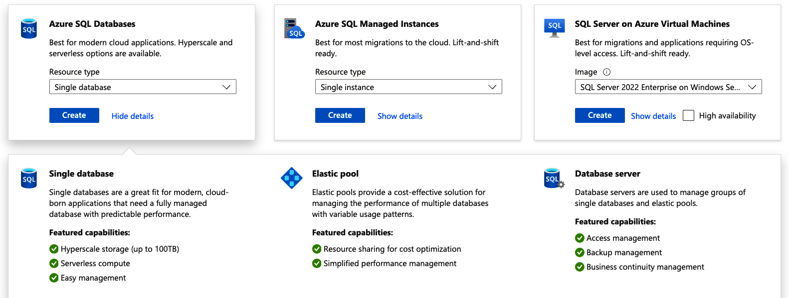

# Chapter 6 Azure SQL Services and Open Source Options

The cloud has revolutionized how we think about and work with databases.
Whether you're building a new applciation or migrating an existing one, understanding Azure's database offerings is crucial for success in modern data management.
In this chapter, we'll expolore both the Azure SQL family of products and Azure's robust support for open source database systems.

**Coverage of Curriculum Objectives**

This chapter addresses the following DP-900 exam objectives:

- Describe relational Azure data services, including the Azure SQL family of products: Azure SQL Database, Azure SQL Managed Instance, and SQL server on Azure virtual machines (VMs).
- Identify Azure database services for open source database systems.

## Understanding the Azure SQL Family

When organizations consider moving their databases to the cloud, they often face a crucial decision: how much control and responsibility do they want to maintain over their database infrastructure? Azure provides a spectrum of options through its SQL family of products, each designed to meet different requirements and comfort levels with cloud adoption.

Figure below illustates the key decision points when choosing between Azure SQL services.
Let's explore each option in detail to understand its unique characteristics and ideal use cases.

### Azure SQL Database: Cloud Native Database Solution

Azure SQL Databases represents Microsoft's vision of a truly cloud native database service.
It takes the core capabilities of SQL Server and transforms them into a fully managed platform-as-a-service (PaaS) offering.
This transformation means that while you maintain complete control over your data and access, Microsoft handles the underlying infrastructure management tasks that traditionally consume significant IT resources.

**NOTE**

Azure SQL Database exemplifies the DBaaS model which we discussed in Chapter 4, in which traditional database administration taks are automated, allowing organizations to focus on data and applications rather than infrastructure managment.

**EON**

#### Features that drive cloud adoption

The appeal of Azure SQL Database lies in its ability to simplify database management while enhancing reliability and security.
When you create an Azure SQL Databse, you automatically get:

- *Automated maintance* that keeps your database running smoothly without manual intervention.
Think of it having a dedicated database administrator working 24/7, handling routine tasks like patching and updates.
This automation extends to performance tunning, where the service continuously monitors your workload and adjusts settings for optimal performance.
- *Built-in high availability* that becomes part of your database's DNA rather than an additonal feature to configure.
The service maintains multiple copies of your data and automaticall fails over to a healthy copy if issues arise, typically within seconds and without requiring any application changes.

The intelligent performance monitoring system acts like a vigilant guardian, constantly watching your database's behavior.
It can alert you to potential problems before they impact your applications and even provide specific recommendations for improvement.

#### Deployment decisions

When implementing Azure SQL Database, you'll need to choose between two primary deployment models, each suited to different scenarios.

The *single database* option deployment model provides a fully isolated database environment with dedicated resources.
Unlike a full SQL Server instance, you work with individual databases rather than server-level objects.
This choice is ideal for:

- Applications with predictable resource requirements
- Scenarios where guarenteed performance levels are essential
- Organization seeking simplicity in database management while maintaining isolation

The *elastic pools* deployment model implements a shared-resource approach that pools resources across multiple databases.
It's particularly beneficial for:

- Environments managing multiple databases with varying workloads
- Organizations looking to optimize costs through resource sharing
- Scenarios where databases have flunctuating resource demands and can benefit from a dynamic resource allocation model

When implementing Azure SQL Databse, you'll need to carefully evaluate these deployment models based on your specific requirements and use cases.
Each option offers distinct advantages that can significantly impact your database performance, cost efficency, and management overhead.

#### The shared responsibility model

Azure SQL Database operates as a true PaaS offering with a clear division of responsibilities.
Microsoft manages everything below the database level--the SQL Server instance, host server, storage, network infrastructure, and physical security.
You manage the database itself, including your data, user access, and database-level configurations.

The shared responsiblity model brings both benefits and considerations.

Microsoft manages:

- Physical infrastructure and hardware
- Operating system patching and updates
- SQL Server instance configuration
- High availability and disaster recovery infrastructure
- Physical and network security

You manage:

- Database schema and objects
- Data and access control
- Query optimization and indexing
- Database-level security setting
- Application connections

Because of this archictectural design, certain server-level features available in traditional SQL Server installations aren't accessible in Azure SQL Database.
For instance, SQL Server Agent jobs need to be replaced with Azure Automation or Logic Apps, and cross-database queries require different approaches using external tables or elastic queries.

### Azure SQL Managed Instance: The Bridge to the Cloud

Azure SQL Managed Instance serves as a strategic middle ground in Microsoft's database portfolio.
It's desinged for organizations that want the benefits of a managed service but need greater compatibility with SQL Server features.

#### The value proposition

SQL Managed Instance provides an experience remarkably similar to traditional SQL Server but with the added benefits of cloud automation.
This familiarity makes it particulary valuable for organizations with existing SQL Server deployments looking to move to the cloud.

The service maintains near-complete compatiability with on-premises SQL Server instances, supporting features like SQL Server Agent, Service Broker, and Database Mail.
This compatibility extends to security features, with support for Windows authentication and Azure AD integration

#### Real-world migration scenarios

The true strength of SQL Managd Instance becomes apparrent in migration scenarios.
Consider a company with a complex application that uses linked servers and cross-database queries.
With SQL Managed Instance, the company can often move its databases to the cloud with minimal code changes, maintaining existing functionality while gaining cloud benefits.

Another common scenario involves organizations using SQL Server Agent for job scheduling and automation.
Rather than redesigning these processes for Azure SQL Database, these companies can maintain their existing jobs while moving to SQL Manged Instance.

#### Operational considerations

Operating SQL Managed Instance requires understanding its unique characteristics.
While it provides greater compatibility than Azure SQL Database, it also introduces some operational considerations:

- Network connectivity works differently, with the service deployed within your virtual network.
This provides better security and isolation but requires careful network planning
- Resource allocation follows a differnt model, with more granular control over compute and storage resources.
This flexibility comes with the responsibility of proper capacity planning.

Success with SQL Managed Instance often depends on proper planning and understanding of its operational model.
Organizations that take the time to understand these aspects typically experience smoother migrations and better long-term results.

**Exam Tip**

For the DP-900 exam, focus on the role of SQL Managed Instance as a bridge between on-premises SQL Server and cloud native Azure SQL Database.
Understanding when to choose it over other options is crucial

**EOET**

### SQL Server on Azure Virtual Machines: Maximum Control and Flexibility

For organizations that need complete control over their database environment or have specific requirements that can't be met by managed services, running SQL Server on Azure VMs provide a solution that combines the familiarity of SQL server with the benefits of cloud infrastructure.

#### Control and responsibility

Running SQL Server on Azure VMs means you maintain control over every aspect of your database environment, from the operating system to the SQL Server configuration.
This control comes with the responsibility of managing updates, security, and performance tunning.

Consider an organization that needs to run a specific version of SQL Server with custom patches or configurations.
With SQL Server on Azure VMs, the organization can maintain these requirements while still benefiting from Azure's infrastructure capabilities.

#### Cost and performance optimization

Azure provides several tools and features to optimize the cost and performance of SQL Server on VMs:

Azure Hybrid Benefit allows you to use existing SQL Server licenses in the cloud, potentially reducing costs significantly.
The automated patching and backup features help maintain security and reliability without manual intervention.

Performance optimization tools in the Azure portal provide insights and recommendations specific to SQL Server workloads, helping you maintain optimal performance even in a self-managed environment.

## Exploring Open Source Databases in Azure

The modern data landscape extends far beyond Microsoft's SQL Server ecosystem.
Recognizing this, Azure provides robust support for popular open source databases through fully managed services.
Let's explore these options and understand their unique characteristics.

### Azure Database for MySQL: Powering Web Applications

MySQL has long been the backbone of many web applications, particularly those built on the LAMP (Linux, Apache, MySQL, PHP) stack.
Azure Database for MySQL brings this popular database engine to the cloud as a fully managed service.

#### Service capabilities

Azure Database for MySQL maintains compatibility with communit MySQL while adding enterprise-grade features.
When you create a MySQL database in Azure, you get:

- Automated patching and updates that keep your database secure and up-to-date
- Built-in high availability with up to 99.99% uptime SLA
- Automated backups with point-in-time restore capabilities
- Intelligent performance recommendations
- Advanced threat protection

#### Deployment models

Azure Database for MySQL Flexible Server provides three distinct service tiers to meet different workload requirements.

Each tier provides flexible scaling options, with compute scaling requiring a brief 60 to 120-second restart, while storage scaling can be performed online without downtime.
The service also includes automated storage management features and comprehensive backup capabilities across all tiers.

#### Burstable tier

Designed for workloads that don't need continous full CPU utilization, the Burstable tier is ideal for development, testing, and nonproduction environments.

It operates on a credit system where CPU performance can burst above baseline during high-demand periods.
However, once credits are exhausted, the server operates at the base performance level.
This tier supports storage from 20 GiB to 16 TiB but doesn't support read replicas or high availability features.

#### General Purpose Tier

Suited for most business workloads that require balanced compute and memory resource, the General Purpose tier provides 4 GiB to 16 TiB and is ideal for hosting web and mobile apps and other enterprise applications requiring consistent performance.

#### Business Critical tier

Optimized for high performance database workloads, the Business Critial tier offers 8 GiB memory per vCore for most configurations and scales from 2 to 96 vCores.
However, the highest tier configurations (64, 80, 96 vCores) provide 504 GiB, 504 GiB, and 672 GiB of memory, respectively.
It supports larger storage capacirt up to 32 TiB with IOPS autoscaling up to 80K, and includes built-in zone resilience at no additional cost (rolled out mid-December 2024).
The tier features Accelerated Logs capability that provides up to 2x throughput improvement for mission-critical workloads.
This tier is particularly well suited for processing real-time transactional and analytical applications that require low latency, high concurrency, and fast failover capabilities.

### Integration and developement

Azure Database for MySQL integrates seamlessly with popular development tools and framworks.
Whether you're using PHP, Python, Node.js, or any other popular programming language, you'll find familiar tools and drivers that work as expected.

**Exam Tip**

Although there are more features that Azure Database for MySQL offers, such as integrated services and extensions, they are not in scope for the DP-900 exam

**EOET**

## Azure Database for PostgreSQL: Enterprise-Grade Open Source

PostgreSQL has gained significant popularity due to its robust feature set and extensibility.
Azure Database for PostgreSQL brings these capabilities to the cloud while adding enterprise-grade managment and security.

### Service capabilities

The service provides several unique capabilities that make it attractive for enterprise use:

- Support for complex queries and custom functions
- Rich spatial data handling through PostGIS
- Advanced data types and indexing options
- Extensive security features including data encryption and firewall rules

### Deployment models

Azure Database for PostgreSQL Flexible Server offers three distinct computer tiers to meet different workload requirements.

Each tier allows flexible scaling of compute and storage resources.
Compute scaling requires a brief 60 to 120 second restart, while storage scaling can be performed online without disruption.

#### Burstable tier

Ideal for workloads that don't need the full CPU continuously, this tier offers variable memory per vCore and scales from 1 to 20 vCores.
It provides 2 GiB to 80 GiB of meemory depending on the configuration selected.
It provides 2 GiB to 80 GiB of memory depending on the configuration selected.
Storage can scale from 32 GiB to 64 TiB.
This tier is perfect for development, testing, and applications with variable workloads.

#### General Purpose tier

Designed for most business workloads requiring balanced compute and memory performance, this tier provides 4 GiB memory per vCore and scales from 2 to 96 vCores.
It supports storage from 32 GiB to 64 TiB and is well suited for hosting web and mobile apps and other enterprise applications requiring consistent performance.

#### Memory Optimized tier

Optimized for high-performance database workloads that require in-memory performance for faster transaction processing and higher concurrency, this tier provides between 6.75 GiB and 8 GiB memory per vCore and scales from 2 to 96 vCores.
It supports storage up to 64 TiB.
This tier is idela for processing real-time data and high-performance transactional or analytical applications.

### Extensions and ecosysrem

One of PostgreSQL's strengths is its extensive ecosystem of extensions.
Azure Database for PostgreSQL supports many popular extensions, allowing you to:

- Add new data types and functions.
- Implement custom indexing methods.
- Integrate with external data sources
- Enhance security and monitoring capabilities.

The ecosystem has stood the test of time as it innovates and keeps with the latest trends.
It is particularly well suited for AI and machine learning workloads through various extensions that enable advanced capabilities.
This makes PostgreSQL an excellent choice for AI-powered applications, supporting use cases such as semantic search, recommendation systems, and other vector-based machine learning opertions.

Combine with Azure AI services, Azure Database for PostgreSQL enables you to build sophisiticated AI-enabled applications while keeping your vector data close to your application data.

**Exam Tip**

While PostgreSQL offers extensive AI capabilities through extension like pgvector for vector similarity search, these features are not in scope for the DP-900 exam.
Microsoft has also developed its own PostgreSQL extensions to enhance integration with Azure services, though these details are beyond the scope of the DP-900 exam.

## Bringing it All Together: Choosing the Right Database Service

Choosing the right database service doesn't have to be overwhelming.
Think of it like choosing a new home: just as different families have differnt needs when house huntine, different organizations have different requirements for their databases.
Let's walk through how to make this decision in a way that makes sense for your situation.

### Stating with the Basiscs

The first question to ask yourself is simple: how much database mangement do you want to handle? If you're like many organizations today, you probably want to focus on using your database rather than maintaining it. In this case, the fully managed services--Azure SQL Database or the managed open source options--are your best bet.
These services are like living in a modern apartment complex where maintenance and security are handled for you.

However, if you have existing database applications that need special configurations or if you have specific requirements about how your database runs, you might want more control.
This is where SQL Server on VMs comes in.
It's like owning your own house where you have complete control over everything from the foundation up.

### Understanding your Workload

The next consideration is understanding what you'll be doing with your database.
Let's look at some common scenarios:

If you're building a new web application, either Azure SQL Database or Azure Database for MySQL is an excellent choice.
Both are designed to scale easily as your application grows, and they handle most of the maintenance work for you.
It's like moving into a new home that's already equipped with modern amentities.
Everything just works.

For organizations moving existing SQL Server databases to the cloud, Azure SQL Managed Instance often provides the smoothest path forward.
It's like moving to a new house that's been specifically designed to feel like your old one: most of your belongings (or in this case, your database features) will fit right in without any need for reorgnization.

### Thinking About Growth

One of the most important aspects of choosing a database service is thinking about the future.
Your application might start small, but what happens when it grows? This is where the different service tiers come into play.

Each of Azure's database services offers different performance tiers that you can think of as differnt sizes of homes.
The Burstable tier is like a starter home--perfect when you're beginning and you need to manage costs, but with some limitations.
The General Purpose tier is like a comfortable family home--suitable for most business needs, with room to grow.
The Business Critical and Memory Optimized tiers are like luxury estates--designed for organizations that need the highes levels of performance and capability.

### Simplifying Cost Considerations

Undestanding database costs doesn't have to complicated.
Here's what you need to know.

If you're just starting out or working on development project, the Burstable tiers of any service can help you keep costs low while still getting the features you need.
It's like renting a smaller apartment while you figure out your long-term needs.

For established applications, you can often save money by commiting to longer-term use through reserved capacity pricing.
This is similar to signing a longer lease on an apartment--you get better rates by committing to stay longer.

If you already have SQL Server licenses, you can use them with Azure through the Azure Hybrid Benefit program.
Think of this like being able to transfer your exisiting home warranty to a new house--you get to keep the benefits you've already paid for.

**Exam Tip**

The DP-900 exam tests your ability to understand which database service fits different scenarios.
Pay attention to the distinguishing features and limitations of each service

## Summary

Azure's database services represent a fundamental shift in how organizations approach data management--moving beyond traditional infrastructure to embrace cloud native solutions.
Each service tier addresses specific organizational needs while maintainging enterprise-grade capabilties:

- Azure SQL Database delivers cloud native simplicity with automated management
- SQL Managed Instance bridges on-premises and cloud environments seamlessly.
- SQL Server on VMs provides ultimate control for specialized requirements.
- Open source options like MySQL and PostgreSQL bring enterprise features to community favoriyes.
- Flexible deployment models ensure that organizations can grow without compromising performance.

The choice between these services isn't just technical. It's strategic, allowing organizations to balance control, cost, and capabilties as they build their cloud future.

**Exam Essentials**

For success on the DP-900 exam, focus on these key areas:

- Understanding the key differences between Azure SQL services (Database, Managed Instance, and VM)
- Knowing the capabilities and limitations of each open source database service
- Recognizing appropriate use cases for different database options
- Understanding the management responsibilities for each service type

## Beyond the Exam

While the DP-900 exam provides essential foundational knowledge, real-world database management in Azure often presents unique challenges and learning opportunties.
Let's explore some practical insights from the field.

### Making the Right Choice in Practice

The decision between Azure SQL Database, Managed Instance, and SQL VMs isn't always as clear-cut as exam scenarios might suggest. 
In my experience consulting with dozens of organizations, these decisions often involve factors beyond technical requirements:

    Organizational politics
        I've seen cases where technically sound choices for Azure SQL Database were overruled because certain departments weren't comfortable giving up control.
        Understanding and navigating these dynamics is crucial for successful implementations.
    
    Skills Transfer
        One client of mine chose SQL Manged Instance despite Azure SQL Database being technically sufficient because their existing DBAs could transfer their skills more easily, reducing resistance to cloud adoption.

### Navigating Cost Mangement

Cost management in Azrue databases often reveals surprising complexitities that go beyong simple service tier selection.
Organiations frequently migrade their databases to Azure with a "lift and shift" mindset, matching their on-premises specifications to cloud resources.
This approach typically leads to overprovisioned resources and unnecessarily high costs, as cloud databases require a differnt optimization strategy than on-premises systems.

Common cost optimization opportunities often emerge from right-sizing environments and implementing appropriate scaling strategies.
Development and testing environments rarely need the same performance tier as production, and even production databases can often use lower tiers with burst capabilties rather than premium tiers sized for peak load.
By implementing auto-scaling and choosing appropriate service tiers based on actual usage patterns rather than peak capacity, organizations can significantly reduce their monthly costs while maintaining necessary performance levels.

The most successful Azure database implementations often start with careful workload analysis and graduated scaling strategies.
Using features like serverless options for varying workloads and reserved capacity pricing for stable ones helps organizations optimize costs while maintaining performance.
This strategic approach to resource provisioning not only reduces costs but also provides valuable insights for long-term capacity planning.

### Understanding Differences in Implementation

The exam covers features, but real-world success with open source databases in Azure often comes down to understanding subtle differences in implementation:

- A startup might initially choose Azure Database for PostgreSQL for its AI application because of its vector capabilities.
However, the company might find success by carefully planning its data model to take advantage of PostgreSQL's json type for flexible shema evolution.
- A media company may successfully migrate from on-premises MySQL to Azure by using read replicas strategically during its migration period, maintaining zero downtime during the transition.

### Looking Ahead

The future of Azure database services continues to evolve in exciting ways.
Advising with startups and small business recently, I witnessed firsthand how they leverage PostgreSQL's vector capabilities for AI workloads, something that wasn't even possible a few years ago.
Their experience highlighted how the lines between traditional database workloads and AI/machine learning operations are blurring.

As we look to the future, the key to success lies in understanding the technical features of Azure's database services as well as developing the judgment to apply them effectively to real-world situations.
The most successful database professionals I've worked with combine deep technical knowledge with strong problem-solving skills and business acumen.

Rememebr, while certification knowledge provides a strong foundation, success in real-world implementaion often comes from experience, adapatability, and continous learning.
The stories and experiences shared here represent just a small sample of the rich learning opportunties you'll encounter as you apply your knowledge in practice.

In the next chapter, we'll explore Azure's NoSQL and big data solutions, where you'll see how services like Cosmos DB complement the relational databases we've discussed here, providing differnt approaches to data storage and processing for modern applications.

# Part III. Nonrelational Data on Azure

Modern application rarely live on relational storage alone. This part broadens your perspective to the specialized storage modalities that optimize cost, scalability, and latency for unstructured content, schema-less entries, asynchronous processing, and globally distributed operational data.
You'll learn how Azure Storage services provide foundational primitives and how Azure Cosmos DB delivers low-latency, globally replicated data with tunable consistency.

- Chapter 7 "Azure Storage Solutions", classifies storage services--object (Blob), table, quenue, and file--explaining access characteristics, durability guarentees, and when each pattern fits (or doesn't fit).
It emphasizes selecting the lightest viable abstraction rather than forcing database smemantics into object stores.
- Chapter 8 "Azure Cosmos DB", examines what changes when data distribution, partioning, consistency trade-offs, and elasticity throughout become primary design drivers.
You'll see how partition key desing and request unit (RU) budgeting influence both performance and spend.

After completeing this part of the book, you should be able to map workload access patterns to their storage modality, articulate the consequences of a poor Cosmos DB partition strategy, and justify consistency level selection based on business tolerance for stateleness versus latency/

Common mistakes surfaced here include adopting Cosmos DB without having a genuine need for global distribution, selecting a partition key that causes hot partitions, over-specifying strong consistency, and treating Blob Storage like a query engine.

Exam Alignment: Expert scenario-driven differentiation questions about storage types and high-level Cosmos DB characteristics.