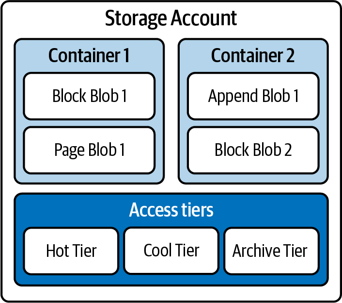
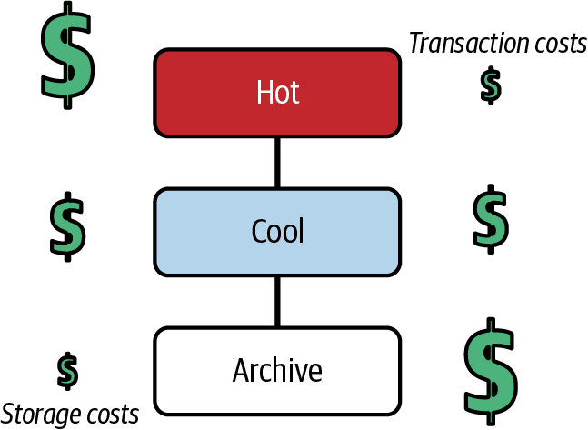
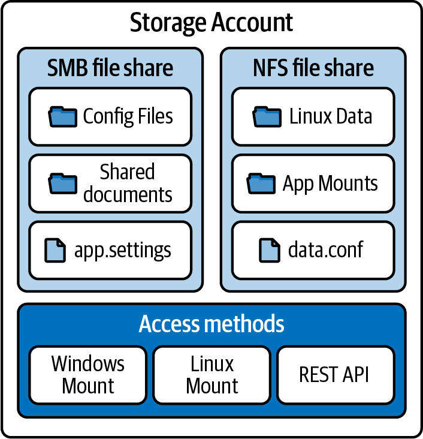
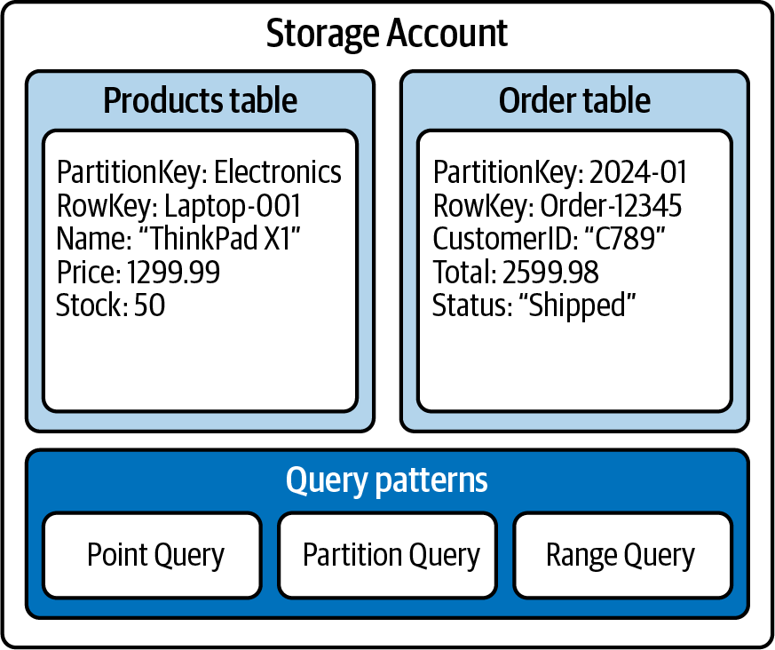

# Chapter 7 Azure Storage Solutions

The cloud has transformed how we think about storage.
Gone are the days when organizaitons needed to predict their storage need years in advance and purchase expensive hardware that might sit partially empty--or worse, run out of space at critical moments.
Azure Storage services represent a fundamental shift in how we approach data storage, offering flexibility and scalability that wasn't possible with traditional on-premises solutions.

Think of Azure Storage as a vast, intelligent library system. Just as a modern library offers different secrions for books, periodicals, and digital media--each organized in ways that make sense for that type of content--Azure provides specialized storage services optimized for differnt data and access patterns.
Whether you're storing simple text files, large videos, structured application data, or anything in between, there's a storage service designed specifically for your needs.

For the DP-900 exam and anyone working with Azure, understanding these storage services is crucial.
While Azure Storage supports several storage solutions, this chapter focuses primarily on three most fundamental services:

- Blob Storage of unstructured data
- File storage for shared file systems
- Table Storage for structured NoSQL data

These services form the foundation of many solutions.
Mastering them will prepare you for more advanced scenarios.

**Coverage of Curriculum Objective**

This chapter addresses the following DP-900 exam objectives:

- Describe Azure Blob Storage capabilities, types, and use cases.
- Understand Azure File Storage features and deployment scenarios.
- Explain Azure Table Storage functionality and data modeling.

## Azure Blob Storage

The journey to cloud storage often begins with a simple question: "Where do we put all our stuff?"
In the cloud and AI era, organizations generate and collect massive amounts of data in various formats--from simple text documents to complex video files, from system logs to data backups.
Azure Blob Storage provides the answer to this fundamental need, offering a robust, scalable solution that has revolutionized how we think about storing and managing data in the cloud.

Before diving into Blob Storage, it's important to understand the distinction between structured and unstructured data.
Structured data follows a predefined schema and is typically stored in databases with rows and columns.
Unstructured data like images, videos, and documents, doesn't follow a predifined format.
Azure provides differnt storage solutions for each: Azure SQL Database and similar services for structured data, and Azure Blob Stprage for unstructured data.

The Azure blob storage architecture diagram illustates a clear hierarchical structure starting with a Storage Account at the top level.
Within this Storage Account, you can see there are two main organizational components:

At the upper part of the diagram, there are two containers--Container 1 and Container 2.
Container 1 holds Block Blob 1 and Page Blob 1, while Container 2 contains Append Blob 1 and Block Blob 2.
This shows how blobs of different types can be organized within containers.

At the lower portion of the diagram, we can see Access Tiers section.
This section displays three distinct tier arranged horizontally: Hot Tier, Cool Tier, and Archive Tier.
These tiers repersent different levels of storage performance and cost options available within the Storage Account.
I'll explain this throughout the section.

The entire structure is encapsulated within the Storage Account boundary, showing how all these componenets are unified under a single storage namespace.

### Understanding Object Storage

The transition from traditional filesystems to cloud storage represents more than just a change in technology.
It's a paradigm shift in how we organize and access data.
Imagine moving from a physical filing cabinet, with its rigit structure of folders and files, to a system where physical limitations simply don't exist.
This is the promise of Azure Blob Storage, where data can be stored, organized, and accessed in ways that were impossible with traditional storage systems.

In the world of blob (Binary Large OBject) storage, we think differently about data organization.
Instead of folders and files, we work with containers and blobs.
A contianer acts like a smart filing cabinet that automatically expands as needed, while blobs are hte individual items stored within it.
The fundamental shift in approach enables unprecedented flexibility in how we store and manage data.

The power of this system lies not just in its capacity--through storing petabytes of data is certainly impressive--but in its intelligence.
Azure Blob Storage understands different types of data and can optimize how it handles each type, ensuring both efficiency and cost-effectiveness.
Whether you're storing millions of small sensor readings or a handleful of massive video files, the system adpats to provide optimal performance.

**Exam Tip**

The DP-900 exam emphasizes understanding how these different blob types serve different purposes.
You won't need to know detailed technical specifications, but you should understand which type fits which scenario.

**EOET**

The true elegance of Blob Storage becomes apparent when we consider how it handles various real-world scenarios.
A media company might use it to store and stream video content of millions of users.
A healthcare organization could securely maintain patient records and medical images.
A manufacturing company might collect and analyze sensor data from thousands of devices.
Each scenario benefits from the unique capabilities of different blob types, which we'll explore next.

### Types of Blobs

Azure's approach to blob storage demostrates a deep understanding that not all data is created equal.
Diffrent types of data have different requirements for how they need to be written, read, and updated.
This insight led to the development of three distinct blob types, each optimized for specific scenarios.
Understnding these types and their appropriate use cases is crucial for designing effective storage solutions.

### Block blobs: The workhorses of cloud storage

When most people think about cloud storage, they're thinking about block blobs without realizing it.
These versatile storage containers handle everything from simple text files to complex multimedia content, making them the backbone of most cloud stroage solutions.
The genius of block blobs lies in their approach to handling large files.
Instead of trying to upload or download entire files at once, they break them down into manageable chunks called *blocks*.

This block-based approach transforms how we handle large-scale data transfers.
Imagine moving into a new house.
Rather than attempting to move everything at once, which would be inefficent and risky, you break the task down into smaller, manageable loads.
Block blobs work the same way, allowing multiple blocks to be uploaded in parallel, significantly improving performance and reliability.

The impact of this design becomes clear in real-world scenarios.
Consider a video streaming service that needs to handle thousands of simultaneous uploads and downloads.
Block blobs make this possible by allowing viewers to start watching a video before it's fully downloaded, while content creators can reliably upload massive files without worrying about network interruptions--if a block fails to upload, only that blocks needs to be retired, not the entire file.

As we wrap up our discussion of block blobs, it's worth noting that their versatility makes them the default choice for most storage scenarios.
However, there are specific situations where other blob types might be more appropriate, which brings us to append blobs--a specialized storage type designed for growing datasets.

#### Append blobs: The digital logbook

In the world of data storage, some information grows continuously but never changes.
Think of a pilot's logbook.
New entries are constantly added, but previous entries remain unchanged and in chronological order.
This specific pattern of data growth presents unique challenges that append blobs are specifically designed to address.

Append blobs shine in scenarios where data accumulates over time but past records must remain immutable.
Consider an aircraft's flight data recorder--often called a *black box*--which continuously records flight parameters.
Each new piece of data adds to the historical record, but previous entries are never modified.
This pattern across many industries: security system logging access attempts, IoT devices reporting sensor reading, or financial systems tracking transactions.

The beauty of append blobs lies in their simplicity and efficiency.
Unlike block blobs, which might require complex coordination when multiple processes try to modify the same file, append blobs handle concurrent writes elegently.
Each write operation simply adds its data to the end of the blob, eliminating the need for complex locking mechanisms or conflict resolution.

This approach brings particular benefits in distributed systems.
Imagine a large industrial facility with thousands of sensors reporting temperature reading every minute.
With append blobs, each sensor can reliably write its data without worrying about interferring with data from other sensors.
The result is a clean, chronological record that's perfect for later analysis or auditing.

However, there are times when sequential write operations aren't enough--sometimes we need the ability to update any part of a file at any time.
This requirement brings us to our third type of blob: page blobs, which offer capabilities that neither block nor append blobs can match.

#### Page blobs: The virtual disk specialists

In the realm of cloud storage, some workloads require a level of flexibility that goes beyond simple file storage or sequential logging.
Imagine trying to update a single sentence in the middle of a book.
With traditional storage types, you'd need to rewrite everything from that point forward.
Page blobs solve this challenge by breaking data into fixed-size pages that can be updated independently, much like being able to replace individual pages in a loose-leaf binder.

The unique capability makes page blobs the perfect foundation for Azure's VM disks.
When you're running a VM, its operating system needs to be able to read and write data anywhere on its disk at any time.
Page blobs make this possible by allowing random access to any 512-byte page within the blob, enabling the kind of rapid, random read/write operations that operating systems require.

**Exam Warning**

While the random access capabilities of page blobs might seem attractive for other scenarios, their specialized nature comes with overhead that makes them less efficient for general-purpose storage.
The exam often tests your ability to recognize when page blobs are appropriate and when other blobs types would be more suitable.

**EOEW**

The impact of page blobs extends beyond just VMs.
Database systems that need to manage their own data pages, specialized scientific applications that work with large matrices, or any system that needs to randomly update portions of large files can benefit from this capability.
However, this flexibility comes at a cost: page blobs require more overhead to maintain their 512-byte page boundaries and additional metadata, making them typically 20% to 30% more expensive than block blobs for equivalent storage.

As we conclude our exploration of blob types, it's clear that Azure has created a sophisticated ecosystem where each type serves a specific purpose.
But having the right type of storage is only part of the equation.
Equally important is understanding how to manage the lifecycle of your data and optimize costs through Azure's tiered storage system.

### Access Tiers and Cost Management

In the early days of cloud storage, organizations faced a simple but costly choice: keep everything readily available or move it to cheaper offline storage.
Azure's tiered storage system revolutionized this approach by offering a more nuanced solution that aligns storage costs with how frequently data needs to be accessed.
This innovation transforms storage from a fixed cost into a dynamic resource that can be optimized based on actual usage patterns.

#### Hot tier: Ready for immediate access

Think of the Hot tier as your active workspace--the digital equivalent of your desk where you keep frequently acccessed files within arm's reach.
While this immediate accessibility comes with higher storage costs, the minimal access charges make it perfect for data that's regularly in use.
Like a well-organized desk that helps you work efficiently, the Hot tier ensures that your frequently accessed data is always ready when you need it.

The impact of this tier becomes clear when we consider real-world scenarios.
A new website might store current articles and images in the Hot Tier, ensuring fast access for readers browsing breaking news.
An ecommerce platform could keep product images and descriptions for popular items readily available during peak shopping seasons.
Medical imaging systems might maintain recent patient scans for quick retrieval during follow-up appointments.

#### Cool tier: Balancing access and economy

Just as you might move last season's clothes to a storage closet--still accessible but not taking up prime wardrobe space--the Cool tier provides a balanced approach for data that's important but not immediately needed.
This tier revolutionizes how organizations handle aging data, offering substantial storage cost savings while maintaining reasonable access times when the data is needed.

The genius of the Cool tier lies in its economics.
By accepting slightly higher access costs and a minimum 30-day storage duration, organizations can significantly reduce their storage expenses.
This trade-off makes perfect sense for many scenarios: quarterly financial reports that need to be kept accessible for reference but aren't accessed daily, completed project documentation that might be needed for future projects, or backup data maintained for short-term recovery scenarios.

Consider how a marketing department might use the Cool tier.
After a major campaign ends, the team could move all related assets--videos, images, and documents--to Cool storage.
The content remains readily available if needed for future reference or inspiration, but at a fraction of the storage costs.
When the next campaign begins, any relevant assets can be quickly retrieved, with the access costs justified by the significant storage savings achieved during the interim period.

As we think about data that's accessed even less frequently, we arrive at the Archive tier--Azure's solution for long-term data retention at the lowest possible cost.

#### Archive tier: The digital time capsule

Every organization has data that must be kept but is rarely, if ever, accesssed.
Think of old tax records, completed project files from years past, or compliance documentation that must be retained for regulatory purposes.
The Archive tier transforms this necessary burden into a manageable expense, offering the lowest storage costs in exchange for longer retieval times and a minimum 180-day storage duration.

The Archive tier represents a fundamental shift in how organizations approach long-term data retention.
Rather than maintaining expensive on-permises tape libraries or paying premium prices for instant access to rarely needed data, organizations can now store this information at minimal cost while maintaining the ability to retrieve it when truly necessary.
This capability has particular impact in industries with strict data retention requirements, such as healthcare, finance, and legal services.

**Real-world scenario**

Consider a healthcare provider that must retain patient records for decades due to regulatory requirements. Recent records stay in the Hot tier for active cases, records from the past year move to the COol tier for occasional reference, and older records transition to the Archive tier for long-term retention.
This tiered approach optimizes costs while ensuring compliance with data retention requirements.

**EORWS**

The beauty of Azure's tiered storage system lies not just in its cost savings but also in its flexibility.
Data can move between tiers as its value and access patterns change.
A stored video might start in the Hot tier during a marketing campaign, move to Cool storage when the campaign ends, and finally transition to the Archieve tier of long-term preservation.
This movement can even be automated through lifecycle management policies, ensuring optimal cost efficiency without manual intervention.

The figure illustrates the inverse relationship between storage and transaction costs across Azure's storage tiers.
The vertical arrangement shows the progression from the Hot storage at the top, through Cool storage in the middle, to Archive storage at the bottom.
The dollars signs ($) on the left side represent storage costs, which decrease in size as we move down through the tiers, indicating lower storage costs for cooler tiers.

Conversely, the dollar signs on the right side represent transaction costs, which increase in size as we move down through the tiers, demonstrating the higher costs associated with accessing data in cooler storage tiers.
This visual representation highlights the fundamental trade-off in Azure's tiered storage system: as storage costs decrease in cooler tiers, the cost of accessing that data increases.

As we conclude our exploration of storage tiers, it's clear that effective data management in the cloud requires more than just storage space.
It demands a thoughtful approach to data lifecycle management.
This brings us to our next topic: the advanced security features that protect your data across all tiers and access patterns.

### Security Features of Blob Storage

In today's digital landscape, storing data in the cloud is just the beginning.
Protecting it is equally crucial.
As organizations move their most sensitive information to the cloud, security can no longer be an afterthought or a simple checkbox exercise.
Azure Blob Storage approaches security as a fundamental design principle, weaving protection into every layer of the storage system.

#### Encryption: Protecting data at rest and in motion

The journey of data through Azure Blob Storage is like a carefully guarded secret being passed through a series of secure channels.
From the moment data enters the Azure ecosystem until it's retrieved, it never exists in an unprotected state.
This comprehensive protection begins with encryption at rest, a process so seamless that most users never even realize it's happening.

Storage Service Encryption (SSE) automatically encrypts every byte of data written to Azure Blob Storage using 256-bit AES encryption--one of the strongest encryption standards available.
This encryption happens automatically, requiring no changes to your applications or workflows.
It's like having an invisible security guard who ensures that every piece of data is secured before it's stored.

Encryption can be applied at different scopes: account-level encryption (default, applies to all data), container-level options for specific requirements, and individual blob encryption for granular control.

Organizations that need additional control over their encryption keys can choose between several options.
Some perfer to let Microsoft manage the encryption keys entirely, similar to letting a bank handle the security of a safety-deposit box.
Others opt for customer-managed keys through Azure Key Vault giving them the ability to control and rotate encryption keys as needed.
The most security-conscious organizations might choose to provide their own encryption keys, maintaing complete control over who can access their data.

But protection doesn't stop when data needs to move.
Like an armored car protecting valuable in transit, Azure automatically encrypts all data moving to and from Blob Storage using TLS/SSL protocols.
This ensures that even if someone were to intercept the data in transit, they wouldn't be able to read it.

As we secure our data both at rest and in motion, we must also consider who should have access to it.
This brings us to Azure's sophisiticated system for controlling access to stored data.

#### Role-based access control: The digital gatekeeper

In the physical world, organizations use keycards and security badges to control who can access different areas of a building.
Azure's role-based access control (RBAC) brings this concept to the cloud, but with far more sophistication and granularity.
Instead of simple yes/no access decisions, RBAC allows organizations to define exactly what actions each user or application can perform on specific resources.

This granular control becomes particularly powerful when integrated with Azure Active Directory.
Imagine a large media company managing thousands of digital assets.
Designers might need full access to their project files, while external partners should only view final deliverables.
Marketing teams might need to update product images, while the legal department requires read-only access to all content for compliance reviews.
RBAC makes these complex permission scenarios not just possible but also manageable.

**Exam Tip**

Understanding RBAC is crucial for the DP-900 exam, as it represents a fundamental shift from traditional file permissions to cloud native security models.

**EOET**

But what about scenarios where you need to grant temporary access to contractors or allow limited-time downloads for customers? This is where shared access signatures come into play.

#### Shared access signatures: Temporary keys to your data kingdom

Shared access signatures (SAS) solve one of the most common challenges in data sharing: how to grand limited, temporary access to specific resources without compromising security.
Think of SAS like a digital hotel key card--it provides access only to specific areas, works only for a predetermined time period, and can be revoked if needed.

The flexibility of SAS becomes clear when we consider real-world scenarios.
A photographer studio might generate SAS URLs that allow clients to download their photos for a week after a session.
A research institution could provide temporary upload access to specific containers for external collaborators.
A media company might generate SAS tokens that allow its content delivery network to access video files while preventing direct public access.

As organizations implement these security features, they need tools to monitor and respond to potential threats.
This brings us to Azure's advanced threat protection capabililtes.

### Managing the Data Lifecycle

One of Blob Storage's most powerful features is its tiered access system, as mentioned in the previous sections.
Think of it like organizing your closet: frequently worn clothes stay easily accessiblem seasonal items go into storage boxes, and rarely used items move to the attic.
Similarly, Azure's Hot tier provides immediate access for actively used data, the Cool tier offers cost savings for infrequently accessed data, and the Archive tier provides the most economical storage for rarely needed information.

The real innovation lies in how easily data can move between these tiers.
A retail company might store current product images in the Hot tier for quick website access, move last season's images to Cool storage, and archive photos of discontinued products.
This automated lifecycle management ensures that you're never paying more than necessary for storage while maintaining appropriate access levels for different data types.

Having explored how Blob Storage handles unstructured data, let's turn our attention to a unique challenge: providing traditional file shares in the cloud.
This is where Azure File Storage comes into play, offering familiar file sharing capabilities with cloud native advantages.

### Azure File Storage

The transition to cloud storage often raises a crucial question: "How will we share files across our organization?"
While Blob Storage excels at handing large-scale unstructured data, organizations still need the familiar collaborative environment that traditional file shares provide.
Azure File Storage briges this gap by bringing the well-understood world of network file shares into the cloud era, combining the familarity of traditional file servers with the scalability and resilience of cloud computing.

Figure shows how Azure File Storage is organized, much like a digital filing cabinet in the cloud.
At the top level, we have a Storage Account, which acts as the main container for all your files.
Inside this, there are two types of file-sharing space: an SMB File Share (which works with Windows, macOS, and linux systems that support the SMB 3.0 protocol) and an NFS File Share (designed for Linux systems).

The SMB side contains familiar elements like Config Files and Shared Documents folders, along with a settings file.
Meanwhile, the NFS side stores Linux-specific items like Linux Data and App Mounts, plus a configuration file.
At the bottom of the diagram, we can see three different ways to access these files: through Windows Mount, Linux Mount, or the REST API.
This setup allows users to work with their cloud files just as easily as they would with files on their local computer, regardless of which system they're using

### Understanding Cloud File Shares

When organizations first encounter Azure File Storage, they often see it merely as a network drive in the cloud.
While this is technically accurate, it dramatically understates the transformation that occures when file sharing moves to the cloud.
Traditional file servers required careful planning, regular maintenance windows, and complex backup solutions.
Azure File Storage elimates these constraints while adding capabilities that would be difficult or impossible to implement on premises.

Consider how file sharing typically works in a traditional office.
You have a file server in your building, connected to your local network, with mapped drives that employees can access.
This works well until you need to support remote workers, open new offices, or scale beyond your server's capacity.
Azure File Storage transforms this model by making your file shares globally accessible while maintaining the simplicity of mapped network drives

**Exam Tip**

For the DP-900 exam, understand that Azure File Storage isn't just a lift-and-shift of traditional file servers.
It's a reimagining of file sharing for the cloud era.

### SMB and NFS: Speaking Your Language

Azure File Storage's support for industry-standard protocols represents more than just technical compatibility.
It's a bridge between traditional IT infrastructure and modern cloud services.
The Server Messge Block (SMB) protocol, familiar to Windows users as the backbone of network file sharing, and the Network File System (NFS) protocol, beloved in the Linux world, form this foundation of this bridge.

#### The power of SMB integration

SMB support in Azure Files goes far beyond basic file sharing.
Modern SMB features like protocol encryption, indentity-based authentication, and persistent handles enable sophisicated scenarios that weren't possible with traditional file servers.
For example, multiple applications can maintain open handles to the same file while Azure manages the complexity of coordinating these accesses--crucial for applications that need to maintain file locks across multiple instances.

Consider a financial services company that needs to process thousands of transaction records daily.
Its Windows-based processing applications can directly access files in Azure File Storage as if they were on a local drive, while Azure handles the underlying complexity of ensuring data consistency and managing concurrent access patterns.

#### NFS and Linux integration

The addition of NFS support transforms Azure File Storage into a truly cross-platform solution.
Linux systems can mount Azure File Shares natively, enabling scenarios like hosting home directories for Linux users or sharing data between Linux-based application servers.
This become powerful in hybrid scenarios where organizations need to maintain consistent file access across both on-premises and cloud environments.

**Real-World Scenario**

A media production company uses NFS shares in Azure Files to store raw footage accsesible to both it's on-premises editing workstations and cloud-based rendering farm.
The same data is available everywhere without complex replication schemes.

**EORWS**

### Adcances Features that Transform File Sharing

Here are some of the advanced features of Azure File Storage that make it an enterprise-grade solution to most file sharing scenarios.

#### Snapshots: Time travel for your files

Azure File Storage's snapshot capability changes how organizations approach file protection and version control.
Unlike traditional backup systems that require seperate infrastructure and complex scheduling, Azure File Share snapshots provide near-instantaneous, point-in-time copies of your entire file share with minimal storage overhead.

Think of snapshots like photographs of your entire filesystem as specific moments in time. When someone accidently deletes an important file or makes unwanted changes, recovereing the previous version becomes as simple as browsing through these snapshots.
This capability transforms disaster recovery from a complex IT operation into a self-service function that users can often handle themselves.

The real power of snapshots emerges in scenarios like:

- Protecting against ransomware by maintaining clean copies of files
- Supporting development and testing by providing consistent filesystem states
- Enabling file-level recovery without full share restoration.
- Maintaing point-in-time copies for compliance requirements.

Not that Azure File Storage supports up to 200 snapshots per share.
While snapshots use incremental storage (only changed blocks consume space), consider the cumulative overhead when planning retention policies.
Snapshot operations may also impact performance during creation, so schedule them during low-usage periods when possible.

#### Identity and access management

Security in Azure File Storage represents a sophisiticated evolution of traditional file share permissions.
While maintaing the familar concepts of share- and file-level permissions, it adds cloud native capabilities that address modern security challenges.

Azure Files also preserves NTFS ACLs when used with Windows systems, maintaining familiar permission structures that IT administrators already understand.

#### Microsoft Entra ID integration

Integration with Azure AD transforms how organizations manage file access.
Instead of maintaining separate file share credentials, users can access files using their organizational identity--the same credentials they use for Microsoft 365 or other Azure services.
This integration enables:

- Single sign-on for file share access
- Conditional access policies that can restrict file share access based on device state or location
- Detailed audit logging of file access patterns
- Granular permission management through Azure AD groups

Consider how this works in practice: a global organization can implement policies that restrict sensitive file access to specific office locations or require multifactor authentication for remote access.
All of this happens transparently to users, who simply see their mapped network drives as always.

#### Scale and performance

Azure File Storage's architecture enables scenarios that would be challenging with traditional file servers.
Shares can scale to handle:

- Thousands of concurrent connections
- Petabyte of data
- Millions of files
- Global access patterns

The serivce automatically handles load balancing, storage optimization, and performance monitoring, allowing organizations to focus on using their file shares rather than managing infrastructure.

**Exam Tip**

While Azure Files Storage can handle massive scale, understanding its performances tiers and limits is crucial for optimal application design.
The DP-900 exam often tests understanding of when to use premium versus standard files shares.

### Azure File Sync: Extending to Hybrid Scenarios

Many organizations aren't ready to completely abandon their on-premises file servers, despite the tremendous benefits of cloud storage.
Perhaps they have applications that must remain local or users who need the fastest possible file access.
Azure File Sync elegently bridges this gap, creating a hybrid environment that combines the best of both worlds.

Think of Azure File Sync like having a smart replication system that keeps your on-premises file servers in sync with Azure File Storage.
It is like how your smart phone keeeps photos synchronized with cloud storage, but at an enterprise scale and with sophisiticated caching capabilities.
This synchronization happens automatically and bidirectionally, ensuring that users always have access to their files through whichever path makes the most sense for their location and needs.

#### Cloud tiering: Intelligence at the Edge

One of File Sync's most powerful features is cloud tiering.
Cloud tiering can be configured based on last access time, file age, or free space policies.
Instead of simply copying all files everywhere, it intelligently manages which files are stored locally and which remain cloud only.
Frequently accessed files stay cached on local server for fast access, while rarely used files are replaced with shortcuts that point to their cloud copies.
This approach dramatically reduces the storage requirements for on-premises servers while maintaing access to the full file set.

**Real-world scenario**

A global engineering firm uses Azure File Sync to maintain consistent project files across offices worldwide.
Each office had a local file server for fast access to current projects, while completed projects are automatically tiered to the cloud.
When an old project needs review, its files are retrieved on demand, eliminating the need for massive local storage at each site.

#### Disaster recovery simplified

Azure File Sync transforms how organizations approach disaster recovery for file servers.
Instead of mainting complex backup systems and dealing with tape libraries, organizations can quickly restore file servers by simply installing File Sync on a new server and connecting it to their Azure file share.
The system automatically pulls down the most frequently accessed files first, ensuring that critical data is available quickly while less urgent files sync in the background.

Consider how this plays out in a real distaster recovery sceantio.
If a file server fails, IT can:

1. Deploy a new server (phyiscal or virtual).
2. Install the File Sync agent.
3. Connect to the exisiting sync group.
4. Have critical files available within minutes.

The entire process can be completed in hours rather than the days it might take to restore from traditional backups.

### Managing at Scales

As organizations grow, managing file server across multiple locations becomes increasingly complex.
Azure File Sync includes centralized management capabilties that help IT teams:

- Monitor sync health across all servers.
- Track storage usage and tiering efficency.
- Managed sync groups and cloud endpoints.
- Configure namespaces and conflict resolution policies.

This centralized control plan transforms what would traditionally be a complex distributed system into a cohesive, manageable service.

While File Storage excels at handling traditional file sharing scenarios, organizations often need different approaches for storing structured data.
This brings us to Azure Table Storage, which offers a unique solution for storing large amount of structure data without the constraints of traditional databases

## Azure Table Storage

In the world of data storage, not everything fits neatly into files or traditional databases.
Consider an IoT scenario where millions of devices send temperature readings every few minutes, or a product catalog where each item might have completely different attiributes.
These scenarios demand a different approach--one that's both scalable and flexible.
Azure Table Storage provides this alternative, offering a NoSQL data store that combines the simplicity of tables with the flexibility of schema-less design.

The figure shows the layout of the Azure Table Storage, which provides a different way to store data compared to traditional databases.
Under the main Storage Account, we see two exmaple tables shown in boxes: a `Products` table and a `Orders` table.
Each table demonstates how data is stored in a flexible format.
The `Products` table contains information about electronics items, showing fields like `PartitionKey` (Electronics) and `RowKey` (Laptop-001), along with product details such as `Name` (ThinkPad X1), `Price` ($1299.99) and `Stock` (50).
Similarly, the `Orders` table shows how order information is stored with its own `ParitionKey` (2024-01), `RowKey` (Order-12345)m and revelant order details like `CustomerID` (C789), Total (2599.98) and Status (Shipped).

At the bottom of the diagram, we see three types of Query Patterns that can be used to access this data: Point Query, Parition Query, and Range Query.
This shows how users can retrieve information from these tables in different ways depending on their needs.

The structure illustrates how Table Storage offers a simple yet powerful way to store differnt types of data without needing to define a rigit structure beforehand, making it perfect for scenarios where data might vary between entries.
Now let's get into the details of how NoSQL structure works in Azure Table Storage

## Understanding NoSQL in Azure Table Storage

Traditional relational databases require you to define your *schema*--the structure of your data--before you store anything.
It's like having to decide the exact layout of a filling cabinet before you can start using it.
But what if different documents need different type of folders? 
What if you don't know all the types of documents you'll need to store?
This is where Table Storage's schema-less design shines

### Entities and Properities: A Flexible Foundation

In table storage, data is organized into entities (similar to rows in a traditional database) and properities (similar to columns), but with a crucial difference: each entity can have its own set of propertires.
This flexibility is transformative for certain types of applications.

Consider an ecommerce product catalog:

- A clothing item might need properties for size, color, and material
- An electronic device might track voltage, dimensions, and warrenty period.
- A food item might include nutrional information and expiration date.

With Table Storage, each product entity can have exactly the properties it needs--no more empty colummns for irrelevant attributes, and no schema changes when new product types are added.

### Partitiong Strategy: The Key to Performance

Understanding partioning in Table Storage is like understanding how to organize a massive library.
Just as a library categories and subcategories to make book findable, Table Storage uses partition keys and row keys to organize and locate data efficently.
This organization isn't just about keeping things tidy.
It's fundamental to the performance and scalability of your solution.

#### The power of the partition key

Think of a partition key as a major category for your data.
Just as a library might separate fiction from nonfiction, your partition key creates logical grouping of related entities.
But this decision impact more than just organization.
It affects how Azure can distribute and scale your data across its infrastructure.

**Exam Tip**

The DP-900 exam often tests understanding of how partition keys affect performance.
Rememebr that entities with the same parition key must reside in the same partition, which can become a bottleneck if not designed carefully.

**EOET**

Consider an application tracking temperature reading from sensors across different cities:

- Using the city name as the partition key groups all reading from the same location together
- This make queries for a specific city's data extremely efficent.
- However, if one city generates significantly more data, its partition could become a performance bottleneck.

#### Row keys: Ensuring uniquenesss

Within each partition, the row key provides the final piece of the puzzle, ensuring that each entity can be uniquely identified and efficiently retrieved.
Together, the parition key and row key form a composite key that can quickly locate any entity in your table.

For our temperature sensors example:

- The paritition key is `CityName`
- The row key is `SensorID_Timestamp`. This structure allows for efficent queries such as:
    - All reading from a specific city (partition key)
    - Specific sensor readings in a city (partition key + partial row key)
    - Exact reading at a specific time (partition key + full row key)

### Query Patterns and Performance

Understanding how to query Table Storage effectively requires a shift in thinking from traditional SQL databases.
While SQL allows complex joins and arbitrary `WHERE` clauses, Table Storage is optimized for different access patterns.

#### Optimized query patterns

The most efficent queries in Table Storage are those that use the partition key and row key effectively.
Think of it like having a precise address fro a book in a library--if you know exactly where to look, retrieval is nearly instantaneous.

Efficient query patterns include:

- Point quries using both the parition and row keys
- Parition scans susing just the parition key
- Range queries within a parition using the row key range

Example: A weather monitoring system stores millions of temperature reading daily.
By using the pattern `CityName` for the partition key and `YYYY_MM_DD_HH_mm` for row key, the system can efficently:

- Retrieve all reading for a city (partition scan).
- Find specific time frame readings (row key range query).
- Get exact reading at precise moments (point query).

### Advanced query capabilities

While Table Storage may seem simple at first, it supports sophisicated query capabilities when properly designed.

#### Filtering and projection

Just as you might want to retrieve only specific fields from a record, Table Storage allows you to:

- Select specific properties rather than entire entities
- Filter results based on property values.
- Combine filters with parition/row key criteria.

#### Continuation tokens

For large result sets, Table Storage provides continuation tokens--like bookmarks that help you pick up where you left off when processing large amounts of data.

### Table Storage versus Cosmos DB

Azure Table Storage shares many key features with Azure Cosmos DB, particularly with its NoSQL API.
As both are cloud-based NoSQL storage solutions, developers often wonder which service better suits their needs.
Understanding their similarities helps establish a foundation for making an informed choice between these technologies.

While we'll explore Azure Cosmos DB in depth in the next chapter, it's important to note that the decision betwen these services isn't always a simple either-or choice.
Many organizations successfully implement both Azure Table Storage and Cosmos DB with their architecture, leveraging each service's unique strengths for different use cases.
This hybrid approach allows teams to optimize their storage solutions based on specific requirements for different parts of their application.

The decision to use Azure Table Storage versus Azure Cosmos DB typically depends on several key factors.
Table Storage excels in scenarios requiring simple, cost-effective storage for large volumes of structured data with basic query needs.
In contast, Cosmos DB is better suited for applications demanding gloabl distribution, complex queries, and guaranteed low latency.
The choice ultimately comes down to balancing factors like data complexity, scalability requirements, global distribution needs, and budget constraints.

## Bringing it All Togehte: Storage Solutions in Practice

Picture yourself as an architect designing the foundation of a modern digital enterprise.
Like a well-planned city, Azure's storage services form distinct districts, each serving unique purposes while working in harmony.
Let's explore how these services come together to create a robust and efficent data ecosystem.

### The Modern Data Estate

Consider MJA Fashion, a rapidly growing ecommerce platform.
When approaching its storage architecture, the MJA team didn't force all its data into a single storage solution.
Instead, the team crafted a sophisticate symphony of storage services, each playing its perfect part.

The product images and marketing videos flow naturally into Blob Storage, which excels at handling large, unstructured files.
Meanwhile, the development team collaborates seamlessly through File Storage, sharing configuration files and documentation as easily as if it were working with a local drive.
For lightning-fast access to product metadata and user preference, Table Storage serves as a reliable companion, delivering consistent performance at Scale.