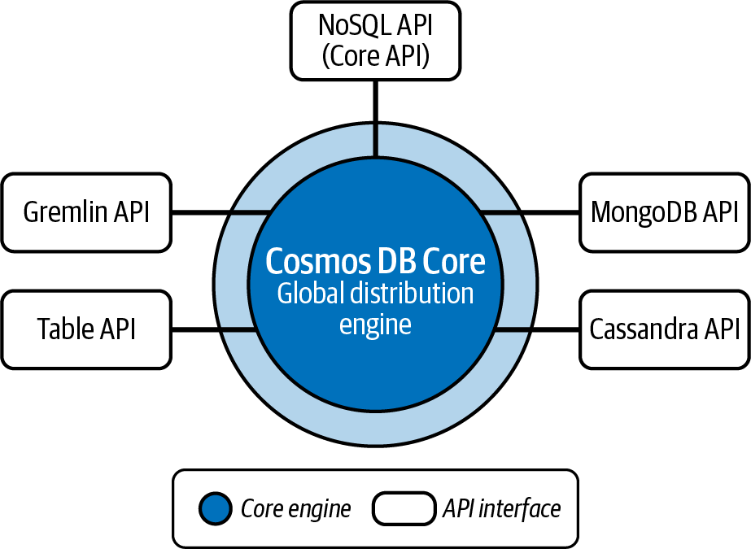

# Chapter 8 Azure Cosmos DB

The landscape of data management presents an interesting paradox: while operational tasks have become more streamlined, the proliferation of available options has introduced new layers of complexity.
This evolution is particularly evident in how we engage with data today.
Consider how you use your favorite social media app: you expect your posts to appear instantly, your friends across the globe to see your updates immediately, and the app to work flawlessly whether you're in Toyko or Toronto.
This expectation of seamless, globla data access represents a profund shift from traditional database systems.
Azure Cosmos DB emerged as Microsoft's response to this new reality, offering a database service built from the ground up for the global, cloud native era.

To understand why Azure Cosmos DB represents such as significant advancement, imagine trying to build a modern social media platform using traditional database technology.
You might start with seperate databases in different regions, attempting to synchronize data between them.
You'd quickly encounter challenges: How do you handle conflicts when users see consistent information regardless of their location? How do you maintain performance as your user base grows globally?
These are precisely the challenges that Azure Cosmos DB was designed to address, and we'll discuss them throughout this chapter.

**Coverage of Curriculum Objectives**

This chapter addresses the following DP-900 exam objectives:

- Describe Azure Cosmos DB APIs.
- Indentify use cases for Azure Cosmos DB.

## Understanding the Cosmos DB Architecture

At its core, Azure Cosmos DB reimagines what a database can be in the cloud and AI era.
Rather than starting with traditional database concepts and adding cloud features, Microsoft desinged Azure Cosmos DB with global distribution and massive scale as foundational principles.
This apprach manifests in its architecture, which differs signficantly from conventional databases.

Think of Azure Cosmos DB as a global logistics network for your data.
Just as a modern shipping company maintains distrubution centers worldwide to ensure fast delivery, Azure Cosmos DB automatically replicates your data across multiple regions.
But unlike physical good, which can only be in one place at a time, Azure Cosmos DB allows your data to exist simultaneously in multiple locations, each copy fully functional and immediately accessible.

## The Power of Global Distribution

Let's explore how this works through a real-world scenario.
Imagine you're building a global gaming platform where players complete in real-time matches and maintain persistent inventories.
Traditional database approaches would force you to choose between data consistency (ensuring that all players see the same game state) and performance (providing quick response times for players worldwide).
Azure Cosmos DB eliminates this false choice through its sophisicated global distribution system.

### Understanding Consistency Models

In the traditional database world, consistency was often a binary choice: either your data was consistent, or it wasn't.
Azure Cosmos DB transforms this limitation into an opportunity by offering multiple consistency levels that can be selected based on your specific needs.
Think of these consistency levels like different shipping options for a package--from expensive overnight delivery to more economical standard shipping, each with its own trade-offs between speed and guarentees.

The five consistency levels in Azure Cosmos DB represent different positions on the spectrum between strong consistency and high availability. Let's explore these through practical scenarios that demonstrate when each level makes sense.

#### Strong consistency

The most rigorous consistency level is strong consistency. 
It ensures that all readers see the most recent version of data.
Imagine a banking application where a customer transfers money between accounts.
Here, it's crucial that the balance shown reflects the most recent transaction, regardless of which region the customer accesses their acocunt from.
While this level provides the strongest guarentees, it comes with a performance cost as each write must be synchronized across all regions before being confirmed.

#### Eventual consistency

The most relaxed consistency level, eventual consistency provides the highest availability and performance but the weakest consistency guarentees.
Readers might see older versions of data, but all replicas will eventually converge to the same state.
This works well for scenarios like social media likes or view counts where immediate consistency isn't critical.

#### Consistent prefix

The consistent prefix level guarentees that readers never see out-of-order writes.
If updates are made in order A, B, C, readers might see A, or A and B, but never B and C without A.
This is useful for scenarios like chat applications, where message ordering matters but slight delays are acceptable.

#### Bounded staleness

Another flexible consistency approach is bounded staleness.
The approach is done by allowing reads to lag behind writes by a bounded amount, either time or number of operations.
Consider a social media platform where showing a post's Like count that's a few seconds old is acceptable.
The platform might configure bounded staleness to allow reads to lag by up to five seconds, gaining better performance while still maintaining reasonably fresh data.

#### Session consistency

Session consistency is perhaps the most practical level for many applications, because it ensures that a single user always sees their own writes while potentially seeing older data from other users.
This works paricularly well for user-centric applications.
Take an ecommerce platform where a customer updates their shopping cart.
With session consistency, the customer always sees their current cart contents, while other users browsing the site might see slightly older product availability information.

### Understanding Data Modeling in Azure Cosmos DB

Traditional relational database design often begins with creating tables and defining relationships between them.
Azure Cosmos DB requires a different mindset, one that prioritizes access patterns and query performance over normalized data structures.
This shift in thinking often challenges developers and database architects who are accustomed to traditional database design.

Consider how you might model a product catalog for an ecommerce platform.
In a relational database, you might create separate tables for products, categories, pricing, and inventory.
Each product would reference these related tables through foreign keys.
In Azure Cosmos DB, a more effective approach often involves denormalization, embedding related data within a single document:

```JSON

{
    "id": "product_12345",
    "name": "Professional Camera XDR",
    "category": {
        "id": "electronics",
        "name": "Electronics",
        "path": "/electronics/cameras"
    },
    "pricing": {
        "basePrice": 999.99,
        "currentPrice": 899.99,
        "discounts": [
            {
                "type": "holiday_sale",
                "amount": 100.00,
                "validUntil": "2024-02-01"
            }
        ]
    },
    "inventory": {
        "totalAvailable": 157,
        "reservations": 12,
        "warehouseLocations": [
            {
                "id": "SEA-1",
                "quantity": 89
            },
            {
                "id": "NYC-4",
                "quantity": 68
            }
        ]
    }
}

```

This denormalized structure might intially seem inefficent.
After all, we're storing category information with each product rather than referencing a centralized categories table.
However, this design offers several crucial advantages in a distributed system.
First, it eliminates the need for joins, which can be particularly expensive when data is distributed across multiple regions.
Second, it ensures that all information needed to display a product is available in a single read operation, improving application performance.

## Azure Cosmos DB API Types

When developers first approach Azure Cosmos DB, they often feel overwhelmed by the variety of APIs availble.
Think of these APIs as different languages that Azure Cosmos DB can speak, each one designed to communciate with different types of applications in their native tongue.
Just as a skilled diplomat might switch between languages to better commmunicate with different audiences, Azure Cosmos DB adapts its communication style based on your application's needs.

At the heart of this versatile system lies the Azure Cosmos DB core, a powerful global distribution engine surrounded by five specialized API interfaces.
As shown in the figure below, these interfaces--the NoSQL (core) API, MongoDB API, Cassandra API, Table API, and Gremlin API--act as dedicated communication channels, each connecting directly to the core engine.
This architecture ensures that regardless of which database "language" you perfer, you're always working with the full power of Cosmos DB's distributed capabilities.



Let's explore each of these APIs and understand when to use them in real-world scenarios.

### NoSQL (Core) API in Azure Cosmos DB

The NoSQL API, also known as the *Core API*, is the native language of Azure Cosmos DB.
Imagine you're building a brand-new application from stratch--this would be your go-to choice.
It speaks in JSON, a format that developers love for its flexibility and readability.
Just as you might find it easiest to express yourself in your native language, applications built using the NoSQL API can take full advantage of everything Azure Cosmos DB has to offer without any translarion layer.

**Exam Tip**

Pay special attention to scenarios involving new application development.
The DP-900 exam often includes questions about choosing between the NoSQL API and other options for greenfield projects.
When you see questions about upgrading from Azure Table Storage, the Table API is likely the answer, but you should read the question carefully to ensure that it matches your specific scenario.

**EOET**

Let's dive deeper into a real-world scenario to understand the power of the NoSQL API.
Consider a modern social media platform that needs to handle various types of content.
Initially, your posts might be simple text updates:

```JSON

{
    "id": "post123",
    "type": "text",
    "content": "Hello world!",
    "userId": "user456",
    "timestamp": "2024-02-11T10:30:00Z"
}

```

But as your platform evolves, you might want to add support for rich media posts:

```JSON

{
    "id": "post124",
    "type": "rich_media",
    "content": "Check out my vacation!",
    "userId": "user456",
    "timestamp": "2024-02-11T10:35:00Z",
    "location": {
        "city": "Paris",
        "country": "France",
        "coordinates": {
            "lat": 48.8566,
            "lng": 2.3522
        }
    },
    "media": [
        {
            "type": "image",
            "url": "vacation1.jpg",
            "caption": "Eiffel Tower"
        },
        {
            "type": "video",
            "url": "paris_walk.mp4",
            "duration": "00:02:30"
        }
    ],
    "mood": "excited",
    "weather": {
        "condition": "sunny",
        "temperature": 22
    }
}

```

The NoSQL API handles this evolution gracefully--no database schema changes required.
You can even query across these different post types using SQL-like syntax:

```SQL

SELECT p.id, p.content, p.location.city
FROM posts p
WHERE p.type = 'rich_media'
AND p.location.country = 'France'

```

**Exam Tip**

The DP-900 exam often tests your understanding of querying capabilities.
Remeber that the NoSQL API supports SQL-like syntax for querying JSON documents, combining the flexibility of NoSQL with the familarity of SQL.

**EOET**

While the NoSQL API is perfect for new applications, what about organizations that have existing MongoDB applications?
This brings us to our next API, which serves as a bridge between familar MongoDB operations and Azure Cosmos DB's powerful features.

### MongoDB API in Azure Cosmos DB

Have you ever moved to a new city but found a resturant that reminds you of home? That's what the MongoDB API feels like for developers who are familar with MongoDB.