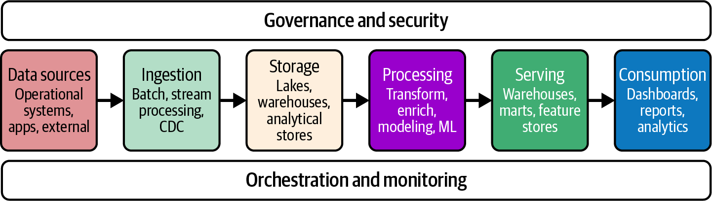
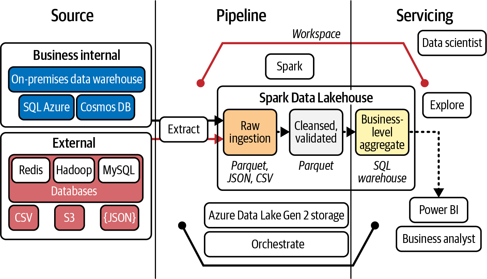
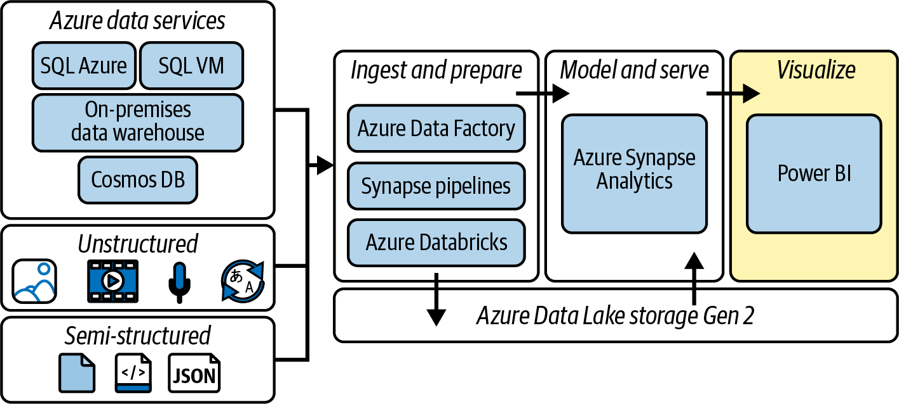
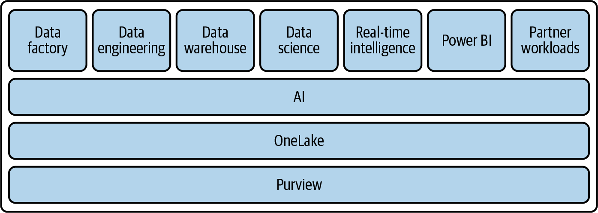

# Chapter 9 Large-Scale Analytics

Organizations face unprecendented challenges when working with data.
The volume, variety, and velocity of information have expanded exponentially, pushing traditional analytics solutions beyond their limits.
Large-scale analytics represents a response to these challenges--a set of approaches, technologies, and architectures designed to extract meaningful insights from massive datasets, and conventional tools simple cannot handle.

**Coverage of Curriculum Objectives**

This chapter addresses the following DP-900 exam objectives:

- Describe considerations for data ingestion and processing.
- Describe options for analytical data stores.
- Descrive Microsoft cloud services for large-scale analytics, including Azure Databricks and Microsoft Fabric

**EOCCO**

Figure below illustrates the key components of a large-scale analytics architecture.
The flow begins with diverse data sources, moving through ingestion and storage layers, followed by processing and serving layers, and culminating with consumption.
Each step contains specialized components designed to handle specific aspects of analytics.

Think of large-scale analytics as the difference between crossing a small pond and crossing an ocean.
The skills, tools, and planning required are fundamentally different in scale and complexity.
When datasets grow from gigabytes to terabytes or even petabytes, and when data sources multiply from a handful to hundreds, traditional analytics approaches begin to falter.
Large-scale analytics provides the vessel and navigation equipment needed to successfully cross these vast data oceans.

For the DP-900 exam and anyone working with Azure, understanding large-scale analytics is crucial.
The cloud has revolutionized how organizations approach big data challenges, making advanced analytics capabilities accessible without massive infrastructure investments.
Azure's comprehensive ecosystem of services transforms what was once possible only for the largest enterprises into capabilities available to organizations of all sizes/

## Understanding Large-Scale Analytics

Your journey into large-scale analytics begins with understanding its characteristics and components.
Unlike traditional analytics, which might process structured data from a single database, large-scale analytics handles diverse data from multiple sources at enormous volumes.
This shift isn't simply about scaling up existing solutions.
It requires completely rethinking how we collect, store, process, and analyze data.

**Exam Tip**

The DP-900 exam often presents scenarios asking you to identify whether a traditional database solution or a large-scale analytics approach is more appropriate.
Look for clues about data volume (terabytes or petabytes), variety (multiple formats), and velocity (streaming data) that indicate large-scale analytics is needed.

**EOET**

### The Scale Challenge

Traditional analytics infrastructure was designed for predictable, structured data flowing in at a managable pace.
Organizations would collect transaction records, customer information, and operational metrics in well-organized databases, then analyze this information using standard reporting tools.
This approach worked well when data volumes grew gradually and structures remained relatively stable.

The digital transformation has shattered these comfortable constraints.
Every aspect of modern business now generates data at unprecedented rates.
Ecommerce platforms track every click, scroll, and view.
Manufacturing equipment reports status updates every few seconds.
Mobile applications generate constant streams of usage data.
Social media platforms produce endless feeds of text, images, and interactions.

This digital explosion isn't just about quantity.
It's also about fundamental changes in how information flows through organizations.
Three major shifts define this new landscape.

First, the sheer volume of data has grown exponentially.
The traditional three Vs of big data--Volume, Variety, and Velocity--have expanded to include Veracity (data quality and trustworthiness) and Value (the ability to turn data into meaningful insights).

Organizations now routinely collect and analyze petabytes of information from business transactions, sensors, social media interactions, and countless other sources.
This volume quickly overwhelms traditional database systems and analytics tools designed for gigabyte-scale operations.

Second, modern data comes in remarkably diverse formats.
The structured rows and columns of traditional databases now represent only a fraction of valuable information.
Semi-structured data like JSON or XML fiiles contain nested, varaible information.
Unstructured data includes everything from customer emails and support chat logs to product images and surveillance video.
Large-scale analytics must accommodate this variery, often requiring different processing approaches for each type.

Third, the speed at which data arrives has accelerated dramatically.
Many valuable data sources now generate continous streams rather than periodic batches.
Analyzing this high-velocity data requires fundamentally different apporaches than traditional ETL processes designed for nightly or weekly updates.

**Exam Tip**

The DP-900 exam emphazises understanding how these shifts in data volume, variety, and velocity necssitate different approaches for large-scale analytics.
Focus on recognizing scenarios where traditional solutions would be insufficent.

**EOET**

Modern large-scale analytics addresses these challenges through specialized architectures that distribute processing across multiple computers, store diverse data types efficently, and process information at various speeds.
Rather than attempting to force all data into a single system or approach, these architectures embrace the inherent diversity of modern data landscapes.

### Components of Large-Scale Analytics

While the tranformation from traditional to large-scale analytics is about handling more data, it also requires rethinking the entire approach to working with information.
To understand this shift, we need to examine how modern analytics systems organize the flow from raw data to business insight.

Large-scale analytics represents more than just scaled-up traditional systems.
It encompasses a comprehensive approach to handling data through its lifecycle, from initial collection to final insight.
Understanding this end-to-end process reveals why conventional tools struggle with modern data challenges.

The data flow begins with the vastly expanded universe of data sources.
While traditional analytics might draw from a handful of internal databases, modern approaches incorporate information from across the digital ecosystem.
Enterprise applications generate structued records of business activities.
Websites and mobile apps produce detailed logs of user interactions.
IoT devices report telemetry from the physical world.
External sources provide market trends, social sentiment, and competitive intelligence.
Each source brings unique formats, update frequencies, and quality considerations.

This diverse information flows into the organization through data ingestion processes that form the foundation of modern ETL architectures that must handle both historical information and real-time streams.
Unlike traditional ETL processes that moved data on fixed schedules, modern ingestion operates continusously, adapting to varying volumes and velocities.
Some data arrives in massive batches, while other information streams in constantly.
Effective ingestion must handle both patterns while maintaining data integrity and tracking lineage.

After collection, the next step is storage.
Traditional data warehouses excel at organizing structured information in optimized formats but struggle with the semi-structured and unstructured data due to their rigid schema requirements and inability to handle variable data structures that now dominate many landscapes.
Modern analytics employs specialized storage approaches optimized for different data types and access patterns.
These range from data lakes that preserve raw information in its native format to purpose-built analytical databases designed for specific query patterns.

With data properly stored, the true information occurs in processing, where raw information becomes analytical insight.
Processing might include cleaning messy data, converting between formats, joining related datasets, aggregating for performance, or applying advanced analytics through statistical methods and machine learning.
This processing often occurs in distributed systems that spread work across dozens or hundreds of computers, enabling analytics at scales impossible on single machines.

The final step in the data pipeline makes processed information available through interfaces that translate complex findings into actionable business decisions.
Interactive dashboards, analytical tools, and embedded analytics within operational applications help business users dervive value from the processed data.

Modern large-scale analytics connects these components into cohesive architectures that maintain data flowing from source to insight.
Unlike traditional approaches that often created disconnected silos, these architectures emphasizes integration while allowing specialization for different data types and analytical needs.

## Data Ingestion and Processing

Now that you understand the overall components of large-scale analytics, let's examine how data begins its journey.
Data ingestion forms the critical first step in any analytics pipeline--the process of collecting information from various sources and bringing it into your analytical environment.
Getting this foundational step right is essential for everything that follows.

### The Ingestion Challenge

In large-scale sceanrios, ingestion faces challenges that require rethinking traditional approaches to data movement.
Consider what happends when orgnanizations attempt to scale up conventional data collection methods to meet modern demands.

Imagine a global retail organization collecting POS data from thousands of stores, website interactions from millions of online shoppers, inventory updates from hundreds of warehouses, and market research from dozens of third-party sources.
Each data source might use different formats, update at different frequencies, and require different handling.
Some provide historical data in batches, while others generate continous streams of information.

Traditional data movement typically relied on periodic ETL processes. 
These would connect to source systems on a scheduled basis (perhaps nightly or weekly), extract new data, apply transformations to standardize formats, and load the results into analytics streams.
This approach worked well when data sources were limited in number, relaticely stable in structure, and updated on predictable schedules.

However, modern data landscapes shatter these assumptions. The number of valuable data sources has multiplied dramatically, with many organizations tracking hundreds or thousands of distinct information streams.
Data structure evolve constantly as applications add features and tracking requirements change.
Update frequencies have accelerated from daily batches to continous feeds, with some sources generating thousands of records per second.

These fundamental shifts require rethinking our approach to data collection.
Modern ingestion must handle both traditional batch transfers and continous steaming data.
It needs to accommodate diverse and evolving data formats without requiring extensive reconfiguration.
Systems must scale dynamically to handle peak loads that might be orders of magnitude higher than average volumes.
And throughout all this complexity, organizataions need to maintain data quality and lineage tracking.

**Real-World Scenario**

A global manufacturing company previously collected production line data once daily via database extracts.
After implementing sensors on equipment, data volume increased 50-fold and velocity shifted to continuous streams.
The comapany's traditional ETL process couldn't keep up, causing data loss and delayed insights.
By implementing a hybrid ingestion approach that handled both batch and streaming data, the company reduced insight latency from 24 hours to under 5 minutes while capturing 100% of critical production metrics.

**EORWS**

### Batch and Streming Paradigms

To address diverse ingestion requirements, modern analytics leverages two complementary paradigms, each suited to different types of data sources and analytical needs.

*Batch ingestion* processes data in chunks, typically on a scheduled basis or when triggered by specific events.
This approach resembles traditional ETL processes, but they are scaled for much larger volumes.
Batch processing excels when handling historical data, performing complex transformations, or loading inital datasets.
It prioritizes throughness and completeness over immediacy, often including comprehensive validation and quality checks.

In contrast, *streaming ingestion* processes data continuously as it's generated.
This approach treats data as an endless flow rather than discrete chunks.
Streaming excels at capturing time-sensitive information where immediate processing adds significant value.
Examples include monitoring systems that need to detect anomalies quickly, customer experience applications that adapt to user behavior in real time, and fraud detection systems that must identify suspicious activity before transactions complete.

Most modern analytics architectures incorporate both approaches, recognizing that different data sources and analytical needs requires ingestion patterns.
A retail analytics system might use streaming ingestion to capture current shopping behavior while using batch processes to load histroical sales records and inventory data.
These complementary approaches ensure comprehensive data availability while prioritizing timelines for critical information flows.

I'll talk more about batch versus streaming in the next chapter.

### Processing Considerations

With data flowing into our analytics environment through appropriate ingestion mechanisms, the next step is processing--transforming raw information into formats that enable effective analysis.
This critical middle stage connects ingestion to storage and ultimately to business insight.

Once data enters the analytics environment, it typically requires processing before it can yield valuable insights.
Processing transforms raw data into structured formats suitable for analysis, enriches it with additional information, and optimizes it for efficent querying.

Large-scale data processing faces several fundamental challenges that traditional approaches struggle to address.
First, the sheer volume of data often exceeds what single machines can handle efficently.
Processing terabytes or petabytes requires distibuted approaches that spread work across multiple computer.
Second, diverse data formats require specialized processing techniques--text requires different handling than images or time-series data.
Third, different analytical scenarios have vastly different latency requirements,  from batch processses that can run overnight to interactive queries that must return results in seconds.

Modern processing technologies address these challenges through several complementary approaches.
Distributed processing frameworks divide large datasets into manageable chunks, process them in parallel across multiple machines, and combine the results.
Specialized processing engines optimize for particular data types and analytical patterns.
Configurable execution environments balance performance against cost, scaling resources up or down based on workload demands.

Processing strategies typically fall along a spectrum from ETL to ELT.
Traditional ETL transforms data before loading into analytical stores, ensuring consistency but potentially limiting flexibility.
Modern ELT approaches often load raw data first, then apply transformations as needed for specific analytical needs.
This approach preserves the original information while enabling diverse processing paths for different requirements.

For example, in traditional ETL, customer data from multiple sources would be standardized to a common format with consistent field names and data types before being loaded into the warehouse.
In contrast, ELT would load the raw customer data from each source into the data lake first, then transform it as needed--perhaps one way for marketing analytics and differently for financial reporting.

### Analytical Data Stores

With data properly ingested and processed, we now need a place to store it that enables efficent analytics.
This brings us to a crucial component of any large-scale analytics architecture: specialized data storage designed for analytical workloads.

After ingestion and processing, data must be stored in ways that support efficent analytics.
Traditional transactional databases (OLTP systems) were designed to record individual business transactions quickly and reliably, not to analyze massive datasets.
Large-scale analytics require specialized data stores optimized for analytical workloads.

**Exam Tip**

Understanding the difference between transactional (OLTP) and analyical (OLAP) storage is fundamental for the DP-900 exam.
OLTP systems optimize for fast recording of individual transactions, while OLAP systems optimize for complex queries across large datasets.
The exam frequently tests this distinction through scenario-based questions.

**EOET**

### The Storage Challenge

OLTP systems are designed for fast, reliable recording of business transactions, while OLAP systems optimize for complex queries across large datasets.
Understanding this distinction is crucial for choosing appropriate storage solutions.

Analytical data storage presents fundamentally different requirements than transactional systems.
While transactional databases optimize for quickly recording individual business activities, analytical stores must support complex queries across vast datasets.
This distinction manifests in several key areas.

Query patterns differ dramatically between transactional and analyticla workloads.
Transactional systems typically access small amounts of data in precise locations--finding a specific customer record or updating a paricular inventroy item.
Analytical queries often scan million or billions of records, comparing and aggregating information across many dimensions.
Stores designed for analytics optimize for these broad, scanning queries rather than precise records access.

Data volumes in analytical systems dwarf their transactional counterparts.
While operational databases might manage gigabytes or terabytes, analytical stores routinely handle terabytes or petabytes.
They often retain years of historical data to support trend analysis and pattern recognition.
Managing these volumes requires specialized approaches to storage, indexing, and query processing.

Data diversity presents another significant challenge.
Transactional systems typically work with well-defined, structured data models that change infrequently.
Modern analytics incorporates structured data alongside semi-structured information like JSON documents and unstructured content like text and images.
Analytical stores must accommodate this variety while still enabling efficent queries.

Concurrency patterns also differ significantly.
Transactional systems handle many small, independent operations, often with strict consistency requirements.
Analytical workloads might involve fewer queries, but each can consume substantial resources while scanning large datasets.
Analytical stores must balance these resource-intensive operations while serving multiple users and applications simultaneously.

These difference explain why organizations maintain separate storage systems for transactional and analytical workloads, even when they contain related information.
Attempting to serve both patterns from a single system inevitably compromises performance for one or both workloads.

### Data Lakes

Data lakes represents a fundamental shift in how organizations store data for analyics.
Unlike traditional approaches that required data to be structured and organized before storage, data lakes provide a repository for raw, unprocessed data in its native format.
They serve the foundation for many large-scale analytics architectures, particularly when organizations need to preserve data in its original form.

The concept emerged as a response to the increasing variety and volume of valuable data.
Traditional data warehourses required information to be transformed into predefined structures before storage, a process that often discarded potentially valuable detils and limited future analytical flexibility.
Data lakes instead preserve raw information exactly as it arrives, maintaining its full fidelity and enabling diverse processing paths as analytical needs evolve.

Modern data lakes typically store information in distributed file systems like Hadoop Distributed File System (HDFS) or cloud-based object storage.
Unlike simple folder structures, data lakes provide distributed processing capabilities, metadata management, query engines, and data governance features that enable analytics at scale.
Files are often converted to efficient formats like Parquet or ORC that maintain all data while optimizing for analytical queries.
Modern data lakes organize data into logical hierarchies that might reflect source systems, business domains, or time periods.
They maintain the original format of incoming data--whether CSV files, JSON documents, images, videos, or proprietary formats--while providing tools to catalog and discover this diverse content.
This approach preserves maximum analytical flexibility, allowing different teams to process the same raw data in ways that serve their specific needs.

Data lakes excel in several crucial scenarios.
Organizations with changing or evolving analytical requirements benefit from preserving raw data that can be processed as needs change.
Data science teams value access to unfiltered information that retains all potentially valuable signals.
Storage administrators appreciate the cost efficency of maintaining a single copy of raw data rather than multiple transformed versions.

However, data lakes also present challenges.
Without careful governance, they can become *data swamps*--disorganized repositories where valuable information becomes difficult to find.
The flexibility of raw storage shifts transformation responsiblity to data consumers, potentially creating inconsistent interpretations responsibility to data consumers, potentially creating inconsistent interpretations of the same information.
Many organizations address these challenges through metadata management, data cataloging, and the creation of curated zones with processed, trusted datasets derived from the raw lake content.

**Exam Tip**

Data lakes store raw data in its original format, while data warehouses store processed, structured data optimized for specific analytical queries.
The DP-900 exam often tests you ability to recognize when each approach is most appropriate based on scenario characteristics.

**EOET**

### Data Warehouses

While data lakes excel at storing raw, diverse data, data warehouses take a more structured approach to analytical storage.
They organize information into dimensional models specifically designed for analytical queries, enabling fast performance for businesss intelligence and reporting.

Data warehouses have evolved over decades as the primary platform for business analytics.
They transform raw, operational data into optimized structures that support complex analytical queries.
Unlike data lakes that preserve information in its original format, data warehouses impose defined schemas, relationships, and aggregations that align with how organizations analyze their business.

The core archiecture of a data warehouse typically includes fact tables containing measurable business events (sales transactions, website visits, support calls) connected to dimension tables that provide context (customers, products, time periods).
This star or snowflake schema design optimizes for analytical queries that aggregate measures across different dimensions--for example, calculating tool sales by product catagory and region for each quarter.

Modern data warehouses employ several techniques to deliver perofrmance at scale.
Columnar storage organizes data by column rather than row, dramatically improving efficency for queries that analyze specific attributes across many records.
Massively parallel processing (MPP) distibutes queries across many computers, enabling analysis of enormous datasets.
Intelligent partioning and indexing strategies optimize data access based on common query patterns.

Data warehouses particularly excel at supporting standardized reporting, dashboards, and business intelligence applications.
Their structured approach ensures consistent results across different analyses and enables business users to work with familiar dimensions like customers, products, and time periods.
The predefined nature of data warehouse models makes them ideal when analytical requirements are well understood and consistent over time.

However, data warehouses also present limitations in the modern analytics landscape.
Their structured nature requires defining schemas before loading data, making them less flexible for exploratory analysis or rapidly evolving data sources.
The transformation required for warehouse loading can delay data availability compared to data lakes.
And the focus on structured data can make it challenging to incorporate unstructured or semi-structured information that provides valuable context.

These complementary strengths and limitations explain why many modern analytics architectures combine data lakes and data warehouses in a layered approach.
Data lakes serve as the flexible foundation for storing all raw data, while data warehouses provide optimized performance for well-defined analytical workloads.
This combined approach maximizes both flexibility and performance.

### Analytical Databases

Beyond the broad categories of data lakes and data warehouses, the analytics landscape includes specialized databases optimized for particular analytical patterns and workloads.
These purpose-built systems provide advanced capabilities for specific scenarios while maintaining familar database interfaces.

Several specialized analyical database types have emerged to address specific needs:

In-memory analytical databases store data primarly in memory rather than on disk, delivering performance improvements for interactive analytics.
They enable business users to explore data and iterate through different analyical perspectives without the delays typically associated with disk-based systems.
While more expensive per terabyte than disk storage, they justify their cost through improved productivity and faster insight generation.

Columnar databases optimize storage and processing specifically for analytical workloads that typically analyze a few columns across many rows.
By storing data organized by column rather than row, they minimize I/O requirements for analytical queries, often improving performance by orders of magnitude compared to traditional row-based storage.
This approach directly addresses the mismatch between row-oriented transactional systems and column-oriented analytical queries.

Time-series databases specialize in handling data where time forms the primary organizating dimension.
They excel at ingesting and analyzing the high-velocity streams from IoT sensors, financial markets, application monitoring, and similar sources that generate timestamp-oriented data.
Their specialized indexing and storage techniques optimize for the specific patterns of time-based queries, such as identifying trend, detecting anomalies, and comparing periods.

Azure provides specialized analytical databases through services like Azure Cosmos DB, which offers multiple data models including document, key-value, graph, and column-family APIs.
Each model optimizes for specific analytical patterns while maintaining the flexibility of a managed service.

Graph databases organize information based on relationships rather than tables, enabling sophisiticated analysis of connections and networks.
They excel at scenarios like fraud detection (identifying suspicious relationship patters), recommendation systems (finding similar users or products), and impact analysis (understanding cascading effects through a network).
Their ability to traverse relationships makes them powerful tools for analyzing complex, interconnected data.

Many organizations leverage multiple analytical store types in complementary ways.
They might use data lakes for initial storage and exploration, data warehouses for structured business reporting, and specialized databases for particular analytical patterns.
This multifaceted approach recognizes that no simple storage technology excels at all analytical scenarios.

### How to Choose the Right Analytical Store

With so many options available, selecting the appropriate analytical storage approach requires careful consideration of several key factors:

Data structure represents one of the most important considerations.
Highly structured data with well-defined schemas typically works best in data warehouses, while diverse or evolving data might start in a data lake.
The balance between structured and unstructured information often determines the primary storage approach, with specialized databases addressing particular segments of this spectrum.

Query patterns significantly influence storage decisions.
Known, repeatable queries benefit from the optimized structure of a data warehouse, while exploratory analysis might leverage the flexibility of a data lake.
The predictability and consistency of analytical needs often determine whether the up-front investment in warehouse modeling delivers appropriate returns.

Performance requirements shape both technology selection and implemenation details.
Time-sensitive analytics might require the speed of in-memory processing or specialized analytical databases, while batch analysis can leverage any of these options.
The balance between query peformance and storage cost often leads to tiered approaches where frequently accessesd data resides in performance-optimized stores while historical information moves to more economical options.

Integration needs influence how analytical stores connect with existing systems, visualization tools, and other analytics components.
The technological ecosystem and skill sets within an organization often guide storage decisions, favoring options that align with existing capabilities and investment.

Rather than choosing a single approach, most large-scale analytics architecture combine multiple storage technologies in a layered design.
A common pattern includes the following:

    Raw zone
        Lake storage that holds original, unprocessed data that will help further zones
    
    Refined zone
        Processed data in optimized formats within Data Lake Storage
    
    Curated zone
        Highly structured data in data warehouses or other analytical databases
    
    Specialized zones
        Purpose-built databases for particular analytical patterns

This layered approach provides both the flexibility of a data lake and the performance of specialized analytical stores, allowing organizations to match storage characteristics to different stages of the analytical lifecycle.

## Microsoft Cloud Services for Large-Scale Analytics

Having explored the core concepts and componenet of large-scale analytics, let's turn our attention to how Microsoft implements these capabilities in Azure.
The cloud has revolutionized analytics by removing infrastructure barriers, enabling organizations of all sizes to implement sophisticated analytical capabilities without massive capital investments.

### Azure Databricks

Among Azure's analytical offerings, Databricks stands out as a specialized platform designed specifically for large-scale data processing and advanced analytics.
It represents a collaborative analytics service built around Apache Spark, the popular open source distributed processing framework.
Developed throug a partnership between Microsoft and Databricks (founded by the creators of Spark), it provides a powerful environment for data engineering, data science, and machine learning at scale.

Databricks promotes the lakehouse architecture, combining the flexibility of data lakes with the performance and reliability of data warehouses (shown in the figure).
This approach uses the medallion architecture with bronze (raw), silver (refined), and gold (curated) layers to organize data at different stages of processing.

Azure Databricks brings together several capabilities essential for modern analytics workflows.
At its core lies an optimized version of Apache Park, the distributed processing engine that enables analysis across clusters of computers rather than single machines.
This foundation enables processing of enormouse datasets that would overwhelm traditional tools.
Surrounding this engine, Databricks provides collaborative workspaces where data professionals can develop, share, and execute analytical code and workflows.

The platform particularly excels at complex data engineering, where raw information requires substantial transformation before it yields valuable insights.
Databricks includes specialized tools for defining, executing, and monitoring data pipelines that convert raw inputs into analytics-ready information.
These capabilities integrate with Delta Lake, an open source storage layer that brings reliability and performance features typically associated with data warehouses to data lake environments.

Beyond data engineering, Databricks provides specialized capabiliites for data science and machine learning.
Its collaborative notebooks combine code, visualizations, and explanatory texy, enabling data scientist to develop and share analytical approaches.
The platform includes MLflow, an open source framework for managing the machine leraning lifecycle from experiment tracking through model deployment.
These capabilities make Databricks particularly valuable for organizations whose analyics needs extend beyond reporting into predictive and prescriptive analytics.

With its combination of powerful distributed processing and collaborative features, Databricks excels in several key scenatios.

Data engineering workflows benefit from Databricks' ability to process massive datasets, transform diverse information types, and build reliable data pipelines.
The platform's integration with Delta Lake anbles reliable updates to data lake content through features like ACID transactions and schema enforcement.

Data science activities leverage the collaborative nature of Databricks notebooks, which enable teams to work together on analyical approaches while providing access to the computational power needed for large-scale analytics.
The ability to work interactively with enormous datasets enables more thorough exploration and insight generation.

Machine learning development takes advantage of Databricks' MLflow integration for experiment tracking, model versioning, and deployment management.
The platform simplifies the path from analytical prototype to production model by providing consistent environments across development and operations.

**Exam Tip**

For the DP-900 exam, understand that Azure Databricks specializes in large-scale data processing and advanced analytics based on Apache Spark.
Its collaborative workspace is particularly valuable for data science and machine learning scenarios where teams need to combine code development with powerful distributed processing.

**EOET**

### Azure Synapse Analytics

While Databricks focueses on code-first advanced analytics, Azure Synapse Analytics takes a different approach by providing an integrated analytics platform that combines multiple technologies under a unified experience.
It brings together enterprise data warehousing, big data processing, data integration, and analytics into a cohesive service designed to simplify end-to-end analytics development, as shown in the figure.

Synapse Analytics evolved from Azure SQL Data Warehouse, expanding its capabilities well beyond traditional data warehousing.
At its core, Synapse still provides powerful SQL-based analytics through dedicated SQL pools that leverage maassively parallel processing for performance at scale.
These pools excel at structured data analysis using familiar SQL syntax, making them accessible to the many data professionals with SQL expertise.

However, Synapse goes far beyond traditional SQL capabilites.
It also inclues Apache Spark pools that provide distributed processing for unstructured and semi-structured data, enabling code-based analytics using languages like Python, Scala, and .NET.
This dual-engine approach allows organizations to handle both structured and unstructured analytics within a single service, reducing the complexity of managing mutiple platforms.

Integration forms a central theme throughout Synapse Analytics.
Built-in data integration capabilites enable movement and transformation across various sources without requiring separate tools.
The service connects seamlessly with Azure Data Lake Storage, enabling queries directly against lake data without copying it into specialized stores.
The unified Studio experience brings developement, management, and monitoring together in a cohesive interface that simplifies the analytics workflow.

Synapse Analytics particularly shines in scenarios that span the spectrum from traditional data warehousing to modern big data analytics:

Enterprise Data Warehousing leverages Synapse's SQL capabilities to deliver high-performance structured analytics.
The service scales from small departmental data marts to enterprise-wide warehouses, with flexible resource allocation that balances performance and cost.

Data Lake Exploration extends analytics beyond structured data, enabling organizations to gain insights from diverse information sources.
Serverless SQL capabilities allows analysts to query data lake content directly using familiar SQL syntax, while Spark integration supports code-based analysis for more complex scenarios.

Integrated Data Preparation simplifies the transformation of raw data into analytics-ready formats.
Synapse's data flows enable visual definition of transformations with requiring code, making data engineering more accessible to analyst personas.

** Real-World Scenario**

A retail organization uses Synapse Analytics to combine POS data (via SQL pools) with customer behavior from web logs (via Spark pools), creating a unified customer view for personalization and marketing analytics.
Marketing analysts can use familar SQL to analyze structured sales data, while data scientists leverage Spark notebooks to analyze browsing patterns.
The unified platform ensures consistent definitions and metrics across both analysis paths.

### Microsoft Fabric

Microsoft's newest addition to the analytics portfolio represents an evolution in how organizations approach analytics in the cloud.
Launched in 2023, Microsoft Fabric takes integration to a new level by providing a unified software-as-a-service (SaaS) platform that brings together the entire analytics lifecycle under a single experience and data platform as shown below.

Fabric builds on Microsoft's analytics evolution by unifying previously separate services into an integrated experience that emphasizes simplicity and cohesion.
As its foundation lies OneLake, a single data lake that serves as a unified storage layer across all analytical workloads.
This approach eliminates the silos that traditionally separated different analytical tools, enabling seamless data sharing and collaboration across roles and teams.

The platform brings together multiple workload types under a consistent experience.
Data engineers can build and manage pipelines that ingest and transform information.
Data scientists can develop and deploy machine learning models.
Data analysts can create reports and dashboards.
Business users can access self-service analytics.
All these personas work within a unified platform that maintains consistent data defintions and goverance across activities.

Microsoft Fabric takes a fundamentally diferent apporach to analytics infrastructure by providing a true SaaS experience.
Unlike traditional analytics platforms that require singificant administration and maintaince, Fabris handles the underlying infrastructure automatically.
This apporach dramatically reduces operational overhead, allowing organizations to focus on deriving insights rather than managing systems.

Fabric particularly excels in scanrios where simplicity and integration deliver substantial value:

    End-to-End Analytics
        These workflows benefit from Fabric's unified approach, which eliminates the friction traditionally associated with moving data between differnt tools and platforms.
        Teams can progress smoothly from data ingestion through transformation, analyis, and visualization within a consistent environment.
    
    Self-service analytics
        This becomes more accessible when business users can access trusted data through intuitive interfaces.
        Fabric's emphasis on usability and integration enables nontechnical users to perform sophisticated analytics without requiring extensive technical expertise.
    
    Governed data sharing
        This becomes simplier when all analytical workloads operate on a shared data foundation.
        Fabric's OneLake storage provides consistent access controls and lineage tracking across analytical activities, supporting both compliance and requirements and collaborative workflows.

**Exam Tip**

For the DP-900 exam, understnad that Microsoft Fabric represents an integrated SaaS approach to analytics that combines previously separate services into a unified experience.
It's particularly valuable for organizations seeking to minimize infrastructure management while maintaining a comprehensive analytics capability.

### How to Choose Between Analytics Services

With multiple powerful analytics platforms available in Azure, organizations often ask which service they should choose.
Rather than thinking of these options as competing alternatives, it's more helpful to consider how they complement each other within the broader analysis ecosystem.

The selection between analytics services depends on several key factors that influence which platform best meets an organization's needs:

Exisiting skills guide technology decisions, as teams naturally leverage their established expertise.
Organizations with strong Spark expertise might gravitate towards Databricks, while thoes with SQL backgrounds might find Synapse Analytics more accessible.
Fabric's unified approach appeals to organizations seeking to minimize specialized technical requirements.

Integration requirements shape platform choices, particularly for organizations with existing investments in Microsoft technologies.
Synapse Analytics offers deep integration with other Azure services, while Fabric provides seamless connections across the Microsoft ecosystem.
Databricks, while well integrated with Azure, also maintains compatiblity with other cloud environments.

Specialized needs often determine platform selection for specific workloads.
Projects requiring advanced machine learning might benefit from Databricks' comprehensive machine learning capabilies, while data warehousing workloads might favor Synapse Analytics.
Fabric's simplified administration appeals to organizations seeking to minimize operational complexity.

Architectural complexity presents another important consideration.
Databricks and Synapse Analytics provide specialized capabilities for particular analytics scenarios, often requiring careful architectural planning.
Fabric takes a different approach by emphasizing simplification and integration over specialized optimization, potentially reducing architectural complexity at the cost of some customization options.

Many organizations adopt multiple analytics services to address different scenarios within their overall analytics strategy.
They might use:

- Databricks for data science and complex processing scenarios that benefit from its advanced machine learning capabilities.
- Synapse Analytics for data warehousing and structured analytics leveraging SQL expertise
- Fabric for business intelligence and self-service analytics, prioritizing simplicity and accessibility

This pragmatic approach recognizes that different analytical workloads have different requirements, with each platform offering particular strengths.
Organizations often start with one platform to address their most pressing analytics needs, then add complementary services as their analytical maturity grows.

**Exam Tip**

The DP-900 exam frequently presents scenarios where you need to choose between analyics services.
Focus on understanding the core strenths and typical use cases for each service rather than memorizing specifications

**EOET**

## Bringing It All Together: Large-Scale Analytics in Practice

Now that you've explored the concepts, components, and architectures of large-scale analytics, let's examine how these elements come together in a real-world scenario.
This practical perspective helps illustrate how organizations translate technical capabilities into business value.

Consider Global Retail Inc., a fictional multinational organization with physical stores, ecommerce platforms, and mobile applications.
The organization is implementing large-scale analytics in Azure to gain comprehensive insights into its business operations and customer behavior.
It's journey illustrates the practical application of the concepts we've discussed throughout this chapter.

### The Data Landscape

Global Retail faces classical big data challenges that exemplify why traditional analytics approaches no longer suffice.
Its diverse operations generate enormous volumes of data, arriving in various formats and at different velocities:

Volume presents a significant challenge, with billions of transactions, customer interactions, and inventory movements annually.
The organization's data has grown exponentially, from terabytes to petabytes as it has expanded operations and increased digital touchpoints.
Traditional database systems struggled to handle this scale, particularly for analytical queries that neeeded to scan historical information across multiple years.

Variety complicates its analytics landscape, as information arrives in multiple formats requiring different handling approaches.
Structured data from POS systems and inventory management follows well-defined schemas, while semi-structured data from web logs and mobile apps contains nested, variable information.
Unstructured data includes customer reviews, support conversations, and social media mentions.
No single storage or processing approach could effectively handle this diversity.

Velocity adds another dimension of complexity, with data arriving at dramatically different rates.
Real-time streams flow continuously from online shopping sessions, in-store sensors, and supply chain updates.
Batch updates arrive daily or weekly from operational systems and external partners.
The organization's analytics architecture needed to handle both patterns while maintaining data consistency and completeness.

### The Analytics Architecture

To address these challenges, Global Retail implemented a modern analytics architecture in Azure, following the layered approach we discussed earlier.
Its solution integrated multiple Azure services into a cohesive ecosystem that transformed raw data into business value:

For data ingestion, Global Retail deployed a hybrid approach that accommodated both batch and streaming patterns.
Azure Data Factory managed scheduled collevtions from operational systems, handling the extraction of sales, inventory, and customer information during off-peak hours.
Azure Event Hubs captured real-time streams from websites and mobile apps, preserving every click, search, and interaction for immediate processing.
Azure IoT Hub connected in-store sensors that monitored customer movement, environmental conditions, and inventory positions, bringing physical store operations into the digital analytics ecosystem.

The storage layer centered on Azure Data Lake Storage as the foundation for all analytical data.
The organization organized the lake into a multitiered structure that balanced flexiblity with governance.
A raw zone preserved incoming data exactly as it was recieved, maintaining complete historical fidelity.
A standardized zone applied consistent formatting and quality controls while maintaining the granular detail of original records.
A curated zone contained trusted business-aligned datasets for self-service analytics.
Throughout these zones, Global Retail implemented Delta Lake to ensure data reliability and performance at scale.

For processing and transformation, Global Retail leveraged multiple technologies optimized for different scenarios.
Azure Databricks handled complex transformations and data preparation for diverse data types, using its distributed processing capabilities to process massive datasets efficently.
Azure Synapse Analytics provided SQL-based analytics accessible to the organization's large community of analysts with SQL expertise.
The combination enabled both sophisticated data engineering and accessible analytical capabilities within a unifed architecture.

The serving and consumption layers connected analytical insights to business value through appropriate interfaces for different roles.
Data scientists accessed notebook experiences in Databricks to develop machine learning models for customer segmentation and demand forecasting.
Business analysts used familiar SQL queries in Synapse Analytics to analyze sales performance and inventory metrics.
Executives and store managers accessed interactive dashboards through visualization tools, delivering insights without requiring technical expertise.

Throughout this architecture, orchestration and governance ensured reliable, consistent operations.
Data Factory pipelines coordinated the overall data flow, managing dependencies between processing steps and handling error conditions.
Purview provided data catalog capabilities, helping users discover available datasets and understand their meaning.
RBACs maintained appropriate security boundaries while enabling collaborative analytics across departments.

### Implementation Approach

Rather than attempting to build this entire architecture at once, Global Retail took an incremental apporach that delivered value at each stage while building towards its comprehensive vision.

It began by establishing its data lake and basic ingestion pipelines.
This initial deployment focused on collecting and preserving data from its highest priority sources, including POS systems, ecommerce platforms, and inventory management.
It implemented core data quality and governance processes to ensure trustworthy information, then build initial reports on these priority datasets.
This approach delivered immediate value while laying the groundwork for more sophisticated capabilities.

Building on this foundation, the organization next implemented real-time analytics for its digital platforms.
This phase expanded its Event Hubs implementation to capture every customer interaction on its website and mobile app, feeding this information into Stream Analytics for immediate processing.
The resulting insights enabled personalized experiences for customers and real-time alerting for operational issues, delivering tangible business impact through improved conversion rates and reduced problem resolution times.

With foundational capabilities and real-time analytics in place, Global Retail progressed to advanced analytics using Databricks.
This phase developed sophisticated machine learning models for customer segmentation, product recommendations, and demand forecasting.
The resulting capabilities transformed how the organization apporached marketing, merchandising, and supply chain management, leveraging predictive insights to optimize business decisions across the organization.

Global Retail's most recent phase expanded to IoT analytics from store sensors, integrating physical store operations into its analytical ecosystem.
Sensors tracking customer movement patterns, environmental conditions, and inventory placements provided digital insights into traditionally analog operations.
This information helped optimize store layouts, staffing levels, and inventory positioning, improving both operational efficency and customer experience in physical locations.

This phased approach delivered value at each stage while building towards a comprehensive analytics ecosytem.
It allowed Global Retail to learn from each phase before proceeding to the next, adjusting its implementation based on real-world experience rather than theoretical planning.
It also enabled the organization to demonstrate tangible business impact early in the process, building organizational momentum and support for continued investment.

## Summary

The shift from traditional storage to Azure's cloud-based solutions represents more than just a change in technology.
It's a fundamental transformation in how we think about and manage data analytics.
Each Azure analytics service addresses specific needs while offering the flexibility and scalability that modern applications demand.

Throughout this chapter, you explored how:

- Large-scale analytics addresses fundamental challenges of data volume, variety, and velocity.
- Modern ingestion approaches handle both batch and streaming data from diverse sources.
- Specialized analytical stores optimize for different data types and query patterns.
- Azure's analytics services provide a comprehensive ecosystem for end-to-end analytics.

**Exam Essentials**

For success on the DP-900 exam, focus on these key areas:

- Large-scale analytics basics:
    - Understand data challenges: volume, variety, and velocity.
    - Know how modern analytics differs from traditional approaches.
    - Recognize key components in analytics architectures.
    - Identify common use cases for large-scale analytics.
- Data ingestion and processing:
    - Distinguish between batch and streaming data ingestion.
    - Know when to use Azure Data Factory versus Event Hubs.
    - Understand how databricks and Synapse handle data processing.
- Analytical data storage:
    - Understand data lake versus data warehouses.
    - Know when to use Azure Data Lake Storage versus Synapse Analytics.
    - Recognize benefits of specialized analytical storage solutions.
    - Understand data movement between different storage technologies.
- Microsoft analytics services
    - Know the main purposes of Azure Databricks, Synapse Analytics, and Microsoft Fabric.
    - Understand which analytics services work together.
    - Understand how Microsoft analytics services connect with visualization tools.

## Beyond the Exam

While studying for the DP-900 exam provides an excellent foundation in Azure's large-scale analytics concepts and services, real-world implementations often involve additional considerations beyond exam coverage.
Having implemented analytics solutions across industries, I've observed several factors that significantly influence success but might not appear directly in certification exams.

### The Organizational Factoy

While the technical aspects of large-scale analytics recieve most of the attention in educational materials, the organizational dimentsions often determines success or failure in practice.
Technology represents only part of the analytics equation; organizational readiness plays an equally important role in achieving meaningful outcomes.

Perhaps the most critical organizational facor is analytics culture--the exent to which data-driven decision making is valued and practiced across the organization.
Technical solutions can provide access to insights, but they can't force people to use those insights when making decisions.
Organizations achieving the greatest analytics success foster cultures where leaders consistently ask for data to support propoasals, teams habitually test hypotheses rather than relying solely on experience, and insights trump intution when the two conflict.
This cultural transformation often proces more challenging than implementing technical platforms, requiring sustained leadership commitment and demostrated value to overcome entrenched habits.

Skills development represents another critical organizational dimension.
The transition to large-scale analytics requires new capabilities across the organization--not just for technical teams but also for business users who must learn to leverage analytical insights effectively.
Technical roles needs skills in cloud platforms, distributed processing, and modern languages like Python and Scala.
Business users need data literacy to interpret results correctly and analytical thinking to ask effective questions.
Organizations that invest in comprehensive skills development across both technical and business teams achieve faster adoption and greater value from their analytics investments.

Cross-functional collaboration provides the foundation for effective analytics implementations.
Traditional organizational boundaries between IT, business units, and analytical teams often impede the integrated approach that analytics requires.
The most successful implementations establish collaborative strucutes that bring together domain expertise, technical capabilities, and analytical skills.
These might take the form of dedicated analytics centers of excellence, cross-functional teams aligned to specific business domains, or matrix structures that maintain specialized expertise while enabling flexible teaming for specific initiatives.

I once worked with a government agency whose analytics initiative stalled despite substantial technology investements.
The turning point came when the agency established cross-functional "insight teams" combining domain experts, analysts, and data engineers.
These teams rapidly delivered targeted solutions to specific business problems, building momentum and demostrating value that helped change the organizational culture.
This structural change proved more important than any technical optimization in unlocking analytics value.

### Implemenation Realities

Real-world analytics implemenations rarely follow the neat linear progression suggested in textbooks or certification matrials. 
Several practical realities shape how organizations actually implement large-scale analytics in Azure.

Most organizations maintain hybrid environments that combine cloud and on-premises components, requiring careful integration and data movement stategies.
The "all-cloud" architectures depicted in documentation rarely reflect reality, especially for established enterprises with significant exisiting investments.
Successful implementations must address the complexity of connecting cloud analytics platforms with on-premises operational systems, often through carefully designed hybrid architectures that balance modernization with pregmatic reality.

The integration of modern analytics platforms with legacy systems creates significant complexity, particularly around data quality and synchronization.
Many operational systems were designed decades before current analytics approaches emerged, with data models optimized for transactional efficency rather than analytical utility.
Creating coherent analytical views across these disparate systems requires sophisiticated integration strategies that address differences in data formats, update frequencies, and semantic definitions.
These integration challenges often consume more implemenation effort than the analytics platform themselves.

Rather than wholesale replacement, organization typically migrate analytics workloads incrementally, maintaing parallel systems during transition periods.
This evolutionary approach minimizes disruption but creates significant complexity as data flows between old and new environments.
Practical implemenations must manage this hybrid state through careful orchestration, ensuring consistency while gradually shifting workloads to modern platforms.
This transitional complexity rarely appears in certification materials but represents a major focus for real-world implementations.

In one healthcare organization, we implemented a "sidecar" approach where Azure analytics services ran alongside existing on-premises systems.
Each quarter, we migrated additional workloads to the cloud while maintaining business continuity.
This gradual approach minimized risk while demonstrating incremental value.
The architecture included robust synchronization mechanisms to ensure consistency between systems, with an eventual goal of complete migration.
This pragmatic approach delivered more value than attempting a single "bing bang" transition that would have created unacceptable business disruption.

### The Scale Challenge

Storage patterns that work well in development can face challenges at production scale.
In one project, we built a storage system for user-generated content with Hot tier storage (frequently accessed data) and Cool tier storage (infrequently accessed data) that performed perfectly in our test environment.
However, when our Hot tier storage grew significantly in production, we needed to adjust our approach

Our initial design followed standard best practices, but we hadn't fully accounted for our actual scale requirements.
Operations that were fast in testing began to slow down as our data volume grew.
We worked with experienced architects to implement proper partitioning and lifecycle management strategies, finding a balance between theoretical best practices and practical performance needs.

** Real-world Insight**

Testing with production-scale data volumes early in development helps indentify potential performance issues before they impact users.

**EOEWI**

### Emerging Directions

The analytics landscape continues to evolve rapidly, with several trend extending beyond current exam coverage.

The boundary between analytics and AI continues to blur, with organizations increasingly embedding AI capabilities directly into analyical workflows.
This integration moves beyond traditional predictive analytics to incorporate natural language understanding, computer vision, and automated decision making.
Future analytics architectures will likely incorporate these capabilities as standard components rather than specialized extensions.

The concept of a semantic layer--which translates raw data into business-meaningful terms--has evolved beyond traditional approaches, now spanning both structured and unstructured information.
Modern implemenations use knowledge graphs, ontologies, and AI-assisted mapping to create unified business representations across diverse data types.
This evolution addresses one of the most persistent challenges in analytics: ensuring consistent interpretation of information across different uses and tools.

Organizations increasingly use AI to generate synthetic datasets for analytics testing, training, and scenario planning, particularly in highly regulated industries.
These approaches provide realistic data for development and testing without exposing sensitive information.
They also enable development and testing without exposing sensitive information.
They also enable exploration of hypothetical scenarios that haven't occurred in historical data, expanding analytical capabilities beyond historical analysis to sophisticated simulation and planning.

Advanced organizations are moving beyond descriptive and predictive analytics to decision intelligence frameworks that combine analytics with behavioral science and decision theory.
These approaches recognize that deriving insights from data represents only part of the value chain--those insights must influence decisions and ultimately actions to deliver tangible business impact.
Decision intelligence explicitylu models this complete path from data to action, incorporating human factors alongside analytical capabilities.

These emerging approaches hint at where large-scale analytics is headed, tough the may not yet appear in certification exams.

**Real-World Insight**

The most succesful analytics implemenations maintain flexibility to incorporate new approaches as they emerge, rather than locking into a static architecture.

**EORWI**

As you move beyond certification to real-world implementation, remember that large-scale analytics represents a journey rather than a destination.
Technologies will continue to evolve, but the fundamental principles of connecting diverse data sources, processing information at scale, and deriving valuable insights remain constant.
The solid foundation provided by understanding Azure's analytics services will serve you well as you navigate this evolving landscape.